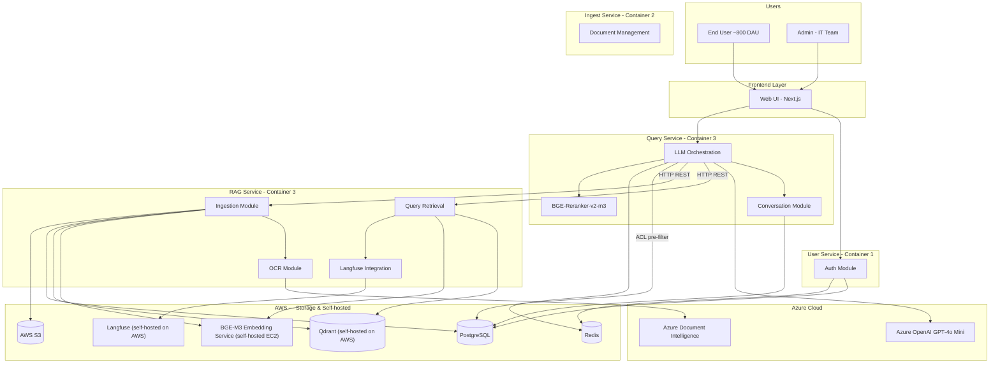
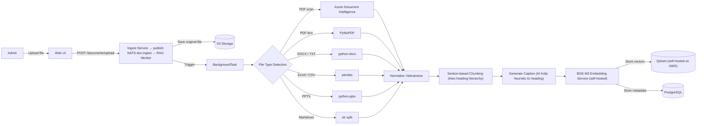
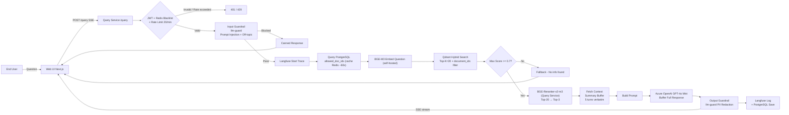
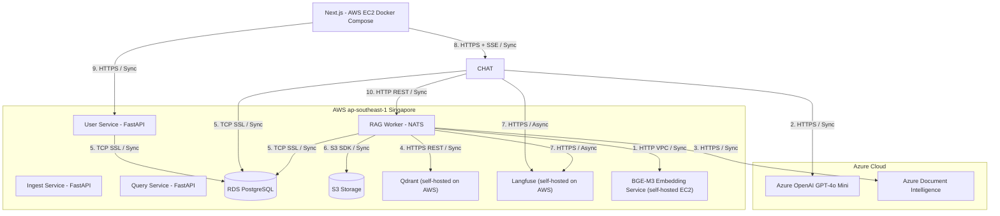
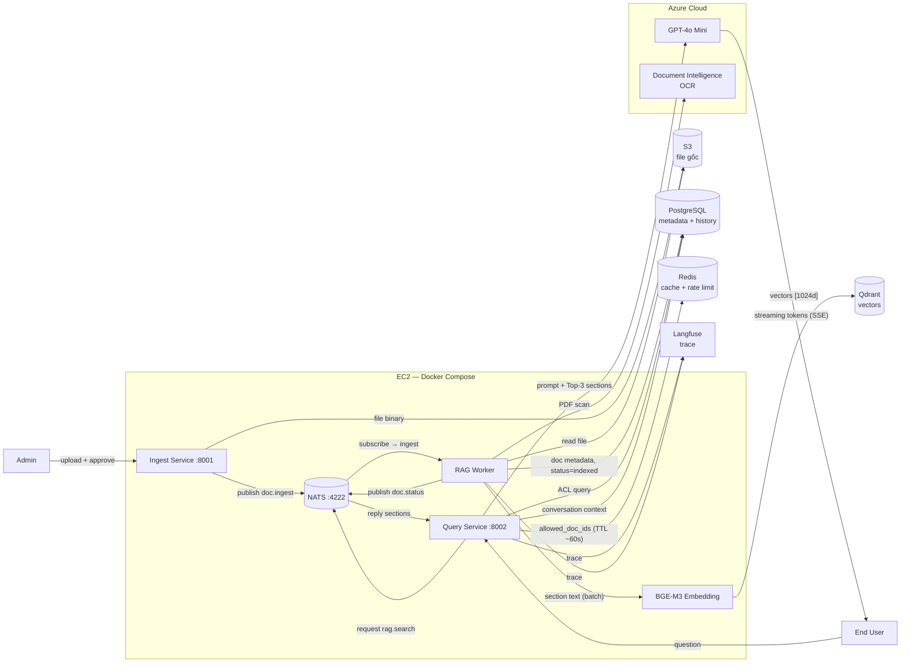
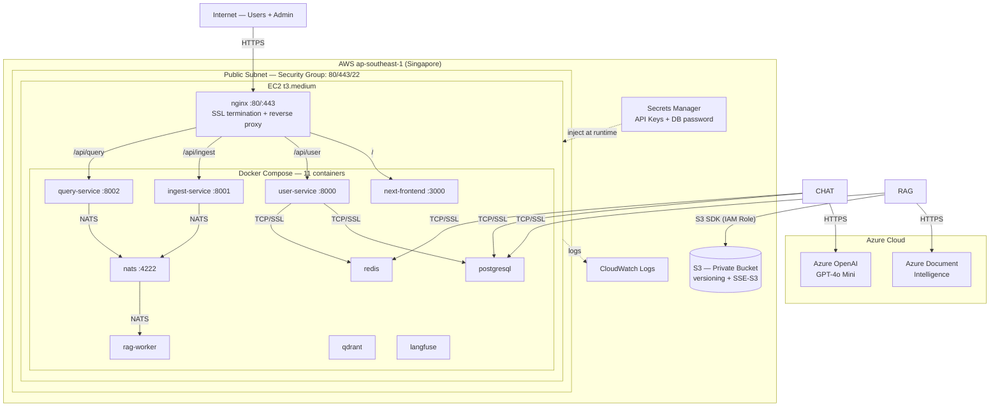

# SOLUTION ARCHITECTURE DOCUMENT

| **Thông tin** | **Chi tiết** |
|---------------|-------------|
| Tên hệ thống | RAG-based Internal Q&A Chatbot – VinSmartFuture |
| Phiên bản docs | 1.0 – MVP (Phase 1) |
| Tác giả (SA) | [Tên SA] |
| Ngày tạo | 2026-05-28 |
| Phase hiện tại | Phase 1 – MVP + Cloud Deploy (3 tuần) |
| Trạng thái | Draft – Living Document |

> _Đây là SA docs Phase 1. Hệ thống sẽ được evaluate cuối tuần 3 (Phase 1.5), sau đó cập nhật docs và phát triển tiếp. Docs này là living document — sẽ thay đổi theo từng phase._

**Lộ trình phát triển:**

| **Phase** | **Thời gian** | **Mục tiêu** | **Trạng thái** |
|-----------|--------------|-------------|---------------|
| Phase 1 – MVP + Cloud Deploy | Tuần 1–3 | Core RAG pipeline, OCR, auth (email/password + Microsoft SSO), guardrails, Redis, Semantic Cache, full AWS deploy | 🔨 Đang làm |
| Phase 1.5 – Evaluation Checkpoint | Cuối tuần 3 | Chạy RAGAS (5 metrics), load test, quyết định tiếp tục Phase 2 hay tune thêm | ⏳ Chờ |
| Phase 2 – Cải tiến & Tích hợp | Tuần 4–5 | Admin Dashboard nâng cao, Knowledge Gap Detection, Microsoft Teams Bot | ⏳ Chờ |

---

# 1. System Overview

**Thông tin cần có:**

## 1.1 Tên hệ thống

RAG-based Internal Q&A Chatbot System – Hệ thống chatbot hỏi-đáp nội bộ dựa trên tài liệu cho VinSmartFuture. Cho phép nhân viên đặt câu hỏi bằng ngôn ngữ tự nhiên và nhận câu trả lời chính xác từ thông tin nội bộ công ty.

## 1.2 Vấn đề giải quyết / Mục đích của hệ thống

VinSmartFuture (~4,000 nhân viên) sở hữu lượng lớn tài liệu nội bộ (quy trình, chính sách, kỹ thuật) nhưng việc tìm kiếm thông tin kém hiệu quả:

- **Tốn nhiều thời gian:** nhân viên mất 15–30 phút để tìm một thông tin đơn giản trong hàng trăm tài liệu.
- **Thiếu chính xác:** đọc sai tài liệu, dùng tài liệu cũ không được cập nhật.
- **Không có truy xuất nguồn:** không biết thông tin lấy từ tài liệu nào, phiên bản nào.
- **Không scale:** khi công ty lớn thêm, lượng tài liệu tăng, vấn đề trở nên nghiêm trọng hơn.
- **Không tra cứu được thông tin cá nhân HR nhanh:** nhân viên cần liên hệ phòng HR để hỏi số ngày nghỉ còn lại, trạng thái đơn nghỉ phép, thông tin lương — tốn thời gian cả 2 phía.

Hệ thống RAG Chatbot giải quyết bằng cách:

- Cho phép nhân viên hỏi bằng tiếng Việt / Anh, nhận câu trả lời chính xác có dẫn nguồn.
- Từ chối trả lời khi không tìm thấy thông tin — tránh hallucination.
- Xử lý được PDF text-based, PDF scan (OCR), DOCX, TXT, Excel, CSV.
- Trả lời câu hỏi cá nhân HR (ngày nghỉ, lương, đơn nghỉ phép) bằng Single Agent + Function Calling — không cần liên hệ HR department.

## 1.3 Đối tượng sử dụng

| **Đối tượng** | **Vai trò** | **Mô tả** |
|--------------|------------|----------|
| Nhân viên nội bộ | End User | Đặt câu hỏi về quy trình, chính sách, kỹ thuật. Upload tài liệu (chờ Admin approve). Ước tính ~800 DAU, peak ~150–200 concurrent users. |
| Quản trị viên | Admin | Upload tài liệu, quản lý index, xem audit log, theo dõi ingestion status. |
| IT/DevOps | Operator | Vận hành hệ thống trên AWS, xử lý sự cố, xem Langfuse dashboard. |

## 1.4 Thu thập & xử lý dữ liệu cá nhân

**Mục đích:** Xác định hệ thống/ứng dụng có thu thập, lưu trữ và xử lý dữ liệu cá nhân của khách hàng/nhân viên.

> Dữ liệu cá nhân được định nghĩa trong Luật Bảo vệ dữ liệu cá nhân hiện hành như sau:
>
> Dữ liệu cá nhân là dữ liệu số hoặc thông tin dưới dạng khác xác định hoặc giúp xác định một con người cụ thể, bao gồm: dữ liệu cá nhân cơ bản và dữ liệu cá nhân nhạy cảm:
> - **a.** Dữ liệu cá nhân cơ bản: quy định tại điều 3 Nghị định 356/2025/NĐ-CP
> - **b.** Dữ liệu cá nhân nhạy cảm: quy định tại điều 4 Nghị định 356/2025/NĐ-CP

**Lưu ý:**
- UserID, SalesforceID, DeviceID,… hoặc các ID là bản ghi định danh chủ thể dữ liệu trên các hệ thống mà có thể kết hợp với thông tin từ các hệ thống khác để xác định con người cụ thể → được coi là dữ liệu cá nhân.
- Dữ liệu cá nhân sau khi được mã hóa vẫn được coi là dữ liệu cá nhân (Luật Bảo vệ dữ liệu cá nhân 2025, điều 2).

- [ ] **Không:** Hệ thống hoàn toàn không xử lý dữ liệu cá nhân.
- [x] **Có:** Hệ thống có lưu/xử lý dữ liệu cá nhân (như tên, sđt, email, cccd, ...).
  - UserID / Email: xác định người dùng, lưu lịch sử hội thoại.
  - Lịch sử hội thoại: nội dung câu hỏi và câu trả lời theo từng user.
  - Audit Log: ghi nhận hành vi người dùng.

> **Lưu ý phạm vi dữ liệu trong đề tài này:**
>
> - **Tài liệu nội dung (documents được index):** Là **mock data** do mentor/giảng viên cung cấp, mô phỏng tài liệu nội bộ doanh nghiệp. **Không chứa dữ liệu cá nhân thật** của bất kỳ nhân viên hay tổ chức nào.
> - **Dữ liệu vận hành hệ thống:** Hệ thống vẫn thu thập UserID/Email và Conversation History của người dùng đăng nhập — dù trong demo là tài khoản test, thiết kế kiến trúc vẫn xử lý các trường này như personal data. Vì vậy chọn **"Có"** và bắt buộc hoàn thiện mục 7.2.

> Nếu **"Có"**, bắt buộc hoàn thiện mục **7.2 Data Privacy**.

## 1.5 Mức độ quan trọng của hệ thống

**Căn cứ** — Dev team căn cứ vào 4 yếu tố chính sau để đánh giá:
- **Tác động kinh doanh (Business Impact):** Nếu hệ thống dừng, doanh thu bị thiệt hại bao nhiêu?
- **Tác động người dùng (User Impact):** Có bao nhiêu người dùng bị ảnh hưởng? Trải nghiệm người dùng bị gián đoạn toàn phần hay một phần?
- **Tính cam kết (SLA/Compliance):** Có vi phạm cam kết mức độ dịch vụ (SLA) với khách hàng hoặc các quy định pháp lý/bảo mật không?
- **Luồng nghiệp vụ (Critical Path):** Hệ thống có nằm trên luồng nghiệp vụ cốt lõi không? Ví dụ: module Thanh toán là cốt lõi, module Gợi ý sản phẩm là bổ trợ.

**Các cấp độ:**

| **Cấp độ** | **Tên gọi** | **Mô tả** | **Ví dụ** |
|-----------|------------|----------|----------|
| Tier 1 | Mission Critical | Sống còn. Ngừng hoạt động gây thiệt hại tài chính cực lớn hoặc sụp đổ luồng nghiệp vụ chính ngay lập tức. | Payment, IAM |
| Tier 2 | Business Critical | Quan trọng. Ảnh hưởng lớn đến vận hành và trải nghiệm, nhưng có thể chịu đựng được trong một khoảng thời gian ngắn (vài phút). | Quản lý đơn hàng (Order), Giỏ hàng, Tìm kiếm |
| Tier 3 | Business Operational | Cần thiết. Ảnh hưởng đến hiệu quả công việc hoặc tính năng bổ trợ. Không làm gián đoạn luồng chính. | Gợi ý sản phẩm, Báo cáo nội bộ, Gửi Notification marketing |
| Tier 4 | Administrative | Phụ trợ. Các hệ thống nội bộ, thử nghiệm hoặc không có tác động trực tiếp đến khách hàng cuối. | Tool quản lý log nội bộ, Môi trường Sandbox, CMS tin tức |

**Đánh giá hệ thống RAG Chatbot:**

| **Yếu tố** | **Đánh giá** | **Lý luận** |
|-----------|-------------|-----------|
| Tác động kinh doanh | Thấp–Trung bình | Hệ thống hỗ trợ tra cứu nội bộ, không nằm trên luồng doanh thu. Downtime không gây thiệt hại tài chính trực tiếp. |
| Tác động người dùng | Trung bình–Cao | Phục vụ đa mục đích cho toàn bộ ~4,000 nhân viên (HR, IT, Kỹ thuật, Vận hành…). Tuy nhiên, **workaround tồn tại**: nhân viên có thể tự tìm tài liệu qua SharePoint/ổ chung, dù mất 15–30 phút thay vì < 60 giây. Downtime gây giảm năng suất đo được nhưng không block hoàn toàn công việc. |
| SLA / Compliance | Thấp | Không có cam kết SLA với khách hàng bên ngoài. Không xử lý luồng pháp lý bắt buộc. |
| Luồng nghiệp vụ cốt lõi | Không | Là công cụ hỗ trợ (support tool). Không nằm trên luồng thanh toán, đặt hàng, hay nghiệp vụ cốt lõi nào. Hệ thống có thể down mà công ty vẫn vận hành bình thường. |

**Tại sao không phải Tier 2?**
> Tier 2 yêu cầu hệ thống ảnh hưởng lớn đến vận hành và **không có workaround ngắn hạn**. RAG Chatbot đáp ứng diện rộng người dùng nhưng không thỏa mãn điều kiện này — nhân viên vẫn tự tra cứu được dù chậm hơn.

**Tại sao không phải Tier 4?**
> Hệ thống được thiết kế cho ~800 DAU (20% tổng nhân viên). Productivity loss có thể đo được (~13,000–26,000 phút/ngày toàn công ty khi down). Không phải tool thử nghiệm hay sandbox.

**→ Phân loại: Tier 3 – Business Operational**

## 1.6 Ước lượng tải

| **Chỉ số** | **Ước tính** | **Ghi chú** |
|-----------|-------------|-----------|
| Tổng nhân viên | ~4,000 người | Toàn công ty VinSmartFuture |
| Daily Active Users (DAU) | ~800 người/ngày | ~20% tổng nhân viên |
| Peak Concurrent Users | ~150–200 người | Giờ cao điểm 9–11h sáng |
| Queries per day | ~4,000–8,000 queries | ~5–10 câu/user/ngày |
| Tài liệu mock | ~15–20 tài liệu | PDF, DOCX, TXT, Excel, CSV – đa phòng ban |

---

# 2. Application Architecture

## 2.1 Application Architecture Diagram

> **Level 2** — Sơ đồ thể hiện cấu trúc các thành phần chính của đối tượng được thiết kế.
>
> _(Hình vẽ + Mô tả thành phần. Yêu cầu các thành phần mô tả phải khớp với sơ đồ)_

### Diagram 1 — Overall Architecture



> _Phase 1: Semantic Cache (Redis) đặt giữa Query Module và Qdrant. Phase 2 (Production Scale): SQS Queue thay thế BackgroundTasks cho Ingestion._

---

### Diagram 2 — Ingestion Pipeline (Async)



---

### Diagram 3 — Query Pipeline (Sync + Streaming)



### Danh sách các thành phần (Module)

| **STT** | **Tên Module** | **Mục đích** | **Phase** |
|--------|--------------|-------------|---------|
| 1 | Web UI (Next.js) | Giao diện chat streaming cho nhân viên + Admin Dashboard upload tài liệu. | ✅ MVP |
| 2 | User Service (FastAPI) | Microservice 1: Auth/JWT, user management, login. Issue JWT token khi login. Chia sẻ `JWT_SECRET_KEY` với Ingest Service, Query Service và RAG Worker để verify locally — không cần gọi lại User Service mỗi request. | ✅ MVP |
| 2b | Ingest Service (FastAPI) | Microservice 2: Admin document management — upload, approve, reject tài liệu. Lưu file lên S3, tạo record PostgreSQL. Sau khi Admin approve → publish NATS subject `doc.ingest`. Subscribe `doc.status` để cập nhật trạng thái ingestion từ RAG Worker. Chỉ Admin mới có quyền upload. | ✅ MVP |
| 2c | RAG Worker (Python/NATS) | Worker thuần NATS — không expose HTTP. Subscribe `doc.ingest` → chạy pipeline ingestion (OCR→chunk→embed→store Qdrant). Handle request-reply `rag.search` từ Query Service (embed query → hybrid search → trả sections). | ✅ MVP |
| 2d | Query Service (FastAPI) | Microservice 3: User chat — nhận câu hỏi, ACL check, publish NATS request `rag.search`, nhận sections, rerank, gọi LLM, stream SSE về frontend. Conversation history, feedback. Verify JWT locally. | ✅ MVP |
| 2e | NATS Message Broker | Message broker trung tâm: (1) Async ingestion — Ingest Service publish `doc.ingest`, RAG Worker subscribe. (2) Request-reply retrieval — Query Service request `rag.search`, RAG Worker reply. Port 4222. | ✅ MVP |
| 3 | OCR Module | Detect PDF scan → Azure Document Intelligence (OCR). PDF text-based → PyMuPDF (local). | ✅ MVP |
| 4 | Ingestion Module | Parse tài liệu (PDF/DOCX/TXT/Excel/CSV), normalize tiếng Việt, Section-based Chunking theo heading hierarchy, generate caption, embed, lưu Qdrant + PostgreSQL. | ✅ MVP |
| 5 | Query Module | Nhận query + allowed_doc_ids từ Query Service (qua NATS request-reply), embed câu hỏi, hybrid search Qdrant với document_ids filter, filter score threshold. Không rerank — Query Service tự rerank sau khi nhận kết quả. | ✅ MVP |
| 6 | Auth Module | Simple JWT authentication. 2 role: Admin và End User. | ✅ MVP |
| 7 | Conversation Module | Lưu/đọc lịch sử hội thoại từ PostgreSQL. Summary Buffer: LLM tóm tắt các turns cũ thành summary, giữ 5 turns gần nhất verbatim — hiểu đủ ngữ cảnh mà không tốn nhiều token. | ✅ MVP |
| 8 | Embedding Service | BGE-M3 Embedding Service (self-hosted trên AWS EC2). 1024 dims. Dùng cho cả ingestion và query. | ✅ MVP |
| 9 | LLM Service | Azure OpenAI GPT-4o Mini. Hỗ trợ streaming response. Data trong Azure tenant. | ✅ MVP |
| 10 | Langfuse Integration | Trace 2 luồng riêng biệt — (1) Ingestion trace: parse time, chunk count, embed time, error rate. (2) Query trace: latency từng bước, token cost, retrieved chunks + scores, feedback. RAGAS evaluation chạy offline Phase 1.5 (cuối tuần 3) trên Query trace data. | ✅ MVP |
| 11 | Vector DB (Qdrant (self-hosted on AWS)) | Lưu và tìm kiếm vector embedding. Metadata filtering theo document. | ✅ MVP |
| 12 | Metadata DB (RDS PostgreSQL) | Lưu document metadata, conversation history, user info, audit log. | ✅ MVP |
| 13 | Document Storage (S3) | Lưu file gốc sau khi upload. Ingestion module đọc từ đây để xử lý. | ✅ MVP |
| 13b | HR Data Module | Mock HR tables trong PostgreSQL: `hr_leave_balance` (ngày nghỉ còn lại), `hr_leave_requests` (trạng thái đơn), `hr_payroll_summary` (thông tin lương). Dùng cho Personal HR Q&A feature. | ✅ MVP |
| 14 | Semantic Cache (Redis) | Cache câu hỏi tương tự (cosine similarity > 0.95). Tiết kiệm ~60% Azure OpenAI API cost. | ✅ MVP |
| 15 | SQS Queue | Async ingestion queue có DLQ. Thay thế BackgroundTasks khi scale. | 🔄 Phase 2 |

### Thông tin dữ liệu – Phân loại bảo mật

**Phân loại cấp độ bảo mật dữ liệu:**

| **Cấp độ** | **Tên** | **Đặc điểm dữ liệu** | **Ví dụ trong hệ thống** | **Hình thức xử lý & Tiêu chuẩn** |
|-----------|--------|---------------------|------------------------|----------------------------------|
| L1 | 🟢 Public (Công khai) | Thông tin không gây hại nếu rò rỉ. Ai có account trên hệ thống đều xem được — kể cả đối tác, contractor bên ngoài. | Tài liệu onboarding, hướng dẫn sử dụng chung. | Không yêu cầu bảo mật đặc biệt. |
| L2 | 🟡 Internal (Nội bộ) | Dữ liệu phục vụ vận hành nội bộ. Chỉ toàn bộ nhân viên chính thức của công ty xem được. | Quy trình nội bộ, chính sách HR, tài liệu kỹ thuật, Audit Log. | Xóa tự động qua TTL, lưu trữ từ 1–2 năm. |
| L3 | 🟠 Secret (Bí mật nhóm) | Dữ liệu nhạy cảm. Chỉ một nhóm nhỏ được chỉ định theo phòng ban hoặc role xem được. | Báo cáo tài chính nội bộ, kế hoạch sản phẩm mới, hợp đồng đối tác. | Lưu trữ 5 năm, Soft delete trước khi Hard delete. |
| L4 | 🔴 Top Secret (Tuyệt mật) | Dữ liệu cực kỳ nhạy cảm. Chỉ 1 người cụ thể — thường là người upload tài liệu đó — xem được. | Hợp đồng cá nhân, tài liệu đàm phán nhạy cảm, dữ liệu lương cá nhân. | Mã hóa at-rest, không đưa vào Langfuse trace, xóa tức thì hoặc Cryptographic Erasure. |

**Danh mục dữ liệu hệ thống:**

| **Loại dữ liệu** | **Phân loại (Privacy Level)** | **Chiến lược lưu trữ** | **Chính sách bảo mật và logic** |
|----------------|------------------------------|----------------------|-------------------------------|
| Tài liệu nội bộ (PDF, DOCX, CSV...) | L2 – Internal | S3, vĩnh viễn đến khi xóa. | Phân loại 4 cấp: Public / Internal / Secret / Top Secret. Phase 1: lưu classification field. Phase 2: enforce Qdrant filter theo cấp bậc. |
| Vector Embedding | L2 – Internal | Qdrant (self-hosted on AWS), xóa khi tài liệu bị xóa. | API Key auth. HTTPS only. Không expose ngoài. |
| Conversation History | L2 – Internal | PostgreSQL, TTL 1 năm. Soft delete 30 ngày trước Hard delete. | Chỉ user sở hữu và Admin xem được. |
| UserID / Email nội bộ | L3 – Confidential | PostgreSQL, đến khi xóa tài khoản. | Mã hóa at-rest, masked trong log. |
| Audit Log | L2 – Internal | PostgreSQL 2 năm, Cold Storage sau 6 tháng. | Append-only, không chỉnh sửa được. |
| Langfuse Trace Data | L2 – Internal | Langfuse (self-hosted on AWS), không log nội dung nhạy cảm. | Trace data nằm trong VPC, không ra ngoài. |
| HR Leave Data (ngày nghỉ, đơn nghỉ phép) | L3 – Confidential | PostgreSQL, đến khi xóa tài khoản. | Chỉ user sở hữu xem được (filter user_id). Masked trong log. |
| HR Payroll Data (lương, khấu trừ) | L4 – Restricted | PostgreSQL, mã hóa at-rest. | Chỉ user sở hữu xem được. Không đưa vào Langfuse trace. Masked hoàn toàn trong log. |

## 2.2 Session Configuration

> Mục này mô tả cấu hình session cho từng chức năng hoặc toàn hệ thống, tùy theo mức độ nhạy cảm.
> - Phase 1 hỗ trợ cả Simple JWT (email/password) và Microsoft Account SSO (Azure AD qua msal). **Phase 1: MFA bắt buộc cho Admin (TOTP).** Phase 2: Conditional Access nâng cao.
> - Nếu cần chỉ rõ các chức năng đặc biệt cần session ngắn/dài khác nhau: đặt tại bảng dưới đây.

**Kịch bản 1: Sử dụng cấu hình mặc định**

Đối với các chức năng thông thường, hệ thống dùng Simple JWT với TTL cố định server-side.
- **Cơ chế:** JWT Token với TTL cấu hình tại FastAPI. Hết hạn → redirect về trang đăng nhập.
- **Thời gian mặc định:** 8 giờ

**Kịch bản 2: Cấu hình đặc thù cho chức năng nhạy cảm**

| **Nhóm chức năng / Module** | **Mức độ nhạy cảm** | **Session Timeout** | **Ghi chú / Hành động khi hết hạn** |
|---------------------------|-------------------|-------------------|-------------------------------------|
| Chat Interface (Q&A) | Thấp | 8 giờ (JWT TTL) | Redirect về trang đăng nhập. |
| Upload tài liệu – End User | Thấp–Trung bình | 8 giờ (JWT TTL) | Redirect về trang đăng nhập. Tài liệu đã submit vào pending queue vẫn được giữ. |
| Upload tài liệu – Admin | Cao | 30 phút inactivity | Auto logout nếu không có thao tác. |
| Admin – Xóa tài liệu / Re-index | Rất cao | 15 phút | Bắt buộc xác thực lại trước thao tác xóa. |

---

# 3. Feature List

| **STT** | **Nhóm chức năng** | **Mô tả** | **Phase** |
|--------|------------------|----------|---------|
| 1 | Document Management | End User upload tài liệu (PDF, DOCX, TXT, Excel, CSV, PPTX, Markdown, tối đa 50MB), chọn classification (Public / Internal / Secret / Top Secret). Status = Pending — chưa index. Admin review queue và Approve/Reject (kèm lý do). Sau khi Approve: Queued → Processing → Indexed / Failed. Admin upload trực tiếp không cần duyệt. Hỗ trợ xóa và re-index. | ✅ MVP |
| 2 | OCR – PDF scan | Tự động phát hiện PDF scan (không có text layer). Gọi Azure Document Intelligence để extract text + layout. PDF text-based dùng PyMuPDF (local). Output là text thuần để đưa vào pipeline. | ✅ MVP |
| 3 | Structured Data (Excel/CSV) | Excel: đọc từng sheet, convert rows sang text có header. CSV: parse với pandas, convert sang text. | ✅ MVP |
| 4 | Tiếng Việt Handling | Normalize Unicode NFC sau khi extract text. Fix encoding lỗi. Hỗ trợ tài liệu tiếng Việt và tiếng Anh lẫn lộn trong cùng file. | ✅ MVP |
| 5 | Q&A Chatbot – Policy/Document | Nhân viên nhập câu hỏi tiếng Việt / Anh về quy trình, chính sách, tài liệu kỹ thuật. Single Agent dùng RAG tool: embed câu hỏi → Qdrant search → LLM build answer. Response streaming – chữ xuất hiện dần. | ✅ MVP |
| 5b | Personal HR Q&A (Function Calling) | Trả lời câu hỏi cá nhân HR: ngày nghỉ còn lại, số ngày đã nghỉ, trạng thái đơn nghỉ phép, thông tin khấu trừ lương. Single Agent dùng HR tool: Function Calling query PostgreSQL HR tables. Luôn filter `WHERE user_id = current_user` — không thể xem data người khác. Phase 1: mock data. | ✅ MVP |
| 6 | Citation / Source Reference | Mỗi câu trả lời kèm nguồn tài liệu (tên file, trang/section). Người dùng click xem trích dẫn gốc. | ✅ MVP |
| 7 | Fallback – Không có thông tin | Nếu retrieval score < 0.7 → trả về "Không tìm thấy thông tin trong tài liệu nội bộ". Không gọi LLM – tiết kiệm cost, tránh hallucination. | ✅ MVP |
| 8 | Conversation History – Multi-turn | Lưu lịch sử hội thoại theo từng user. Summary Buffer: LLM tóm tắt các turns cũ, giữ 5 turns gần nhất verbatim. Câu hỏi sau luôn hiểu đủ ngữ cảnh mà không tốn nhiều token. | ✅ MVP |
| 9 | Authentication | Login bằng email/password hoặc Microsoft Account (SSO via Azure AD). JWT token TTL 8 giờ, blacklist trong Redis khi logout. 2 role: Admin và End User. | ✅ MVP |
| 10 | Admin Dashboard | **MVP:** Xem danh sách tài liệu đã index (trạng thái, ngày upload, số chunk). Xem và xử lý Pending documents queue (Approve / Reject kèm lý do). Xem ingestion status real-time. Upload và xóa tài liệu. Xem usage metrics cơ bản. **Phase 2:** Tổng số câu hỏi theo ngày/tuần, tỉ lệ feedback tốt/xấu, top 10 câu hỏi được hỏi nhiều nhất, danh sách câu hỏi bot không trả lời được (retrieval score < 0.7 — dùng để phát hiện Knowledge Gap). | ✅🔄 MVP + Phase 2 |
| 11 | Feedback Loop | Người dùng đánh giá câu trả lời (thumbs up/down). Lưu vào PostgreSQL và sync lên Langfuse để phân tích chất lượng. | ✅ MVP |
| 12 | Langfuse Observability | Trace toàn bộ LLM pipeline. Dashboard latency, token cost, RAGAS scores, feedback. IT/DevOps dùng để monitor và debug. | ✅ MVP |
| 13 | Semantic Cache | Cache câu hỏi tương tự (cosine similarity > 0.95). TTL 1 giờ. Tiết kiệm ~60% API cost. | ✅ MVP |
| 14 | Document Classification & Access Control | Admin chọn classification khi upload. **ACL pre-filter:** Query Service decode JWT → query PostgreSQL `rag_svc.documents` → lấy `allowed_doc_ids` user được phép đọc → truyền vào NATS request `rag.search` dưới dạng `document_ids` filter. RAG Worker chỉ search trong các doc đó — unauthorized data không rời khỏi Qdrant. `document_ids=None` mặc định chỉ search public docs (fail-secure). Kết quả cache Redis TTL ~60s. | ✅ MVP |

> **Định nghĩa 4 cấp phân loại tài liệu:**
>
> | Cấp bậc | Người được xem | Ví dụ áp dụng |
> |---------|---------------|--------------|
> | 🔴 Top Secret | Chỉ 1 người cụ thể — thường là người upload tài liệu đó | Hợp đồng cá nhân, tài liệu đàm phán nhạy cảm |
> | 🟠 Secret | Một nhóm nhỏ được chỉ định (theo phòng ban hoặc role) | Báo cáo tài chính nội bộ, kế hoạch sản phẩm mới |
> | 🟡 Internal | Toàn bộ nhân viên chính thức của công ty | Quy trình nội bộ, chính sách HR, tài liệu kỹ thuật |
> | 🟢 Public | Ai có account trên hệ thống (kể cả đối tác, contractor bên ngoài) | Tài liệu onboarding, hướng dẫn chung |

| 15 | SSO – Microsoft Account | Đăng nhập bằng Microsoft Account (Azure AD via msal). Cùng hệ sinh thái với Microsoft Teams Bot Phase 2. Phase 1: MFA bắt buộc cho Admin (TOTP). Phase 2: Conditional Access policy nâng cao. | ✅ Phase 1 |
| 16 | Multi-Agent Architecture | Upgrade từ Single Agent lên Multi-Agent nếu có nhu cầu xử lý câu hỏi phức tạp đa nguồn. | 📋 Phase 4 |
| 17 | Microsoft Teams Bot Integration | Nhân viên hỏi bot trực tiếp trong Teams (DM hoặc mention trong channel), không cần mở tab mới. Kỹ thuật: `botbuilder-python` (Microsoft Bot Framework) — cùng hệ sinh thái Azure AD đã dùng cho SSO. | 🔄 Phase 2 |

### Feature 14 — Định nghĩa 4 cấp phân loại tài liệu

> Áp dụng cho Feature 14: Document Classification & Access Control. Uploader chọn khi upload. Phase 1 lưu field; Phase 2 enforce filter.

| **Cấp bậc** | **Người được xem** | **Ví dụ áp dụng** |
|------------|------------------|-----------------|
| 🔴 Top Secret | Chỉ 1 người cụ thể — thường là người upload tài liệu đó | Hợp đồng cá nhân, tài liệu đàm phán nhạy cảm |
| 🟠 Secret | Một nhóm nhỏ được chỉ định (theo phòng ban hoặc role) | Báo cáo tài chính nội bộ, kế hoạch sản phẩm mới |
| 🟡 Internal | Toàn bộ nhân viên chính thức của công ty | Quy trình nội bộ, chính sách HR, tài liệu kỹ thuật |
| 🟢 Public | Ai có account trên hệ thống (kể cả đối tác, contractor bên ngoài) | Tài liệu onboarding, hướng dẫn chung |

---

# 4. Integration Architecture

> Sơ đồ này thể hiện đối tượng được thiết kế đang tích hợp thế nào với các đối tượng xung quanh.
>
> **Lưu ý:** Không thể hiện các tích hợp nội bộ của các thành phần L2.

## 4.1 Integration Topology



> _Số thứ tự trên connection line tương ứng với STT trong bảng 4.2 bên dưới._

## 4.2 Danh sách Interfaces

| **STT** | **Endpoint** | **From** | **To** | **Method** | **Data** |
|--------|-------------|---------|-------|-----------|---------|
| 1 | BGE-M3 Embedding Service | RAG Service / Ingestion + Query Module | BGE-M3 (self-hosted trên AWS EC2) | HTTP nội bộ (VPC) – Sync | Child chunk text → vector [1024 dims]. Không gọi external API. Retry 3 lần khi timeout. |
| 2 | Azure OpenAI Chat Completion API | Query Service / LLM Orchestration | Azure OpenAI GPT-4o Mini | HTTPS/TLS – Sync, Streaming | Full prompt → streaming tokens. Data ở trong Azure tenant. API Key qua Secrets Manager. |
| 3 | Azure Document Intelligence API | RAG Service / OCR Module | Azure Document Intelligence | HTTPS/TLS – Sync | PDF scan image → extracted text + layout. Chỉ gọi khi phát hiện PDF scan. |
| 3b | PyMuPDF | RAG Service / OCR Module | Local processing (không gọi API) | In-process | PDF có text layer → extract text trực tiếp. Nhanh, miễn phí. |
| 4 | Qdrant REST API | RAG Service / Query + Ingestion Module | Qdrant (self-hosted on AWS) | HTTPS / REST | Upsert vectors khi ingest (payload: section_id, document_id, classification, heading_path). Hybrid search Top-K=20 (vector + BM25 via RRF) với document_ids filter khi query. API Key auth. |
| 5 | RDS PostgreSQL | User Service / Ingest Service / Query Service / RAG Worker | AWS RDS PostgreSQL 15 | TCP/SSL | User Service: user data. Ingest Service: document metadata. Query Service: conversation history. RAG Worker: audit log. SSL required. |
| 6 | AWS S3 SDK | RAG Service / Ingestion Module | AWS S3 (Private Bucket) | HTTPS / S3 SDK | PUT file gốc khi ingest. GET để xử lý. IAM Role-based access. |
| 7 | Langfuse SDK | Query Service + RAG Worker | Langfuse (self-hosted on AWS) | HTTP nội bộ (VPC) | Query Service: LLM trace. RAG Worker: ingestion + retrieval trace. Trace data không ra ngoài AWS. |
| 8 | Frontend → Ingest Service | Next.js (AWS EC2) | Ingest Service (EC2) | HTTPS | REST API cho document management (Admin only). Nginx route /api/ingest → ingest-service:8001. |
| 8b | Frontend → Query Service | Next.js (AWS EC2) | Query Service (EC2) | HTTPS + SSE | REST API cho chat/query. Server-Sent Events cho streaming response. Nginx route /api/query → query-service:8002. |
| 9 | Frontend → User Service | Next.js (AWS EC2) | User Service (EC2) | HTTPS | REST API cho login, user management. Cùng EC2 — Nginx route /api/user → user-service:8000. |
| 10 | Query Service → RAG Worker (rag.search) | Query Service | RAG Worker | NATS request-reply | Query vector + document_ids → Top-20 sections. Query Service rerank nhận về bằng BGE-Reranker-v2-m3. |
| 11 | Ingest Service → RAG Worker (doc.ingest) | Ingest Service | RAG Worker | NATS publish/subscribe | Admin approve → publish `{ doc_id, s3_key, file_type, classification }` → RAG Worker trigger ingestion pipeline. |

---

# 5. Data Flow

## 5.1 Data Flow Diagram tổng quát

> Thông thường sử dụng sơ đồ L2.



## 5.2 Data Flow quan trọng

> **Xác định data flow quan trọng:**
> - Căn cứ vào mục 3 (Feature List): Làm rõ các feature quan trọng.
> - Làm rõ các xử lý nhằm đáp ứng thuộc tính kiến trúc quan trọng nhất (Security, Scalability, Availability, Performance, …).
>
> Trước mỗi data flow nên có tham chiếu tới mô hình L2 phù hợp. Tên các actor trong sequence diagram cần trùng với các thành phần trong sơ đồ tham chiếu.

### 5.2.1 Luồng Ingestion Pipeline (Async – NATS Worker)

_[Tham chiếu: Application Architecture Diagram – Level 2 – Ingestion Pipeline]_

> **Admin-only upload:** Chỉ Admin mới có quyền upload và quản lý tài liệu qua Ingest Service. End User chỉ dùng Query Service để hỏi.

| **Bước** | **Actor** | **Hành động** | **Dữ liệu** |
|---------|---------|-------------|-----------|
| 0 | Langfuse | Khởi tạo ingestion trace. | trace_id, doc_id, file_name, timestamp |
| 1 | Admin | Upload tài liệu qua Admin Dashboard. Chọn classification (public/internal/secret/top_secret). | File (PDF/DOCX/TXT/Excel/CSV/PPTX/MD, max 50MB) + classification |
| 2 | Ingest Service | Validate file type + size. Xác thực JWT (Admin only). | Authenticated request + file |
| 3 | Ingest Service | Upload file gốc lên AWS S3. | S3 key: `{doc_id}/{filename}` |
| 4 | Ingest Service | Tạo record document trong PostgreSQL, status: `queued`. Trả về 202 Accepted. | `{ doc_id, status: 'queued' }` |
| 4b | Ingest Service | Publish NATS subject `doc.ingest` với payload `{ doc_id, s3_key, file_type, classification }`. | NATS message |
| 5 | RAG Worker | Subscribe `doc.ingest` — nhận message, cập nhật status → `processing`, đọc file từ S3. | File binary từ S3 |
| 6 | OCR Module | Auto-detect PDF type: có text layer → PyMuPDF (local). Không có text layer → Azure Document Intelligence OCR. DOCX → python-docx. Excel → openpyxl, convert rows sang text có header. CSV → pandas. PPTX → python-pptx, extract text từng shape. Markdown → parse theo heading. | Raw text + metadata |
| 7 | Ingestion Module | Normalize tiếng Việt: Unicode NFC, fix encoding, collapse whitespace. | Cleaned text |
| 8 | Ingestion Module | Section-based Chunking theo heading hierarchy: PDF/DOCX/MD → theo heading; TXT → theo paragraph; XLSX → Header+RowGroup; CSV → Row-as-Document; PPTX → Slide-as-Section. Mỗi section là một đơn vị độc lập — không chia parent/child. | List of `{ section_id, section_content (Markdown), heading_path }` |
| 8b | Ingestion Module | Generate caption cho mỗi section: thử dùng LLM nếu có, fallback về heuristic từ heading đầu tiên của section. | section_id → caption |
| 9 | Embedding Service | Gọi BGE-M3 Embedding Service (self-hosted), batch embed section_content. | Section text → vector [1024 dims] |
| 10 | Qdrant (self-hosted on AWS) | Upsert vectors với payload: section_id, document_id, document_name, caption, heading_path, source_s3_uri, markdown_s3_uri, classification, ocr_confidence. | Vector + payload |
| 11 | PostgreSQL | Lưu document record: tên, S3 key, số section, status: `indexed`. | Document record |
| 12 | Langfuse | Log ingestion metrics: parse_time, chunk_count, embed_time, total_latency, status (success/failed). Error message nếu thất bại. | Ingestion trace data |
| 13 | RAG Worker | Publish NATS subject `doc.status` với `{ doc_id, status: 'indexed' \| 'failed', error? }`. | NATS message |
| 14 | Ingest Service | Subscribe `doc.status` — nhận kết quả, cập nhật PostgreSQL record. Admin thấy trạng thái realtime trên dashboard. | Document status update |

> _Nếu RAG Worker thất bại → publish `doc.status` với status `failed` → Ingest Service cập nhật DB → Admin thấy trên dashboard và retry thủ công._
>
> **⚠️ Risk — NATS (Phase 1):** NATS mặc định không persist message (in-memory). Nếu RAG Worker crash trước khi xử lý xong, message bị mất. Mitigation: enable NATS JetStream (persistent messaging) hoặc Phase 2 thay bằng AWS SQS + DLQ.

### 5.2.2 Luồng Query Pipeline (Sync – Streaming + Langfuse Trace)

_[Tham chiếu: Application Architecture Diagram – Level 2 – Query Pipeline]_

| **Bước** | **Actor** | **Hành động** | **Dữ liệu** |
|---------|---------|-------------|-----------|
| 1 | User | Nhập câu hỏi qua giao diện chat (max 500 ký tự). | Query text |
| 2 | FastAPI | Xác thực JWT (kiểm tra blacklist Redis). Kiểm tra rate limit Redis (20 req/phút/user). | Authenticated request |
| 3 | **Input Guardrail** (llm-guard) | Scan input: (1) Prompt injection detection, (2) Off-topic classifier — nếu fail → trả canned response ngay, không gọi LLM. | Pass / Block + lý do |
| 4 | Langfuse | Khởi tạo trace mới cho request này. | trace_id, user_id, timestamp |
| 5 | Query Module | Normalize tiếng Việt cho query. Embed bằng BGE-M3 Embedding Service (self-hosted). | Query vector [1024 dims] |
| 4b | Query Service | Query PostgreSQL `rag_svc.documents` → lấy `allowed_doc_ids` theo role/department của user. Cache kết quả trong Redis TTL ~60s. `None` nếu user chỉ có quyền public (fail-secure). | allowed_doc_ids list |
| 5b | Query Module | Query Rewriting: LLM sinh 3 variations của câu hỏi gốc → hybrid search cả 3 → kết hợp kết quả bằng Reciprocal Rank Fusion (RRF). Top-20 candidates. | 3 query variants + merged Top-20 results |
| 6 | RAG Worker / Qdrant | Query Service publish NATS request `rag.search` với `{ query_vector, document_ids, top_k: 20 }`. RAG Worker hybrid search Qdrant (vector + BM25), filter `document_ids`, reply kết quả. Top-K=20 candidates vượt ngưỡng score 0.5. | List of `{ section_id, section_content, caption, heading_path, score, ... }` |
| 7 | Query Service | Kiểm tra score threshold: max score < 0.7 → trả fallback, không gọi LLM. | "Không tìm thấy thông tin trong tài liệu nội bộ" |
| 7b | Query Service / BGE-Reranker-v2-m3 | Rerank Top-20 sections theo độ liên quan với query gốc. Trả về Top-3 sections để đưa vào LLM prompt. | Top-3 section_content (Markdown) |
| 8 | PostgreSQL | Lấy conversation context: summary các turns cũ + 5 turns gần nhất verbatim (Summary Buffer). | Conversation context |
| 9 | Query Module | Build prompt: System prompt + Conversation context + Top-3 section_content (Markdown) + Question. | Full prompt (~2000–4000 tokens) |
| 10 | LLM Service | Gọi Azure OpenAI GPT-4o Mini streaming. Buffer full response trước khi qua Output Guardrail. | Full response text |
| 11 | **Output Guardrail** (llm-guard) | Scan output: PII detection — redact nếu phát hiện thông tin cá nhân người khác. | Cleaned response |
| 12 | FastAPI | Forward response đã clean về frontend qua SSE streaming. | Streaming tokens |
| 13 | Langfuse | Log: latency từng bước, input/output tokens, retrieved chunks, scores, guardrail events. | Trace data (PII masked) |
| 14 | PostgreSQL | Lưu conversation turn: user_id, question, answer, sources, latency, timestamp. | Conversation record |
| 15 | Next.js | Hiển thị streaming response + citation + nút feedback cho user. | Rendered UI |

> **RAGAS Evaluation (Phase 1.5 — Offline, cuối tuần 3):**
> Phase 1 chỉ collect trace data (latency, token, retrieved chunks, scores). RAGAS chạy offline trong Phase 1.5 (cuối tuần 3) bằng cách:
> 1. Lấy sample queries từ Langfuse trace
> 2. Chuẩn bị ground truth thủ công (~20–30 câu hỏi + đáp án đúng)
> 3. Chạy RAGAS pipeline đo 5 metrics: Faithfulness, Answer Relevancy, Context Precision, Context Recall, Answer Correctness
> 4. Kết quả hiển thị trên Langfuse dashboard
>
> RAGAS chỉ áp dụng cho Query flow — không áp dụng cho Ingestion flow.

> **RAG Worker Failure — Circuit Breaker:** Query Service wrap NATS request `rag.search` bằng Circuit Breaker (`pybreaker`, fail_max=5, reset_timeout=30s).
> - **Closed** (bình thường): gọi RAG Worker qua NATS bình thường
> - **Open** (≥5 timeout/failure liên tiếp trong 60s): fail-fast, trả 503 ngay không chờ NATS timeout
> - **Half-Open** (sau 30s): cho 1 request thử — success → Closed, fail → Open lại
>
> Khi circuit Open: SSE `{ "error": true, "message": "Hệ thống tìm kiếm tài liệu tạm thời không khả dụng. Vui lòng thử lại sau ít phút." }`, HTTP 503. Log state change vào Langfuse + CloudWatch. `GET /health` trả `"rag_worker": "circuit_open"`.

## 5.3 Evaluation Criteria — Phase 1.5 (Cuối tuần 3)

> Đây là ngưỡng production tối thiểu. Nếu không đạt → investigate và tune trước khi tiếp tục Phase 2.

### Nhóm 1 — RAG Quality (RAGAS framework)

| Chỉ số | Ý nghĩa | Ngưỡng production |
|--------|---------|------------------|
| **Faithfulness** | Bot có bịa thông tin không có trong tài liệu không? | **≥ 0.90** |
| **Answer Relevance** | Câu trả lời có đúng trọng tâm câu hỏi không? | **≥ 0.85** |
| **Context Precision** | Chunks retrieve về có đúng không, hay lấy về nhiều đoạn rác? | **≥ 0.80** |
| **Context Recall** | Bot có tìm đúng đoạn tài liệu liên quan không? | **≥ 0.80** |
| **Answer Correctness** | Câu trả lời có đúng so với đáp án chuẩn (ground truth) không? | **≥ 0.80** |

### Nhóm 2 — Performance

| Chỉ số | Ý nghĩa | Ngưỡng production |
|--------|---------|------------------|
| **First token latency** | Thời gian đến khi streaming bắt đầu xuất hiện | **< 2 giây** |
| **P95 response latency** | 95% câu hỏi trả lời xong trong bao lâu | **< 8 giây** |
| **Concurrent users** | Bao nhiêu người dùng cùng lúc mà không giật lag | **≥ 50 users** |

### Nhóm 3 — Safety & Reliability

| Chỉ số | Ý nghĩa | Ngưỡng production |
|--------|---------|------------------|
| **Hallucination rate** | % câu trả lời có thông tin bịa không có trong nguồn | **< 5%** |
| **Graceful rejection rate** | Khi không có tài liệu liên quan, bot có nói "không biết" không? | **≥ 95%** |
| **Access control accuracy** | Bot có trả nhầm tài liệu restricted cho người không có quyền không? | **100%** |

### Nhóm 4 — Business Metrics

| Chỉ số | Ý nghĩa | Ngưỡng mục tiêu |
|--------|---------|----------------|
| **User satisfaction rate** | % câu hỏi được thumbs up | **≥ 70%** |
| **Answerable rate** | % câu hỏi bot trả lời được (không phải "không tìm thấy") | **≥ 80%** |
| **Weekly active users** | Số người dùng trong 1 tuần / tổng nhân viên | **≥ 30%** |

**Kết quả evaluation quyết định bước tiếp theo:**

```
Nhóm 1–2 đạt ngưỡng? ──Yes──→ Tiếp tục Phase 2 bình thường
      ↓ No
Investigate nguyên nhân:
  - Faithfulness thấp → prompt engineering, giảm hallucination
  - Context score thấp → tune chunk size / overlap / top-k
  - Latency cao → optimize embedding batch, caching
  - Vẫn không cải thiện → thử Hybrid Search (dense + BM25 keyword)
```

---

# 6. Deployment Architecture

## 6.1 Deployment Diagram



**Hình vẽ kiến trúc triển khai cần có:**
- Loại hạ tầng: **Cloud (AWS ap-southeast-1 Singapore)** — toàn bộ stack trên AWS, không dùng dịch vụ bên ngoài.
- Network Topology: EC2 trong Public Subnet với Security Group chặt. RDS trong Private Subnet, chỉ EC2 truy cập được.
- Entry từ Internet: HTTPS → Nginx (EC2) → route theo path: `/` → Next.js frontend, `/api/*` → backend services.
- Các server / container: 1 EC2 t3.medium chạy Docker Compose với 11 containers: nginx, next-frontend, User Service, Ingest Service, Query Service, RAG Worker, NATS, Qdrant, Redis, Langfuse, PostgreSQL.
- Mapping service/module → node: User Service (port 8000) + Ingest Service (port 8001) + Query Service (port 8002) + RAG Worker (no port) + NATS (port 4222) trên EC2. RDS/S3 là managed cloud services. Phase 2 (Production Scale) tách sang ECS Fargate riêng.
- Database: RDS PostgreSQL Single-AZ (MVP), S3 với versioning.
- Quản lý truy cập: SSH vào EC2 chỉ từ IP cố định (port 22). AWS Secrets Manager inject API Keys runtime.

**Thông tin cần có:**

| **Thành phần** | **Service** | **Ghi chú** |
|--------------|-----------|-----------|
| Web UI (Next.js) | AWS EC2 (Docker Compose) | Container trong cùng EC2, Nginx route `/` → next-frontend:3000. Toàn bộ traffic nằm trong AWS — không có CORS. |
| Backend (FastAPI + NATS Worker) | AWS EC2 t3.medium (4GB RAM) | Docker Compose. 4 backend components: User Service (port 8000), Ingest Service (port 8001), Query Service (port 8002), RAG Worker (no HTTP port). NATS broker (port 4222, internal only). Public IP với Security Group: chỉ mở 80/443/22. |
| Cache / Rate Limit | Redis 7 (Docker Compose) | JWT blacklist (logout thật sự) + per-user rate limiting. |
| Vector DB | Qdrant (self-hosted on AWS) | Docker container trên EC2. Dữ liệu nằm trong VPC — không ra ngoài. |
| Database | AWS RDS PostgreSQL 15 (db.t3.micro) | Managed. Automated backup 7 ngày. Single-AZ cho MVP. |
| File Storage | AWS S3 (Private Bucket) | Lưu tài liệu gốc. Versioning bật. SSE-S3 encryption. |
| Tracing | Langfuse (self-hosted on AWS) | Docker container trên EC2. Dashboard latency, RAGAS, cost. Trace data nằm trong VPC. |
| Secret Management | AWS Secrets Manager | Azure OpenAI Key, Azure Document Intelligence Key, BGE-M3/Reranker URL, DB password, Langfuse Key. Inject vào EC2 lúc runtime. |
| SSL/TLS | Let's Encrypt (Nginx reverse proxy) | HTTPS cho FastAPI endpoint. HTTP redirect sang HTTPS. |

**Diễn giải giải pháp High Availability:**

> _MVP dùng kiến trúc đơn giản: 1 EC2 chạy Docker Compose. Không có HA tự động ở MVP. Phase 2 (Production Scale) nâng lên ECS Fargate (min 2 tasks, auto-scale), RDS Multi-AZ, AWS ALB + WAF._

| **Thành phần** | **MVP (Phase 1)** | **Phase 2 (Production Scale)** |
|--------------|-----------------|------------------------|
| Backend | 1 EC2 t3.medium, Docker Compose (3 services) | ECS Fargate, min 2 tasks/service, auto-scale |
| Database | RDS Single-AZ db.t3.micro | RDS Multi-AZ + Read Replica |
| Vector DB | Qdrant (self-hosted on AWS) — 1 container Docker Compose | Qdrant cluster riêng trên ECS (nhiều replica, persistent volume) |
| Ingestion | NATS Worker (self-hosted, in-memory) | AWS SQS + Worker Service riêng (persistent, DLQ) |
| Cache | Redis (self-hosted EC2) – Semantic Cache | Redis ElastiCache (managed, auto-scaling) |
| Load Balancer | Nginx trên EC2 | AWS ALB + WAF |
| Tracing | Langfuse (self-hosted on AWS) — Docker Compose | Langfuse cluster riêng trên ECS (Phase 2 Production Scale) |
| Monitoring | CloudWatch basic | CloudWatch + Grafana + PagerDuty |

### 6.1.1 Thành phần lưu trữ dữ liệu

| **Thành phần (Component)** | **Công nghệ (Technology Stack)** | **Thông số & Lưu trữ (Spec / Retention)** | **Kiểm soát Hạ tầng (Infra Control)** |
|--------------------------|-------------------------------|------------------------------------------|--------------------------------------|
| Vector Database | Qdrant (self-hosted on AWS) | Lưu trữ vĩnh viễn. Xóa khi tài liệu bị remove. Snapshot hàng ngày 03:00 AM, lưu 7 ngày. | API Key auth. HTTPS only. |
| Metadata Database | PostgreSQL 15 (RDS) | Conversation: 1 năm TTL. Document metadata: vĩnh viễn. Automated backup 7 ngày + PITR 5 phút. | At-rest encryption. SSL connection. Chỉ EC2 truy cập qua Security Group. |
| Document Storage | AWS S3 (Private Bucket) | File gốc lưu vĩnh viễn đến khi admin xóa. Versioning bật. | IAM Role: chỉ EC2 có quyền PUT/GET. SSE-S3 encryption. Không public access. |
| Centralized Logging | CloudWatch Logs | Log nóng 30 ngày. | TLS transport. PII masking tại application layer trước khi ghi log. |

## 6.2 CI/CD Architecture

| **Hạng mục** | **Giải pháp** | **Ghi chú** |
|-------------|-------------|-----------|
| Source Control | GitHub | Branch: main (prod), develop, feature/* |
| CI Pipeline | GitHub Actions | Trigger: PR → develop. Chạy unit test, lint, type check. |
| Security Gate (DevSecOps) | Gitleaks (secret scan) + Trivy (container vuln scan) | Block merge nếu phát hiện secret trong code hoặc CVE critical. |
| Testing | pytest (unit) → Integration test với test DB | Phase 2 bổ sung E2E + Performance test (Locust). |
| Artifact & Versioning | Docker Image – AWS ECR, tag = commit SHA | Immutable tag. Không overwrite tag đã publish. |
| Config & Environment Parity | .env.example versioned, secrets qua Secrets Manager | Không lưu secret trong .env hay source code. |
| Secret Management | AWS Secrets Manager → inject lúc runtime | Rotation tự động cho Database Credentials. Least-privilege IAM Role. |
| Deployment Strategy | GitHub Actions → SSH vào EC2 → `docker compose pull && docker compose up -d` | Manual trigger cho MVP. Phase 2 (Production Scale) dùng ECS rolling deploy. |
| Rollback & DB | `docker compose up image:previous-sha` + Alembic rollback migration | Playbook rollback thực hiện < 5 phút. |
| Observability & Post-deploy | CloudWatch Logs + Langfuse Dashboard | Smoke test 10 câu hỏi mẫu sau mỗi deploy. |
| Governance & Audit | Manual approval trước khi deploy lên main/production | Phase 2 thêm audit trail tự động (who/when/what deployed). |

## 6.3 Tech Stack

| **Hạng mục** | **Công nghệ** | **Lý do chọn** |
|-------------|-------------|--------------|
| Frontend | Next.js 14 + TypeScript + TailwindCSS | Production-ready, streaming response tốt qua SSE, container hóa dễ với Docker. |
| Backend | Python 3.11 – FastAPI | Async native, hệ sinh thái AI/ML tốt nhất, phát triển nhanh. |
| Architecture | Microservices + Event-driven (NATS) | User Service + Ingest Service + Query Service + RAG Worker. HTTP REST cho user-facing. NATS cho internal async (ingestion) và request-reply (retrieval). JWT verify locally bằng shared secret. Mỗi service dùng Clean Architecture nội bộ. |
| LLM Orchestration | LlamaIndex | RAG-focused, ít boilerplate hơn LangChain, dễ học. |
| Embedding Model | BGE-M3 (self-hosted trên AWS EC2) | Không gọi API ngoài, 1024 dims, đa ngôn ngữ tốt, zero latency khi scale nội bộ. Dùng trong RAG Service (ingestion + query). |
| Reranking Model | BGE-Reranker-v2-m3 (self-hosted, trong Query Service) | Cross-encoder rerank Top-20 sections → Top-3 trước khi đưa vào LLM prompt. Thuộc Query Service — AI Engineer implement trong `RerankService`. |
| LLM | Azure OpenAI GPT-4o Mini | Data trong Azure tenant, không đi qua OpenAI public API. Đảm bảo compliance cho doanh nghiệp. |
| OCR PDF scan | Azure Document Intelligence | Bảo mật (trong Azure tenant), chất lượng cao cho tiếng Việt, hỗ trợ bảng + layout phức tạp. |
| OCR PDF văn bản | PyMuPDF (local) | Nhanh, miễn phí, không cần OCR khi PDF đã có text layer. |
| DOCX Parser | python-docx | Standard library cho DOCX. |
| Excel/CSV Parser | openpyxl + pandas | openpyxl đọc .xlsx; pandas convert rows sang text có header. |
| PPTX Parser | python-pptx | Đọc slides, extract text từng shape. |
| Markdown Parser | built-in (str split) | Markdown là plain text — parse trực tiếp, không cần thư viện. |
| Vietnamese NLP | unicodedata (NFC normalize) | Chuẩn hóa dấu tiếng Việt, không cần thêm thư viện nặng. |
| Vector Database | Qdrant (self-hosted on AWS) | Self-hosted trong VPC, dữ liệu không ra ngoài, metadata filtering. |
| Metadata Database | PostgreSQL 15 (AWS RDS) | ACID, reliable, conversation history, audit log. |
| File Storage | AWS S3 | Durable, rẻ, tích hợp tốt với EC2 qua IAM Role. |
| Observability | Langfuse (self-hosted on AWS) (free tier) | Trace LLM pipeline, RAGAS scores, latency, cost. Dashboard cho IT/DevOps. |
| Authentication & Authorization | JWT (python-jose) + Microsoft SSO (msal) + Redis blacklist | Email/password hoặc Azure AD SSO. JWT blacklist trong Redis cho logout thật sự. |
| Guardrails | llm-guard | Input: prompt injection detection + off-topic classifier. Output: PII redaction. Chạy local, không gọi API ngoài. |
| Cache & Rate Limit | Redis 7 | JWT blacklist (logout) + per-user rate limiting (20 req/phút). |
| CI/CD | GitHub Actions | Free, tích hợp tốt với GitHub, đủ cho MVP. |
| DevSecOps Tools | Gitleaks + Trivy | Secret scan + container vulnerability scan. |
| Secret Management | AWS Secrets Manager | API keys, DB password. Inject vào runtime, không lưu trong code. |
| Monitoring & Logging | CloudWatch Logs + Langfuse | CloudWatch cho infrastructure. Langfuse cho LLM pipeline. |
| Deployment Environment | AWS EC2 t3.medium + Docker Compose | Đơn giản, dễ setup, đủ scale cho MVP và evaluation. |

---

# 7. Security

> **Yêu cầu ANBM cần tuân thủ:** Security Compliance Requirements from VinSOC

## 7.1 Security Layers

### 7.1.1 Infrastructure & Network Security

**Phạm vi:** Các lớp phòng thủ vòng ngoài và quản lý hạ tầng vật lý/ảo hóa.

- **Network Security:** Security Groups EC2 chỉ mở port 80/443 (Nginx) và 22 (SSH từ IP cố định). RDS Security Group chỉ accept từ EC2 Security Group.
- **Hạn chế Automated Attacks & Bot:** Rate Limiting 20 request/phút/user cho `/query` endpoint (LLM call) tại FastAPI middleware. Phase 2 bổ sung WAF + Bot Detection tại AWS ALB.
- **Kiểm soát lưu lượng request:** Max 500 ký tự cho query. Max 50MB cho file upload. Validate file type (PDF/DOCX/TXT/Excel/CSV).
- **Quản lý bí mật (Secrets Management):** Azure OpenAI Key, Azure Document Intelligence Key, BGE-M3/Reranker URL, Langfuse Key, DB password lưu trong AWS Secrets Manager. Không lưu secret trong mã nguồn hay .env file. Rotation tự động định kỳ.

> _Bổ sung chi tiết cấu hình cho hệ thống:_
> - S3 Bucket Policy: chỉ EC2 IAM Role có quyền PUT/GET. Block Public Access bật.
> - Qdrant (self-hosted on AWS): API Key authentication. HTTPS only.
> - HTTPS Only: Nginx terminate SSL. HTTP redirect sang HTTPS. Let's Encrypt certificate.
> - **SSL Certificate Auto-renewal:** Let's Encrypt cert hết hạn sau 90 ngày. Certbot cron trên EC2: `0 2 * * * certbot renew --quiet && nginx -s reload`. Chạy daily lúc 2 AM — certbot chỉ gia hạn khi cert còn < 30 ngày. Không cần manual renew.

### 7.1.2 Identity & Access Management

**Phạm vi:** Quản lý vòng đời tài khoản, chính sách xác thực và phân quyền.

**Authentication:**
- **Nguyên tắc:** Simple JWT + Refresh Token (Phase 1). Phase 2 upgrade lên OIDC/OAuth2 tích hợp SSO nội bộ.
- **Chính sách mật khẩu:** Password hash bằng bcrypt. Không lưu plaintext password. Yêu cầu mật khẩu tối thiểu 8 ký tự, có chữ hoa, số.

**Authorization:**

**A. Nguyên tắc**

- **NT 1:** Tất cả các điểm truy cập đều cần thực hiện xác thực JWT. Endpoint không có token hợp lệ → 401 Unauthorized.
- **NT 2:** Mọi yêu cầu thay đổi dữ liệu (POST, PUT, DELETE) hoặc truy cập dữ liệu nhạy cảm (GET) đều phải được thực thi kiểm tra quyền hạn tại tầng FastAPI Backend. Các kiểm tra phía Client chỉ nhằm mục đích tối ưu trải nghiệm người dùng (ẩn/hiện nút bấm).
- **NT 3:** MVP dùng 2 role hardcode (Admin, End User). Phase 1: MFA bắt buộc cho Admin (TOTP). Phase 2: Document-level Access Control theo phòng ban + SSO nâng cao.

**B. Ma trận phân quyền (RBAC Matrix)**

> Nguyên tắc đặc quyền tối thiểu (Least Privilege): Mọi Role mặc định là bị từ chối, chỉ những chức năng được tích trong ma trận mới được phép truy cập.
>
> Ký hiệu chi tiết: **C** (Create) | **R** (Read) | **U** (Update) | **D** (Delete) | **✔** (Cho phép) | **✘** (Từ chối)

| **Chức năng (Function/Action)** | **Role: Admin** | **Role: End User** |
|-------------------------------|----------------|------------------|
| Đặt câu hỏi chat | ✔ | ✔ |
| Xem lịch sử chat cá nhân | ✔ | ✔ |
| Xem lịch sử chat tất cả users | ✔ | ✘ |
| Upload tài liệu (submit → pending queue) | ✔ | ✔ |
| Approve / Reject tài liệu (pending queue) | ✔ | ✘ |
| Xem ingestion status (tất cả tài liệu) | ✔ | ✘ |
| Xem status tài liệu mình upload | ✔ | ✔ |
| Xóa / Re-index tài liệu | ✔ | ✘ |
| Xem Audit Log | ✔ | ✘ |
| Quản lý user (cấp/thu hồi quyền) | ✔ | ✘ |

**Bảo vệ tài khoản:**
> Khóa account sau 5 lần sai mật khẩu liên tiếp, mở khóa tự động sau 15 phút hoặc Admin unlock thủ công. Log toàn bộ lần đăng nhập thất bại.

**Rotation:**
- **Đối với User:** JWT token hết hạn sau 8 giờ, yêu cầu login lại. Phase 2: định kỳ yêu cầu đổi mật khẩu qua SSO.
- **Đối với hệ thống (S2S):** AWS Secrets Manager tự động rotate API Keys/Secrets định kỳ để giảm thiểu rủi ro rò rỉ.

**Refresh Token (Phase 1):**
- Access Token TTL 8h. **Refresh Token TTL 7 ngày**, rotate-on-use (mỗi lần dùng cấp refresh token mới, invalidate cái cũ).
- Lưu refresh token hash trong PostgreSQL (`user_svc.refresh_tokens`) — không lưu raw token.
- Endpoint: `POST /auth/refresh` — nhận refresh token → trả access token mới + refresh token mới.
- Thu hồi: logout → xóa refresh token record. Xóa tài khoản → cascade xóa tất cả refresh tokens.

**MFA (Phase 1 — Admin only):**
- Admin account bắt buộc xác thực 2 lớp qua TOTP (Google Authenticator / Microsoft Authenticator).
- Setup: Admin lần đầu login sau enable MFA → quét QR code → nhập 6-digit TOTP code.
- End User: MFA optional (Phase 2 mở rộng nếu có nhu cầu).

### 7.1.3 Application Security & Data Protection

**Phạm vi:** Logic xử lý bên trong ứng dụng.

**Zero Trust cho hệ thống nội bộ (S2S Validation):**
- Dữ liệu từ các hệ thống nội bộ (System-to-System) phải được validate schema và xác thực định danh (thông qua IAM Role/Service Token) như một request từ bên ngoài. Không mặc định tin tưởng mạng nội bộ.
- Cụ thể: BackgroundTask validate file từ S3 trước khi xử lý; Query Module validate score từ Qdrant trước khi pass sang LLM.

**Data Masking:**
- **Trên UI:** Email hiển thị dạng `h***@company.com`. Không hiển thị raw user_id trong response.
- **Trên Log:** Tuyệt đối không log nội dung câu hỏi đầy đủ, email, password. Langfuse PII masking: mask email/UserID trước khi gửi trace data.

**Logging:**
- Thực hiện ghi log cho các hành vi trọng yếu (Who, Where, What) theo chuẩn Audit Log để phục vụ việc truy vết và giám sát.
- Log không thể bị chỉnh sửa tùy ý (Append-only, lưu trong PostgreSQL với constraint).

> _Bổ sung chi tiết logic bảo mật đặc thù cho hệ thống:_
> - **Prompt Injection Prevention:** Sanitize và escape user input. System prompt hardcode server-side, không lấy từ user input.
> - **Hallucination Control:** Retrieval score < 0.7 → trả fallback, không gọi LLM. LLM chỉ được dùng thông tin từ context chunks đã retrieve.
> - **CORS:** Frontend (Next.js :3000) và backend (FastAPI :8000/:8001/:8002) cùng EC2, traffic qua Nginx — không cross-origin. FastAPI CORS middleware: `allow_origins=["http://localhost:3000"]` local dev, production dùng domain nội bộ (vd: `https://chatbot.vinsmartfuture.vn`). Không dùng wildcard `*`.
> - **SQL Injection:** SQLAlchemy ORM với parameterized queries. Không dùng raw SQL string.

### 7.1.4 Governance & Compliance

**Phạm vi:** Các tiêu chuẩn quốc tế và quy định pháp lý.

- **Tiêu chuẩn ISO 27001:** Toàn bộ quá trình thiết kế, triển khai và vận hành hệ thống phải tuân thủ khung bảo mật thông tin theo tiêu chuẩn ISO 27001.
- **Quy định bảo vệ dữ liệu:** Đảm bảo hệ thống tuân thủ các quy định về bảo vệ dữ liệu cá nhân hiện hành (Nghị định 356/2025/NĐ-CP).

**Audit Log – Hành động bắt buộc ghi log:**

| **Đối tượng thực hiện (Who)** | **Hệ thống/Module phát sinh (Where)** | **Hành động bắt buộc ghi log (What)** |
|-----------------------------|-------------------------------------|--------------------------------------|
| End User | Auth Module | Đăng nhập thành công, Đăng xuất, Đăng nhập thất bại (kèm IP), Đổi mật khẩu. |
| End User | Query Module | user_id, timestamp, latency, doc_ids retrieved, feedback score (thumbs up/down). |
| End User | Ingestion Module | Upload tài liệu (tên file, size, classification) — ghi vào pending queue. Xem status tài liệu mình upload. |
| Admin | Ingestion Module | Approve / Reject tài liệu pending (kèm lý do). Upload tài liệu trực tiếp (tên file, size). Xóa tài liệu, Trigger re-index. |
| Admin | User Management | Cấp quyền Admin, Thu hồi quyền Admin. |
| System (BackgroundTask) | Ingestion Module | Ingestion start, success (số chunk), failure (error message). |
| System (Auth) | Auth Module | Account bị khóa do brute force (kèm IP). |

## 7.2 Data Privacy

> **Hướng dẫn:** Bắt buộc vì mục 1.4 chọn "Có".

| **Hạng mục** | **Thông tin** |
|-------------|-------------|
| Nhóm chủ thể dữ liệu | Nhân viên nội bộ VinSmartFuture (~4,000 người), Quản trị viên (~20 người) |
| Pháp nhân kiểm soát dữ liệu | VinSmartFuture – Việt Nam |
| Số lượng chủ thể dữ liệu | Nhân viên: ~4,000 người \| Quản trị viên: ~20 người |
| Nơi lưu trữ dữ liệu | AWS Singapore (ap-southeast-1): RDS, S3, EC2 (Qdrant + Langfuse + BGE-M3 self-hosted). Toàn bộ dữ liệu nội bộ và trace data nằm trong AWS VPC. Azure OpenAI (LLM call) và Azure Document Intelligence (PDF scan OCR) ra ngoài AWS nhưng trong Azure tenant — không transfer cross-border ra ngoài Azure. |
| Dung lượng dữ liệu lưu trữ | Conversation History: ~5–10 GB/năm. User metadata: < 1 GB. |
| Người tiếp nhận DSR | [Tên] – IT Department – xử lý yêu cầu xóa/truy xuất dữ liệu trong 72 giờ. |
| Thời gian lưu trữ | Conversation History: 1 năm TTL. Email: đến khi xóa tài khoản. Audit Log: 2 năm. |
| Cơ chế xóa | Soft delete → Hard delete sau 30 ngày. Hỗ trợ xóa theo DSR trong 72 giờ. |

**Lưu ý xử lý dữ liệu qua Third-party:**
- **Azure OpenAI:** LLM prompt (câu hỏi + context chunks) gửi đến Azure OpenAI trong cùng Azure tenant. Data Processing Agreement theo Microsoft Azure DPA. Data không rời khỏi Azure region được chọn.
- **Azure Document Intelligence:** Nội dung PDF scan gửi đến Azure Document Intelligence trong Azure tenant. Cùng Microsoft Azure DPA. Chỉ gọi khi phát hiện PDF scan — PDF text layer dùng PyMuPDF local, không gọi API ngoài.
- **Langfuse:** Self-hosted trên AWS EC2 — trace data không ra ngoài VPC. Vẫn cần mask PII trong trace content (question/answer text).

**Biểu đồ luồng dữ liệu cá nhân:**

> **[Diagram: Personal Data Flow]**
>
> Yêu cầu:
> - Thể hiện được các **dữ liệu cá nhân** (Email, Conversation History) trao đổi qua các hệ thống.
> - Luồng: User (VN) → FastAPI (AWS Singapore) → PostgreSQL RDS (AWS Singapore). Không có cross-border transfer dữ liệu PII chưa masked.
> - Langfuse (self-hosted on AWS) chỉ nhận trace data đã masked (không có PII thô).
> - Thể hiện rõ nơi đặt máy chủ: AWS ap-southeast-1 (Singapore).

## 7.3 Cost Controls

| Control | Cách thực hiện |
|---------|---------------|
| `max_tokens` per request | Hard-cap 1500 tokens mỗi LLM call trong Query Service — ngăn response quá dài tiêu tốn token |
| Azure OpenAI budget alert | Đặt alert trên Azure OpenAI dashboard khi đạt 80% ngân sách tháng |
| Daily token tracking | Log `prompt_tokens + completion_tokens` vào Langfuse mỗi request — dễ trace spike bất thường |
| Loop protection | Timeout 30s cho LLM call; không retry nếu lỗi 429 (rate limit Azure) để tránh call loop |
| AWS Budgets alert | Đặt AWS Budget theo tháng. Alert email khi đạt 80% — cover toàn bộ EC2 + RDS + S3 + data transfer + CloudWatch |
| AWS Cost Explorer | Review hàng tuần: kiểm tra EC2 runtime, RDS storage, S3 cost, CloudWatch log ingestion |

## 7.4 Failure Modes & Graceful Degradation

| Dependency | Failure | Behavior | User nhận được |
|------------|---------|----------|----------------|
| **RAG Worker** | Crash / NATS timeout | Circuit Breaker (fail_max=5, reset=30s). Circuit Open → fail-fast 503, không chờ NATS timeout. Query Service `/health` trả `"rag_worker": "circuit_open"`. | "Hệ thống tìm kiếm tài liệu tạm thời không khả dụng. Vui lòng thử lại sau ít phút." |
| **Azure OpenAI** | Timeout / 5xx | Timeout 30s, **không retry** (tránh loop cost). Trả 503 ngay. Log token count trước khi fail vào Langfuse. | "Hệ thống AI tạm thời không phản hồi. Vui lòng thử lại." |
| **PostgreSQL** | Unreachable | Tất cả services trả 503. Không có fallback — DB là critical path cho auth, ACL, conversation history. CloudWatch alarm khi connection pool cạn. | 503 — toàn bộ tính năng không khả dụng |
| **Redis** | Unreachable | **Fail-open**: service vẫn chạy. Rate limit bị tắt (chấp nhận được ngắn hạn). JWT blacklist mất tác dụng (logout token có thể dùng lại trong window còn lại). Log warning vào CloudWatch. | Không thông báo — service hoạt động bình thường nhưng degraded |
| **Qdrant** | Unreachable | RAG Worker bắt lỗi → reply NATS với error → Query Service circuit breaker xử lý tiếp. | Cùng message như RAG Worker crash |
| **BGE-M3 Embedding** | Unreachable | Ingestion fail → document status `failed`, Admin thấy trên dashboard. Query không bị ảnh hưởng (vector đã index rồi). | Admin: "Ingestion thất bại — embedding service không khả dụng" |
| **Langfuse** | Unreachable | **Fail silently** — trace call bọc trong try/except, lỗi chỉ log ra console. Không được làm gián đoạn request. | Không thông báo |
| **Azure Document Intelligence** | Unreachable | Ingestion fail với `error_message: "OCR service unavailable"`. Status → `failed`. Admin retry thủ công. | Admin: "Ingestion thất bại — OCR không khả dụng" |

> **Nguyên tắc:**
> - **Critical path** (PostgreSQL, Azure OpenAI): fail → 503, thông báo user rõ ràng
> - **Observability** (Langfuse): fail silently — không được kill request chính
> - **Cache / Rate limit** (Redis): fail-open — service degraded nhưng vẫn hoạt động
> - **Retry có chi phí** (Azure OpenAI): không retry, log và fail ngay
> - **Dependent service** (RAG Service, Qdrant): Circuit Breaker, fail-fast sau ngưỡng

## 7.5 Monitoring & Alerting

**CloudWatch Alarms (Phase 1):**

| Alarm | Metric | Threshold | Action |
|-------|--------|-----------|--------|
| High 5xx rate | HTTP 5xx từ Nginx access log | > 5% requests trong 5 phút | Email notify IT/DevOps |
| PostgreSQL connections | RDS DatabaseConnections | > 80% max_connections | Email notify dev team |
| EC2 CPU high | CPUUtilization | > 85% sustained 10 phút | Email notify IT/DevOps |
| EC2 disk usage | disk_used_percent | > 80% | Email notify IT/DevOps |
| Circuit Breaker Open | Custom metric (log từ Query Service) | Circuit state = Open | Email notify dev team |

**Application Error Tracking (Phase 1 — Sentry):**
- FastAPI exception handler → Sentry SDK (`sentry_sdk.init(dsn=...)`) — capture tất cả unhandled 500 errors với full stack trace.
- Dùng Sentry free cloud tier (50k errors/tháng đủ cho MVP) — không cần self-host thêm container.
- Sentry alert → Email tức thì khi có exception mới. IT/DevOps nhận alert không cần phải chủ động search CloudWatch.
- PII consideration: Sentry chỉ nhận exception context (stack trace, request path) — không log nội dung câu hỏi hay response LLM.

---

# 8. Backup & Recovery

| **Hạng mục** | **Thông tin** |
|-------------|-------------|
| Dữ liệu cần backup | PostgreSQL RDS (conversation history, document metadata, audit log), Qdrant (self-hosted on AWS) (vector data), AWS S3 (file tài liệu gốc) |
| Vị trí lưu backup | PostgreSQL: RDS automated backup (AWS managed, same region). S3: Versioning real-time. Qdrant: Snapshot hàng ngày. |
| Tần suất backup định kỳ | PostgreSQL: Automated daily backup + PITR mỗi 5 phút. Qdrant: Snapshot hàng ngày lúc 03:00 AM. S3: Versioning real-time. |
| Thời gian lưu backup | PostgreSQL: 7 ngày (Phase 1), 30 ngày (Phase 2). Qdrant snapshot: 7 ngày. S3: Versioning vĩnh viễn. |
| Quy trình Recovery | Xem chi tiết tại **8.1 Recovery Runbook** bên dưới. |
| RTO (Recovery Time Objective) | ≤ 4 giờ (Tier 3 – Business Operational) |
| RPO (Recovery Point Objective) | ≤ 5 phút cho PostgreSQL (PITR). ≤ 24 giờ cho Qdrant. |
| Cơ chế Disaster Recovery (DR) | Phase 1: RDS Single-AZ, failover thủ công (~1–2 giờ). Phase 2 (Production Scale): RDS Multi-AZ với tự động failover < 2 phút. |
| DR Test | Xem **8.2 DR Drill** bên dưới. |

### 8.1 Recovery Runbook (EC2 — Docker Compose)

**Bước 1 — Xác định scope sự cố**

```bash
# SSH vào EC2
ssh -i key.pem ubuntu@<ec2-public-ip>

# Kiểm tra container status
docker compose ps

# Xem log service lỗi (ví dụ query-service)
docker compose logs --tail=100 query-service

# Kiểm tra disk + memory
df -h && free -h
```

**Bước 2 — Dừng backend an toàn**

```bash
docker compose stop    # không dùng 'down' — giữ nguyên volume data
```

**Bước 3 — Restore PostgreSQL (nếu cần)**

```bash
# Restore từ RDS snapshot: AWS Console → RDS → Snapshots → Restore to new instance
# Hoặc PITR: Restore to point in time → chọn thời điểm trước sự cố

# Sau khi restore xong: cập nhật DB host trong Secrets Manager
# → Restart services sẽ tự pick up giá trị mới
```

**Bước 4 — Restore Qdrant (nếu cần)**

```bash
# Snapshot Qdrant được lưu tự động hàng ngày lúc 03:00 AM
# Khôi phục từ snapshot gần nhất:
docker compose stop qdrant
# Copy snapshot vào volume (snapshot lưu tại /qdrant/storage/snapshots)
docker compose start qdrant
# Verify: curl http://localhost:6333/collections
```

**Bước 5 — Verify & Restart**

```bash
docker compose up -d

# Smoke test health endpoints
curl http://localhost:8000/health   # User Service
curl http://localhost:8001/health   # Ingest Service
curl http://localhost:8002/health   # Query Service
curl http://localhost:8002/health   # RAG Service

# Chạy 10 câu hỏi mẫu để confirm end-to-end hoạt động
```

### 8.2 DR Drill

DR drill chạy 1 lần sau khi hoàn thành Phase 1 deploy lên AWS. Mục tiêu: xác nhận RTO ≤ 4h từ đầu đến khi smoke test pass.

| Bước | Hành động | Ghi nhận thời gian |
|------|-----------|-------------------|
| 1 | Simulate sự cố (stop docker compose) | T=0 |
| 2 | SSH vào EC2, xác định scope | T+? phút |
| 3 | Restore PostgreSQL (nếu có change) | T+? phút |
| 4 | Restore Qdrant từ snapshot | T+? phút |
| 5 | Restart services + health check | T+? phút |
| 6 | Smoke test 10 câu hỏi mẫu pass | T+? phút ← RTO thực tế |

Kết quả ghi vào DR Drill Report. Nếu RTO vượt 4h → tối ưu runbook hoặc nâng infra.

---

# Glossary

| **Term** | **Definition** |
|---------|--------------|
| RAG | Retrieval-Augmented Generation – kỹ thuật kết hợp tìm kiếm ngữ nghĩa và LLM để sinh câu trả lời từ dữ liệu có sẵn. |
| RAGAS | RAG Assessment – framework đánh giá chất lượng RAG pipeline theo 4 chỉ số: Faithfulness, Answer Relevancy, Context Precision, Context Recall. |
| Faithfulness | RAGAS metric: đo mức độ câu trả lời dựa trên context tìm được, không tự sáng tạo thêm thông tin. |
| Context Precision | RAGAS metric: % chunks retrieved thật sự liên quan đến câu hỏi. |
| Context Recall | RAGAS metric: % thông tin cần thiết có trong retrieved chunks. |
| Answer Correctness | RAGAS metric: đo mức độ câu trả lời đúng so với đáp án chuẩn (ground truth). Target ≥ 0.80. |
| Langfuse | Open-source LLM observability platform. Trace LLM pipeline, đo latency, token cost, RAGAS scores. |
| OCR | Optical Character Recognition – nhận diện ký tự từ ảnh hoặc PDF scan. MVP dùng Azure Document Intelligence (PDF scan) + PyMuPDF (PDF có text layer). |
| CER | Character Error Rate – % ký tự bị nhận sai khi OCR. Target < 5%. |
| WER | Word Error Rate – % từ bị nhận sai khi OCR. Target < 10%. |
| Semantic Chunking | Cắt tài liệu theo cấu trúc ngữ nghĩa (heading, paragraph) thay vì cắt cố định theo số token. |
| Score Threshold | Ngưỡng similarity tối thiểu (0.7). Dưới ngưỡng → fallback, không gọi LLM. |
| Fallback Rate | % câu hỏi bị từ chối do retrieval score < threshold. Target 10–20%. |
| Semantic Cache | Cache dựa trên cosine similarity của câu hỏi. TTL 1 giờ. Redis key: `semantic_cache:{query_hash}`. |
| NATS | Lightweight message broker (port 4222). Hỗ trợ publish/subscribe (async ingestion) và request-reply (sync retrieval). RAG Worker subscribe các subjects, không expose HTTP. |
| Microservices | Kiến trúc backend chia thành nhiều service độc lập. Project này dùng 4 components: User Service + Ingest Service + Query Service + RAG Worker. Giao tiếp qua HTTP REST (user-facing) và NATS (internal async + request-reply). |
| SSE | Server-Sent Events – cơ chế streaming response từ FastAPI về Next.js. |
| JWT | JSON Web Token – chuẩn xác thực stateless. Token chứa user_id và role. |
| DSR | Data Subject Request – yêu cầu của chủ thể dữ liệu về quyền truy xuất/xóa dữ liệu cá nhân. |
| RTO | Recovery Time Objective – thời gian tối đa cho phép hệ thống ngừng hoạt động. |
| RPO | Recovery Point Objective – lượng dữ liệu tối đa có thể mất khi sự cố. |
| PITR | Point-In-Time Recovery – khôi phục database về bất kỳ thời điểm nào trong khoảng thời gian lưu trữ. |
| Living Document | Tài liệu được cập nhật liên tục theo thực tế phát triển dự án. |
| AWS | Amazon Web Services — nền tảng cloud của Amazon. Hệ thống triển khai tại region ap-southeast-1 (Singapore). |
