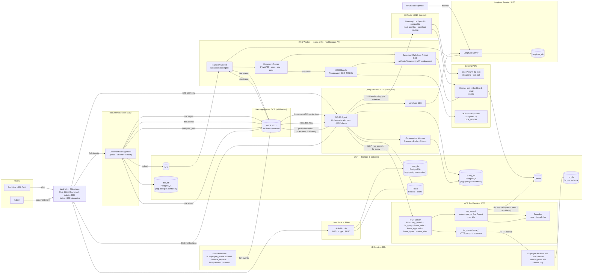
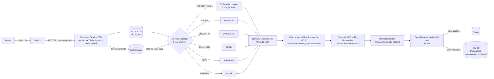
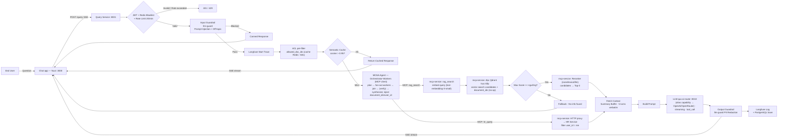
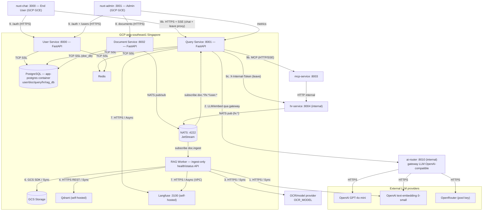
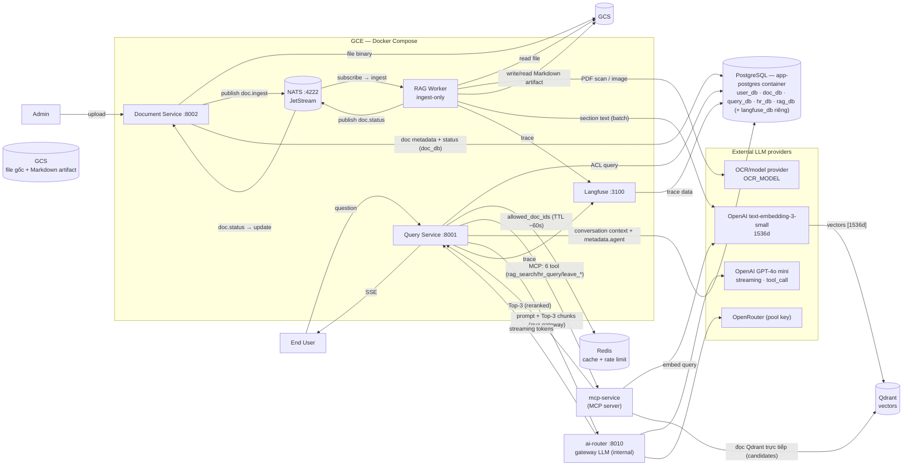
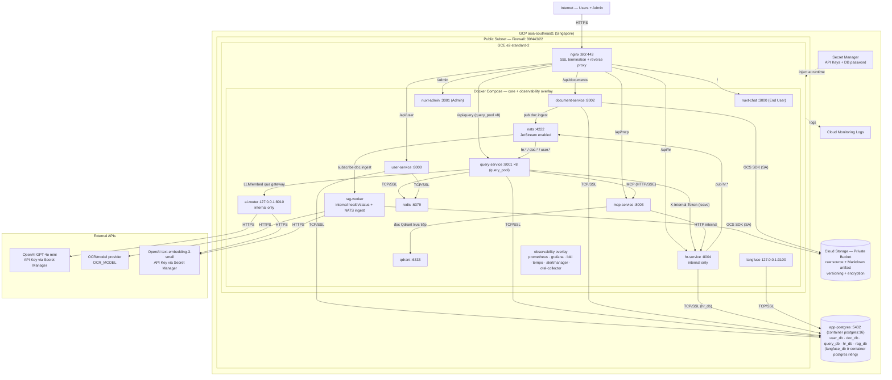

# SOLUTION ARCHITECTURE DOCUMENT

| **Thông tin** | **Chi tiết** |
|---------------|-------------|
| Tên hệ thống | RAG-based Internal Q&A Chatbot – VinSmartFuture |
| Phiên bản docs | 1.0 – MVP (Phase 1) |
| Tác giả (SA) | [Tên SA] |
| Ngày tạo | 2026-05-28 |
| Phase hiện tại | Phase 1 – MVP + Cloud Deploy (3 tuần) |
| Trạng thái | Draft – Living Document |

> _Đây là SA docs Phase 1. Hệ thống sẽ được evaluate cuối tuần 3 (Phase 1.5), sau đó cập nhật docs và phát triển tiếp. Docs này là living document — sẽ thay đổi theo từng phase._

> **Architecture update 2026-06-14:** một số quyết định implementation hiện tại đã thay đổi so với bản SA ban đầu:
> - OCR không hardcode Gemini Vision API. RAG Worker gọi OCR/model provider qua AI gateway, model cấu hình bằng `OCR_MODEL` (hiện default `gpt-4o-mini`).
> - RAG Worker là **ingest-only producer** nhưng có FastAPI health/status API và metadata DB riêng `rag_db` cho ingest job/document state.
> - Production ingestion bắt buộc ghi canonical Markdown artifact vào GCS tại `artifacts/{document_id}/markdown.md`, rồi downstream chunk/caption/embed đọc lại artifact này.
> - Qdrant payload lưu URI nội bộ `source_uri` + `artifact_uri`; mcp-service map ra response `source_gcs_uri` + `markdown_gcs_uri`.

> **Architecture update 2026-06-27 (đồng bộ runtime hiện tại):** sản phẩm đã tiến xa hơn bản SA gốc — các thay đổi dưới đây đã được phản ánh inline trong tài liệu này:
> - **AI Router (`ai-router`, :8010)** — service MỚI: gateway LLM tương thích OpenAI, multi-pool key (OpenAI + OpenRouter), routing theo cost/tải, hot-reload `routing.yaml`. query-service gọi LLM/embedding qua `OPENAI_BASE_URL=http://ai-router:8010/v1` (rỗng = fallback thẳng OpenAI). Bind 127.0.0.1, không service nào `depends_on` → router chết không kéo sập app.
> - **MOSA — Multi-Agent Orchestrator-Workers**: orchestration đã nâng từ Single Agent (FunctionCallingAgent/ReAct) lên **MOSA** (`app/agents/`, planner `orchestrator_workers.py`). Prod bật bằng `AGENT_MODE=orchestrator_workers` (e2e enforce khớp). "Suy nghĩ của agent" (thoughts/plan/trace) lưu vào `messages.metadata.agent`. → Feature "Multi-Agent" (vốn xếp Phase 4) đã triển khai sớm ở Phase 1.
> - **HR leave WRITE đầy đủ** (không còn "MVP draft"): tạo/sửa/hủy/duyệt/từ chối + **"Đơn của tôi"** (nhân viên tự xem đơn & trạng thái). hr-service publish `hr.leave_request.{created,updated,cancelled,approved,rejected}` + `hr.department.renamed`; query-service consume → SSE. Bảng `leave_requests` thêm `idempotency_key`, `cancelled_at`. MCP có **6 tool**: `rag_search`, `hr_query`, `leave_write`, `leave_approvals`, `leave_types`, `resolve_date`.
> - **Documents**: thêm **bulk-delete** (xóa nhiều), `/file/raw`, audit-logs; **Notification Center** thêm **xóa** thông báo.
> - **Hạ tầng**: **8 replica** query-service sau nginx `query_pool` (SSE-safe); **observability stack** Prometheus/Grafana/Loki/Tempo/Alertmanager/otel-collector; deploy keyless **Workload Identity Federation + IAP SSH**; domain thật **`vsfchat.cloud`** (không phải `.com`).

**Lộ trình phát triển:**

| **Phase** | **Thời gian** | **Mục tiêu** | **Trạng thái** |
|-----------|--------------|-------------|---------------|
| Phase 1 – MVP + Cloud Deploy | Tuần 1–3 | Core RAG pipeline, OCR, auth (email/password + Microsoft SSO), guardrails, Redis, Semantic Cache, full GCP deploy | 🔨 Đang làm |
| Phase 1.5 – Evaluation Checkpoint | Cuối tuần 3 | Chạy RAGAS (5 metrics), load test, quyết định tiếp tục Phase 2 hay tune thêm | ⏳ Chờ |
| Phase 2 – Cải tiến & Tích hợp | Tuần 4–5 | Admin Dashboard nâng cao, Knowledge Gap Detection, Microsoft Teams Bot | ⏳ Chờ |

---

# 1. System Overview

**Thông tin cần có:**

## 1.1 Tên hệ thống

RAG-based Internal Q&A Chatbot System – Hệ thống chatbot hỏi-đáp nội bộ dựa trên tài liệu cho VinSmartFuture. Cho phép nhân viên đặt câu hỏi bằng ngôn ngữ tự nhiên và nhận câu trả lời chính xác từ thông tin nội bộ công ty.

## 1.2 Vấn đề giải quyết / Mục đích của hệ thống

VinSmartFuture (~4,000 nhân viên) sở hữu lượng lớn tài liệu nội bộ (quy trình, chính sách, kỹ thuật) nhưng việc tìm kiếm thông tin kém hiệu quả:

- **Tốn nhiều thời gian:** nhân viên mất 15–30 phút để tìm một thông tin đơn giản trong hàng trăm tài liệu.
- **Thiếu chính xác:** đọc sai tài liệu, dùng tài liệu cũ không được cập nhật.
- **Không có truy xuất nguồn:** không biết thông tin lấy từ tài liệu nào, phiên bản nào.
- **Không scale:** khi công ty lớn thêm, lượng tài liệu tăng, vấn đề trở nên nghiêm trọng hơn.
- **Không tra cứu được thông tin cá nhân HR nhanh:** nhân viên cần liên hệ phòng HR để hỏi số ngày nghỉ còn lại, trạng thái đơn nghỉ phép, thông tin lương — tốn thời gian cả 2 phía.

Hệ thống RAG Chatbot giải quyết bằng cách:

- Cho phép nhân viên hỏi bằng tiếng Việt / Anh, nhận câu trả lời chính xác có dẫn nguồn.
- Từ chối trả lời khi không tìm thấy thông tin — tránh hallucination.
- Xử lý được PDF text-based, PDF scan (OCR), DOCX, TXT, Excel, CSV.
- Trả lời câu hỏi cá nhân HR (ngày nghỉ, lương, đơn nghỉ phép) bằng agent (MOSA) + MCP tool — không cần liên hệ HR department.

## 1.3 Đối tượng sử dụng

| **Đối tượng** | **Vai trò** | **Mô tả** |
|--------------|------------|----------|
| Nhân viên nội bộ | End User | Đặt câu hỏi về quy trình, chính sách, kỹ thuật qua giao diện chat. Ước tính ~800 DAU, peak ~150–200 concurrent users. Không có quyền upload tài liệu. |
| Quản trị viên | Admin | Upload tài liệu, quản lý index, xem ingestion status, xóa tài liệu. Không có quyền chat/query. |
| IT/DevOps | Operator | Vận hành hệ thống trên GCP, xử lý sự cố, xem Langfuse dashboard và trace. Không upload tài liệu, không chat. |

## 1.4 Thu thập & xử lý dữ liệu cá nhân

**Mục đích:** Xác định hệ thống/ứng dụng có thu thập, lưu trữ và xử lý dữ liệu cá nhân của khách hàng/nhân viên.

> Dữ liệu cá nhân được định nghĩa trong Luật Bảo vệ dữ liệu cá nhân hiện hành như sau:
>
> Dữ liệu cá nhân là dữ liệu số hoặc thông tin dưới dạng khác xác định hoặc giúp xác định một con người cụ thể, bao gồm: dữ liệu cá nhân cơ bản và dữ liệu cá nhân nhạy cảm:
> - **a.** Dữ liệu cá nhân cơ bản: quy định tại điều 3 Nghị định 356/2025/NĐ-CP
> - **b.** Dữ liệu cá nhân nhạy cảm: quy định tại điều 4 Nghị định 356/2025/NĐ-CP

**Lưu ý:**
- UserID, SalesforceID, DeviceID,… hoặc các ID là bản ghi định danh chủ thể dữ liệu trên các hệ thống mà có thể kết hợp với thông tin từ các hệ thống khác để xác định con người cụ thể → được coi là dữ liệu cá nhân.
- Dữ liệu cá nhân sau khi được mã hóa vẫn được coi là dữ liệu cá nhân (Luật Bảo vệ dữ liệu cá nhân 2025, điều 2).

- [ ] **Không:** Hệ thống hoàn toàn không xử lý dữ liệu cá nhân.
- [x] **Có:** Hệ thống có lưu/xử lý dữ liệu cá nhân (như tên, sđt, email, cccd, ...).
  - UserID / Email: xác định người dùng, lưu lịch sử hội thoại.
  - Lịch sử hội thoại: nội dung câu hỏi và câu trả lời theo từng user.
  - Audit Log: ghi nhận hành vi người dùng.

> **Lưu ý phạm vi dữ liệu trong đề tài này:**
>
> - **Tài liệu nội dung (documents được index):** Là **mock data** do mentor/giảng viên cung cấp, mô phỏng tài liệu nội bộ doanh nghiệp. **Không chứa dữ liệu cá nhân thật** của bất kỳ nhân viên hay tổ chức nào.
> - **Dữ liệu vận hành hệ thống:** Hệ thống vẫn thu thập UserID/Email và Conversation History của người dùng đăng nhập — dù trong demo là tài khoản test, thiết kế kiến trúc vẫn xử lý các trường này như personal data. Vì vậy chọn **"Có"** và bắt buộc hoàn thiện mục 7.2.

> Nếu **"Có"**, bắt buộc hoàn thiện mục **7.2 Data Privacy**.

## 1.5 Mức độ quan trọng của hệ thống

**Căn cứ** — Dev team căn cứ vào 4 yếu tố chính sau để đánh giá:
- **Tác động kinh doanh (Business Impact):** Nếu hệ thống dừng, doanh thu bị thiệt hại bao nhiêu?
- **Tác động người dùng (User Impact):** Có bao nhiêu người dùng bị ảnh hưởng? Trải nghiệm người dùng bị gián đoạn toàn phần hay một phần?
- **Tính cam kết (SLA/Compliance):** Có vi phạm cam kết mức độ dịch vụ (SLA) với khách hàng hoặc các quy định pháp lý/bảo mật không?
- **Luồng nghiệp vụ (Critical Path):** Hệ thống có nằm trên luồng nghiệp vụ cốt lõi không? Ví dụ: module Thanh toán là cốt lõi, module Gợi ý sản phẩm là bổ trợ.

**Các cấp độ:**

| **Cấp độ** | **Tên gọi** | **Mô tả** | **Ví dụ** |
|-----------|------------|----------|----------|
| Tier 1 | Mission Critical | Sống còn. Ngừng hoạt động gây thiệt hại tài chính cực lớn hoặc sụp đổ luồng nghiệp vụ chính ngay lập tức. | Payment, IAM |
| Tier 2 | Business Critical | Quan trọng. Ảnh hưởng lớn đến vận hành và trải nghiệm, nhưng có thể chịu đựng được trong một khoảng thời gian ngắn (vài phút). | Quản lý đơn hàng (Order), Giỏ hàng, Tìm kiếm |
| Tier 3 | Business Operational | Cần thiết. Ảnh hưởng đến hiệu quả công việc hoặc tính năng bổ trợ. Không làm gián đoạn luồng chính. | Gợi ý sản phẩm, Báo cáo nội bộ, Gửi Notification marketing |
| Tier 4 | Administrative | Phụ trợ. Các hệ thống nội bộ, thử nghiệm hoặc không có tác động trực tiếp đến khách hàng cuối. | Tool quản lý log nội bộ, Môi trường Sandbox, CMS tin tức |

**Đánh giá hệ thống RAG Chatbot:**

| **Yếu tố** | **Đánh giá** | **Lý luận** |
|-----------|-------------|-----------|
| Tác động kinh doanh | Thấp–Trung bình | Hệ thống hỗ trợ tra cứu nội bộ, không nằm trên luồng doanh thu. Downtime không gây thiệt hại tài chính trực tiếp. |
| Tác động người dùng | Trung bình–Cao | Phục vụ đa mục đích cho toàn bộ ~4,000 nhân viên (HR, IT, Kỹ thuật, Vận hành…). Tuy nhiên, **workaround tồn tại**: nhân viên có thể tự tìm tài liệu qua SharePoint/ổ chung, dù mất 15–30 phút thay vì < 60 giây. Downtime gây giảm năng suất đo được nhưng không block hoàn toàn công việc. |
| SLA / Compliance | Thấp | Không có cam kết SLA với khách hàng bên ngoài. Không xử lý luồng pháp lý bắt buộc. |
| Luồng nghiệp vụ cốt lõi | Không | Là công cụ hỗ trợ (support tool). Không nằm trên luồng thanh toán, đặt hàng, hay nghiệp vụ cốt lõi nào. Hệ thống có thể down mà công ty vẫn vận hành bình thường. |

**Tại sao không phải Tier 2?**
> Tier 2 yêu cầu hệ thống ảnh hưởng lớn đến vận hành và **không có workaround ngắn hạn**. RAG Chatbot đáp ứng diện rộng người dùng nhưng không thỏa mãn điều kiện này — nhân viên vẫn tự tra cứu được dù chậm hơn.

**Tại sao không phải Tier 4?**
> Hệ thống được thiết kế cho ~800 DAU (20% tổng nhân viên). Productivity loss có thể đo được (~13,000–26,000 phút/ngày toàn công ty khi down). Không phải tool thử nghiệm hay sandbox.

**→ Phân loại: Tier 3 – Business Operational**

## 1.6 Ước lượng tải

| **Chỉ số** | **Ước tính** | **Ghi chú** |
|-----------|-------------|-----------|
| Tổng nhân viên | ~4,000 người | Toàn công ty VinSmartFuture |
| Daily Active Users (DAU) | ~800 người/ngày | ~20% tổng nhân viên |
| Peak Concurrent Users | ~150–200 người | Giờ cao điểm 9–11h sáng |
| Queries per day | ~4,000–8,000 queries | ~5–10 câu/user/ngày |
| Tài liệu mock | ~15–20 tài liệu | PDF, DOCX, TXT, Excel, CSV – đa phòng ban |

---

# 2. Application Architecture

## 2.1 Application Architecture Diagram

> **Level 2** — Sơ đồ thể hiện cấu trúc các thành phần chính của đối tượng được thiết kế.
>
> _(Hình vẽ + Mô tả thành phần. Yêu cầu các thành phần mô tả phải khớp với sơ đồ)_

### Diagram 1 — Overall Architecture



> _Phase 1: Semantic Cache (Redis) đặt giữa Query Module và Qdrant. Phase 2 (Production Scale): Cloud Pub/Sub Queue thay thế BackgroundTasks cho Ingestion._
>
> **NATS chỉ dùng cho ingestion (pub/sub + JetStream):** các subject `doc.*` / `notify.*` / `hr.employee_profile.updated` persist trên disk — không mất message khi subscriber restart. **Retrieval KHÔNG đi qua NATS**: mcp-service (tool `rag_search`) đọc Qdrant trực tiếp (rag-worker là bên ghi, mcp-service là bên đọc; ghép chỉ qua Qdrant). NATS chỉ định tuyến message, **không tự xử lý hay tự trả lời**.

---

### Diagram 2 — Ingestion Pipeline (Async)



---

### Diagram 3 — Query Pipeline (Sync + Streaming)



### Danh sách các thành phần (Module)

| **STT** | **Tên Module** | **Mục đích** | **Phase** |
|--------|--------------|-------------|---------|
| 1 | Web UI — **2 micro-frontend** (Nuxt 4 + Vue 3) | **Chat app** (End User, :3000): chat streaming (SSE) + **Notification Center** (badge/lịch sử) + **Document Viewer** (PDF.js highlight citation) + lịch sử hội thoại. **Admin console** (Admin, :3001): upload tài liệu, quản lý user, **analytics charts**. Dùng chung **Nuxt base layer** (`useAuth` + `useApi` + middleware + design system). Trang `/login` tách riêng: Chat → `POST /auth/login`; Admin → `POST /auth/admin/login` (admin only). | ✅ MVP |
| 2 | User Service (FastAPI) | Microservice 1: Auth/JWT, user management, login. Issue JWT token khi login. Chia sẻ `JWT_SECRET_KEY` với Document Service và Query Service để verify locally — không cần gọi lại User Service mỗi request. JWT chứa `user_id`, `role`, `account_type` (`internal`/`external`). RAG Worker không verify user JWT vì chỉ nhận internal ingest/control traffic. | ✅ MVP |
| 2b | Document Service (FastAPI) | Microservice 2: Admin document management — upload và xóa tài liệu. Lưu file lên GCS, tạo record PostgreSQL (status=queued). Publish NATS subject `doc.ingest` ngay sau khi upload. Subscribe `doc.status` để cập nhật trạng thái ingestion từ RAG Worker. Chỉ Admin mới có quyền truy cập. | ✅ MVP |
| 2c | RAG Worker (Python/NATS/FastAPI) | **Ingest-only producer**: subscribe `doc.ingest` → parse/OCR → ghi canonical Markdown artifact vào GCS → chunk/caption/embed → store Qdrant. Có health/status API và metadata DB riêng `rag_db` cho ingest job/document state. **Không** xử lý retrieval runtime (search do mcp-service đọc Qdrant trực tiếp). | ✅ MVP |
| 2d | Query Service (FastAPI, ×8 replica) | Microservice 3: User chat — nhận câu hỏi, ACL check, Semantic Cache check, **MOSA Agent (Orchestrator-Workers, MCP client)** gọi tool ở mcp-service, gọi LLM qua ai-router, stream **SSE** về frontend (+ stream `/notifications`). Conversation history (lưu cả agent thoughts/trace ở `messages.metadata`), feedback, proxy đơn nghỉ phép sang hr-service. Verify JWT locally. Chạy 8 replica sau nginx `query_pool` (SSE-safe). | ✅ MVP |
| 2e | NATS Message Broker | Message broker trung tâm cho async ingestion + projection — `doc.*`, `notify.*`, `hr.*` (employee/leave/department), `user.deleted`. Port 4222. **JetStream enabled** — persist message. (Retrieval KHÔNG đi qua NATS: mcp-service tool `rag_search` đọc Qdrant trực tiếp.) | ✅ MVP |
| 2f | MOSA Agent — Orchestrator-Workers | LLM Orchestration là **multi-agent** (`app/agents/`, planner `orchestrator_workers.py`): plan → fan-out workers (DAG) → join → (verify) → synthesize; là **MCP client** liệt kê tool từ mcp-service. Prod bật `AGENT_MODE=orchestrator_workers` (fallback an toàn về react). Query Service inject `document_ids`/`user_id`. | ✅ MVP |
| 2g | MCP Tool Service (port 8003) | Microservice 5: **MCP server** expose **6 tool** dùng chung: `rag_search` (đọc Qdrant trực tiếp → rerank `none`/`lexical`/`llm` → Top-3), `hr_query`, `leave_write`, `leave_approvals`, `leave_types`, `resolve_date` (4 cái sau proxy hr-service). Tool gateway, không sở hữu dữ liệu HR. Transport Streamable HTTP. | ✅ MVP |
| 2h | HR Service (FastAPI, internal) | Microservice 6: employee profile, department, employment status, sếp trực tiếp (`manager_user_id`), HR data (`leave_balance`, `leave_requests`, `payroll_summary`) **+ leave WRITE đầy đủ** (tạo/sửa/hủy/duyệt/từ chối + pending-approval + "Đơn của tôi") + `/hr/admin/*`. Publish `hr.employee_profile.updated`, `hr.leave_request.*`, `hr.department.renamed`. | ✅ MVP |
| 2i | AI Router (FastAPI, :8010 internal) | Gateway LLM tương thích OpenAI, **stateless**, multi-pool key (OpenAI + OpenRouter): service đổi `base_url`, dùng `model` = ALIAS capability → router chọn (key, endpoint, model) tối ưu cost/tải. `/v1/chat/completions`, `/v1/embeddings`, `/v1/rerank`, `/v1/route`, `/admin/*`. Bind 127.0.0.1, không ai `depends_on` → fail-open. | ✅ MVP |
| 3 | OCR Module | Detect PDF scan/image → gọi OCR/model provider qua AI gateway (`OCR_MODEL`). PDF text-based → PyMuPDF/local parser, không gọi OCR ngoài. | ✅ MVP |
| 4 | Ingestion Module | Parse tài liệu (PDF/DOCX/TXT/Excel/CSV), normalize tiếng Việt, ghi canonical Markdown artifact vào GCS (`artifacts/{document_id}/markdown.md`), **Parent-Child Chunking**, generate caption, embed, lưu **Qdrant** với `source_uri` + `artifact_uri`. RAG Worker chỉ ghi metadata riêng trong `rag_db`; Document Service cập nhật document catalog/status qua `doc.status`. | ✅ MVP |
| 5 | Search Module (mcp-service, tool `rag_search`) | Nhận query + `document_ids` từ Query Service qua MCP, embed câu hỏi (OpenAI), **đọc Qdrant trực tiếp** lấy candidates, rerank (`none`/`lexical`/`llm`) → Top-3, filter theo ngưỡng. (`document_ids` là no-op — ACL ở service khác.) | ✅ MVP |
| 6 | Auth Module | Simple JWT authentication. 2 role: Admin và End User. | ✅ MVP |
| 7 | Conversation Module | Lưu/đọc lịch sử hội thoại từ PostgreSQL (query_db). Summary Buffer: LLM tóm tắt các turns cũ thành summary, giữ 5 turns gần nhất verbatim — hiểu đủ ngữ cảnh mà không tốn nhiều token. | ✅ MVP |
| 8 | Embedding Service | OpenAI text-embedding-3-small (API). 1536 dims. Dùng cho cả ingestion (RAG Worker) và query (Query Service). | ✅ MVP |
| 9 | LLM Service | OpenAI/OpenRouter qua ai-router. Streaming + Function Calling (tool_call) cho MOSA agent. | ✅ MVP |
| 10 | Observability (Langfuse + stack) | (1) **Langfuse**: trace 2 luồng — Ingestion (parse/chunk/embed time, error) + Query (latency từng bước, token cost, retrieved chunks + scores, feedback). (2) **Stack hạ tầng** (overlay): Prometheus (metrics) + Grafana (dashboard) + Alertmanager (Slack) + Loki (log) + Tempo (trace) + otel-collector (OTLP) + node-exporter. RAGAS chạy offline Phase 1.5 trên Query trace. | ✅ MVP |
| 11 | Vector DB (Qdrant (self-hosted on GCP)) | Lưu và tìm kiếm vector embedding. Metadata filtering theo document. | ✅ MVP |
| 12 | Metadata DB (PostgreSQL — app-postgres container) | Các DB: user/doc/query/hr/rag (+ langfuse riêng); mcp-service không có DB. `rag_db` chỉ phục vụ ingest job/document state của RAG Worker; `doc_db` vẫn là owner document catalog. | ✅ MVP |
| 13 | Document Storage (GCS) | Lưu file gốc sau khi upload và canonical Markdown artifact sau parse/OCR. Artifact chuẩn: `artifacts/{document_id}/markdown.md`. | ✅ MVP |
| 13b | HR Data Module | HR Service sở hữu HR tables trong `hr_db`: employee profile/department/manager, `leave_balance`, `leave_requests` (có `idempotency_key`, `cancelled_at`), `payroll_summary`. Dùng cho Personal HR Q&A và **leave request flow đầy đủ** (tạo/sửa/hủy/duyệt/từ chối + "Đơn của tôi"). `user-service.role` là app role; người duyệt lấy từ `employees.manager_user_id` (hoặc `HR_DEFAULT_APPROVER`). | ✅ MVP |
| 14 | Semantic Cache (Redis) | Cache câu hỏi tương tự (cosine similarity > 0.95). TTL 1 giờ. Tiết kiệm ~60% OpenAI API cost. | ✅ MVP |
| 15 | Cloud Pub/Sub | Async ingestion queue có DLQ. Thay thế BackgroundTasks khi scale. | 🔄 Phase 2 |

### Thông tin dữ liệu – Phân loại bảo mật

**Phân loại cấp độ bảo mật dữ liệu:**

| **Cấp độ** | **Tên** | **Đặc điểm dữ liệu** | **Ví dụ trong hệ thống** | **Hình thức xử lý & Tiêu chuẩn** |
|-----------|--------|---------------------|------------------------|----------------------------------|
| L1 | 🟢 Public (Công khai) | Thông tin không gây hại nếu rò rỉ. Ai có account trên hệ thống đều xem được — kể cả đối tác, contractor bên ngoài. | Tài liệu onboarding, hướng dẫn sử dụng chung. | Không yêu cầu bảo mật đặc biệt. |
| L2 | 🟡 Internal (Nội bộ) | Dữ liệu phục vụ vận hành nội bộ. Chỉ toàn bộ nhân viên chính thức của công ty xem được. | Quy trình nội bộ, chính sách HR, tài liệu kỹ thuật, Audit Log. | Xóa tự động qua TTL, lưu trữ từ 1–2 năm. |
| L3 | 🟠 Secret (Bí mật nhóm) | Dữ liệu nhạy cảm. Chỉ một nhóm nhỏ được chỉ định theo phòng ban hoặc role xem được. | Báo cáo tài chính nội bộ, kế hoạch sản phẩm mới, hợp đồng đối tác. | Lưu trữ 5 năm, Soft delete trước khi Hard delete. |
| L4 | 🔴 Top Secret (Tuyệt mật) | Dữ liệu cực kỳ nhạy cảm. Chỉ 1 người cụ thể — thường là người upload tài liệu đó — xem được. | Hợp đồng cá nhân, tài liệu đàm phán nhạy cảm, dữ liệu lương cá nhân. | Mã hóa at-rest, không đưa vào Langfuse trace, xóa tức thì hoặc Cryptographic Erasure. |

**Danh mục dữ liệu hệ thống:**

| **Loại dữ liệu** | **Phân loại (Privacy Level)** | **Chiến lược lưu trữ** | **Chính sách bảo mật và logic** |
|----------------|------------------------------|----------------------|-------------------------------|
| Tài liệu nội bộ (PDF, DOCX, CSV...) | L2 – Internal | GCS, vĩnh viễn đến khi xóa. | Phân loại 4 cấp: Public / Internal / Secret / Top Secret. Phase 1: lưu classification field. Phase 2: enforce Qdrant filter theo cấp bậc. |
| Vector Embedding | L2 – Internal | Qdrant (self-hosted on GCP), xóa khi tài liệu bị xóa. | API Key auth. HTTPS only. Không expose ngoài. |
| Conversation History | L2 – Internal | PostgreSQL, TTL 1 năm. Soft delete 30 ngày trước Hard delete. | Chỉ user sở hữu và Admin xem được. |
| UserID / Email nội bộ | L3 – Confidential | PostgreSQL, đến khi xóa tài khoản. | Mã hóa at-rest, masked trong log. |
| Audit Log | L2 – Internal | PostgreSQL 2 năm, Cold Storage sau 6 tháng. | Append-only, không chỉnh sửa được. |
| Langfuse Trace Data | L2 – Internal | Langfuse (self-hosted on GCP), không log nội dung nhạy cảm. | Trace data nằm trong VPC, không ra ngoài. |
| HR Leave Data (ngày nghỉ, đơn nghỉ phép) | L3 – Confidential | PostgreSQL, đến khi xóa tài khoản. | Chỉ user sở hữu xem được (filter user_id). Masked trong log. |
| HR Payroll Data (lương, khấu trừ) | L4 – Restricted | PostgreSQL, mã hóa at-rest. | Chỉ user sở hữu xem được. Không đưa vào Langfuse trace. Masked hoàn toàn trong log. |

## 2.2 Session Configuration

> Mục này mô tả cấu hình session cho từng chức năng hoặc toàn hệ thống, tùy theo mức độ nhạy cảm.
> - Phase 1 hỗ trợ cả Simple JWT (email/password) và Microsoft Account SSO (Azure AD qua msal). **Phase 1: MFA bắt buộc cho Admin (TOTP).** Phase 2: Conditional Access nâng cao.
> - Nếu cần chỉ rõ các chức năng đặc biệt cần session ngắn/dài khác nhau: đặt tại bảng dưới đây.

**Kịch bản 1: Sử dụng cấu hình mặc định**

Đối với các chức năng thông thường, hệ thống dùng Simple JWT với TTL cố định server-side.
- **Cơ chế:** JWT Token với TTL cấu hình tại FastAPI. Hết hạn → redirect về trang đăng nhập.
- **Thời gian mặc định:** 8 giờ

**Kịch bản 2: Cấu hình đặc thù cho chức năng nhạy cảm**

| **Nhóm chức năng / Module** | **Mức độ nhạy cảm** | **Session Timeout** | **Ghi chú / Hành động khi hết hạn** |
|---------------------------|-------------------|-------------------|-------------------------------------|
| Chat Interface (Q&A) – End User | Thấp | 8 giờ (JWT TTL) | Redirect về trang đăng nhập. |
| Upload tài liệu – Admin | Cao | 30 phút inactivity | Auto logout nếu không có thao tác. |
| Admin – Xóa tài liệu / Re-index | Rất cao | 15 phút | Bắt buộc xác thực lại trước thao tác xóa. |

---

# 3. Feature List

| **STT** | **Nhóm chức năng** | **Mô tả** | **Phase** |
|--------|------------------|----------|---------|
| 1 | Document Management | Admin upload tài liệu (PDF, DOCX, TXT, Excel, CSV, PPTX, Markdown, tối đa 50MB), chọn classification (Public / Internal / Secret / Top Secret). Upload xong → status `queued` ngay, trigger ingestion pipeline tự động: Queued → Processing → Indexed / Failed. Hỗ trợ xóa tài liệu (gồm **bulk-delete** chọn nhiều) + phân trang + audit-logs. End User không có quyền upload. | ✅ MVP |
| 2 | OCR – PDF scan | Tự động phát hiện PDF scan/ảnh cần OCR. Gọi OCR/model provider qua AI gateway (`OCR_MODEL`) để extract text + layout. PDF text-based dùng PyMuPDF/local parser. Output chuẩn là canonical Markdown artifact lưu ở GCS trước khi chunk/embed. | ✅ MVP |
| 3 | Structured Data (Excel/CSV) | Excel: đọc từng sheet, convert rows sang text có header. CSV: parse với pandas, convert sang text. | ✅ MVP |
| 4 | Tiếng Việt Handling | Normalize Unicode NFC sau khi extract text. Fix encoding lỗi. Hỗ trợ tài liệu tiếng Việt và tiếng Anh lẫn lộn trong cùng file. | ✅ MVP |
| 5 | Q&A Chatbot – Policy/Document | Nhân viên nhập câu hỏi tiếng Việt / Anh về quy trình, chính sách, tài liệu kỹ thuật. MOSA agent dùng tool `rag_search`: embed câu hỏi → Qdrant search → LLM build answer. Response streaming – chữ xuất hiện dần. | ✅ MVP |
| 5b | Personal HR Q&A (Function Calling) | Trả lời câu hỏi cá nhân HR: ngày nghỉ còn lại, số ngày đã nghỉ, trạng thái đơn nghỉ phép, thông tin khấu trừ lương. MOSA agent dùng MCP tool `hr_query`; mcp-service gọi HR Service nội bộ. HR Service luôn filter theo `user_id = current_user` và chỉ trả dữ liệu nếu user map tới employee `active`. `account_type=external` không có quyền HR personal access. Phase 1: mock data. | ✅ MVP |
| 5d | Leave Request — tạo/duyệt/xem đầy đủ | User chat "tạo đơn nghỉ phép..." → AI trích xuất loại/ngày/lý do (qua tool `leave_write` + `resolve_date`), hỏi thông tin thiếu, hiển thị draft chờ confirm → tạo `leave_requests` `status=pending`, `approver = manager_user_id`. **Sếp**: xem pending + approve/reject (tool `leave_approvals`). **Nhân viên**: trang **"Đơn của tôi"** xem mọi đơn + trạng thái (chờ/duyệt/từ chối/hủy) + hủy đơn pending. Mọi biến cố đẩy SSE qua `hr.leave_request.*`. `idempotency_key` chống tạo trùng. Quyền duyệt theo DB record, không dùng `user-service.role`. | ✅ MVP |
| 5c | Realtime Notify – Tài liệu mới (SSE) | Khi tài liệu ingest xong (`indexed`), Document Service publish `notify.doc_new`; Query Service đẩy thông báo "Có tài liệu mới: X" qua stream **SSE `GET /notifications`** tới **mọi user đang online có quyền xem** (lọc theo classification/ACL). Stream notifications mở sẵn ở app-level sau đăng nhập. | ✅ MVP |
| 6 | Citation / Source Reference | Mỗi câu trả lời kèm nguồn tài liệu (tên file, trang/section). Người dùng click xem trích dẫn gốc. | ✅ MVP |
| 7 | Fallback – Không có thông tin | Nếu retrieval score < 0.7 → trả về "Không tìm thấy thông tin trong tài liệu nội bộ". Không gọi LLM – tiết kiệm cost, tránh hallucination. | ✅ MVP |
| 8 | Conversation History – Multi-turn | Lưu lịch sử hội thoại theo từng user. Summary Buffer: LLM tóm tắt các turns cũ, giữ 5 turns gần nhất verbatim. Câu hỏi sau luôn hiểu đủ ngữ cảnh mà không tốn nhiều token. | ✅ MVP |
| 9 | Authentication | Login bằng email/password hoặc Microsoft Account (SSO via Azure AD). JWT token TTL 8 giờ, blacklist trong Redis khi logout. 2 role: Admin và End User. | ✅ MVP |
| 10 | Admin Dashboard | **MVP:** Xem danh sách tài liệu (trạng thái, ngày upload, số chunk). Xem ingestion status real-time (queued / processing / indexed / failed). Upload và xóa tài liệu. Xem usage metrics cơ bản. **Phase 2:** Tổng số câu hỏi theo ngày/tuần, tỉ lệ feedback tốt/xấu, top 10 câu hỏi được hỏi nhiều nhất, danh sách câu hỏi bot không trả lời được (retrieval score < 0.7 — dùng để phát hiện Knowledge Gap). | ✅🔄 MVP + Phase 2 |
| 11 | Feedback Loop | Người dùng đánh giá câu trả lời (thumbs up/down). Lưu vào PostgreSQL và sync lên Langfuse để phân tích chất lượng. | ✅ MVP |
| 12 | Langfuse Observability | Trace toàn bộ LLM pipeline. Dashboard latency, token cost, RAGAS scores, feedback. IT/DevOps dùng để monitor và debug. | ✅ MVP |
| 13 | Semantic Cache | Cache câu hỏi tương tự (cosine similarity > 0.95). TTL 1 giờ. Tiết kiệm ~60% API cost. | ✅ MVP |
| 14 | Document Classification & Access Control | Admin chọn classification khi upload. **ACL pre-filter:** Query Service decode JWT → đọc projection `query_db.document_access` (từ event `doc.access`) và `query_db.user_access_profile` (từ event `hr.employee_profile.updated`) → lấy `allowed_doc_ids` theo `role + account_type + department + user_id` → inject vào MCP call `rag_search(document_ids=allowed_doc_ids)`. **Lưu ý theo code:** search tool của mcp-service NHẬN `document_ids` nhưng KHÔNG tự filter Qdrant (no-op) — ACL được enforce bằng **post-filter ở query-service orchestration** (`_handle_rag` lọc theo `document_id` trả về) + threshold score, rồi mới đưa vào prompt. Kết quả ACL cache Redis TTL ~60s. | ✅ MVP |

**Quy ước MVP cho AI tạo đơn nghỉ phép:**
- `leave_requests` trong `hr_db` là đơn chính thức; không generate Word/PDF trong scope đề tài.
- AI chỉ tạo draft và nộp sau khi user xác nhận rõ ràng. Không tự nộp khi câu hỏi còn mơ hồ.
- Người duyệt là sếp trực tiếp: `leave_requests.approver_user_id = employees.manager_user_id`.
- Quyền duyệt kiểm bằng DB record `approver_user_id = current_user_id AND status = 'pending'`, không dùng `user-service.role`.
- Giao diện user của sếp chỉ hiện thêm "Đơn cần duyệt" khi có pending requests trỏ về user đó.

> **Định nghĩa 4 cấp phân loại tài liệu:**
>
> | Cấp bậc | Người được xem | Ví dụ áp dụng |
> |---------|---------------|--------------|
> | 🔴 Top Secret | Chỉ 1 người cụ thể — thường là người upload tài liệu đó | Hợp đồng cá nhân, tài liệu đàm phán nhạy cảm |
> | 🟠 Secret | Một nhóm nhỏ được chỉ định (theo phòng ban hoặc role) | Báo cáo tài chính nội bộ, kế hoạch sản phẩm mới |
> | 🟡 Internal | Toàn bộ nhân viên chính thức của công ty | Quy trình nội bộ, chính sách HR, tài liệu kỹ thuật |
> | 🟢 Public | Ai có account trên hệ thống (kể cả đối tác, contractor bên ngoài) | Tài liệu onboarding, hướng dẫn chung |

| 15 | SSO – Microsoft Account | Đăng nhập bằng Microsoft Account (Azure AD via msal). Cùng hệ sinh thái với Microsoft Teams Bot Phase 2. Phase 1: MFA bắt buộc cho Admin (TOTP). Phase 2: Conditional Access policy nâng cao. | ✅ Phase 1 |
| 16 | Multi-Agent Architecture (MOSA) | **Đã triển khai sớm ở Phase 1**: MOSA Orchestrator-Workers (`app/agents/`) — plan → fan-out workers (rag_retrieve / hr_lookup / analyze / leave_action) → join → (verify) → synthesize. Bật bằng `AGENT_MODE=orchestrator_workers`, fallback an toàn về Single Agent (react). | ✅ MVP |
| 17 | Microsoft Teams Bot Integration | Nhân viên hỏi bot trực tiếp trong Teams (DM hoặc mention trong channel), không cần mở tab mới. Kỹ thuật: `botbuilder-python` (Microsoft Bot Framework) — cùng hệ sinh thái Azure AD đã dùng cho SSO. | 🔄 Phase 2 |

### Feature 14 — Định nghĩa 4 cấp phân loại tài liệu

> Áp dụng cho Feature 14: Document Classification & Access Control. Uploader chọn khi upload. MVP enforce bằng ACL pre-filter trong Query Service trước khi gọi `rag_search`.

| **Cấp bậc** | **Người được xem** | **Ví dụ áp dụng** |
|------------|------------------|-----------------|
| 🔴 Top Secret | Chỉ 1 người cụ thể — thường là người upload tài liệu đó | Hợp đồng cá nhân, tài liệu đàm phán nhạy cảm |
| 🟠 Secret | Một nhóm nhỏ được chỉ định (theo phòng ban hoặc role) | Báo cáo tài chính nội bộ, kế hoạch sản phẩm mới |
| 🟡 Internal | Toàn bộ nhân viên chính thức của công ty | Quy trình nội bộ, chính sách HR, tài liệu kỹ thuật |
| 🟢 Public | Ai có account trên hệ thống (kể cả đối tác, contractor bên ngoài) | Tài liệu onboarding, hướng dẫn chung |

---

# 4. Integration Architecture

> Sơ đồ này thể hiện đối tượng được thiết kế đang tích hợp thế nào với các đối tượng xung quanh.
>
> **Lưu ý:** Không thể hiện các tích hợp nội bộ của các thành phần L2.

## 4.1 Integration Topology



> _Số thứ tự trên connection line tương ứng với STT trong bảng 4.2 bên dưới._

## 4.2 Danh sách Interfaces

| **STT** | **Endpoint** | **From** | **To** | **Method** | **Data** |
|--------|-------------|---------|-------|-----------|---------|
| 1 | OpenAI Embeddings API | RAG Worker (Ingestion) + MCP Service (`rag_search`) | OpenAI text-embedding-3-small | HTTPS/TLS – Sync | Text → vector [1536 dims]. API Key qua Secret Manager. Retry 3 lần khi timeout. |
| 2 | LLM/Embedding qua ai-router | Query Service / MOSA Agent | ai-router :8010 → OpenAI/OpenRouter | HTTPS/TLS – Sync, Streaming, tool_call | Full prompt → streaming tokens. `model` = ALIAS capability; ai-router chọn provider/key tối ưu cost/tải. `OPENAI_BASE_URL` rỗng = gọi thẳng OpenAI (kill-switch). |
| 3 | OCR/model provider | RAG Worker / OCR Module | Provider theo `OCR_MODEL` | HTTPS/TLS – Sync | PDF scan/image → extracted text + layout. Chỉ gọi khi phát hiện PDF scan/ảnh cần OCR. API key qua Secret Manager. |
| 3b | PyMuPDF | RAG Worker / OCR Module | Local processing (không gọi API) | In-process | PDF có text layer → extract text trực tiếp. Nhanh, miễn phí. |
| 4 | Qdrant REST API | RAG Worker (write) + MCP Service (read) | Qdrant (self-hosted on GCP) | HTTPS / REST | RAG Worker upsert vectors khi ingest (payload có `source_uri`, `artifact_uri`). MCP Service đọc Qdrant trực tiếp cho `rag_search`. API Key auth. |
| 5 | PostgreSQL (app-postgres container) | User Service / Document Service / Query Service / HR Service / RAG Worker | `app-postgres:16` trên VM (Cloud SQL = Phase sau) | TCP | DB: user_db, doc_db, query_db, hr_db, rag_db (+ langfuse_db container riêng). `rag_db` lưu ingest job/document state; `doc_db` owner document catalog. (mcp-service không có DB.) |
| 6 | GCS SDK / S3-compatible API | Document Service + RAG Worker | GCP Cloud Storage (Private Bucket) | HTTPS | Document Service PUT file gốc. RAG Worker GET file gốc, PUT canonical Markdown artifact `artifacts/{document_id}/markdown.md`, rồi đọc lại artifact để chunk/embed. |
| 7 | Langfuse SDK | Query Service + RAG Worker | Langfuse :3100 (self-hosted on GCP) | HTTP nội bộ (VPC) | Query Service: LLM trace. RAG Worker: ingestion trace. Trace data không ra ngoài GCP. |
| 8 | Admin app → Document Service | nuxt-admin :3001 (GCP GCE) | Document Service :8002 (GCE) | HTTPS | REST API cho document management (Admin only). Nginx route /api/documents → document-service:8002. |
| 8b | Chat app → Query Service | nuxt-chat :3000 (GCP GCE) | Query Service :8001 (GCE) | HTTPS + SSE | `POST /query` (SSE) stream token trả lời; `GET /notifications` (SSE app-level) server đẩy thông báo. Các endpoint khác (/conversations, /feedback) là REST. Nginx route /api/query → query-service:8001 (tắt buffering cho SSE). Analytics (`GET /admin/metrics`) thì Admin app gọi. |
| 9 | Chat app + Admin app → User Service | nuxt-chat :3000 + nuxt-admin :3001 | User Service :8000 (GCE) | HTTPS | **Chat app** dùng `POST /auth/login` (nhận cả user + admin). **Admin app** dùng `POST /auth/admin/login` (admin only; user bị 401 generic). `/auth/me`, `/auth/refresh` — cả 2 app dùng chung. **`/users/*` (quản lý user) — chỉ Admin app**. Nginx route /api/user → user-service:8000. |
| 9b | Query Service → MCP Service | Query Service (MCP client) | MCP Service :8003 | MCP (Streamable HTTP/SSE) | Liệt kê + gọi **6 tool** (`rag_search`, `hr_query`, `leave_write`, `leave_approvals`, `leave_types`, `resolve_date`). Query Service inject `document_ids`/`user_id`; không để LLM tự điền tham số nhạy cảm. Circuit Breaker (pybreaker, fail_max=5, reset_timeout=30s). |
| 9c | MCP/Query Service → HR Service | MCP Service (tool `hr_query`/`leave_*`) **+ Query Service (proxy `/leave-requests`)** | HR Service :8004 | Internal HTTP (`X-Internal-Token`) – Sync | Đọc leave balance/requests/payroll theo `user_id`; tạo/sửa/hủy/duyệt/từ chối + pending-approval + "Đơn của tôi". `user_id`/`approver_user_id` do Query Service inject **từ JWT**. HR Service gán `approver = manager_user_id`. External accounts không có HR access. |
| 9d | ai-router → LLM providers | ai-router :8010 | OpenAI + OpenRouter | HTTPS/TLS – Sync, Streaming | Resolve (key, endpoint, model) theo capability alias; multi-pool key, spill khi chạm quota. Bind 127.0.0.1, không expose Internet. |
| 10 | MCP Service → Qdrant (đọc trực tiếp) | MCP Service (tool rag_search) | Qdrant | Qdrant client (HTTP/gRPC) | mcp-service embed query → đọc Qdrant lấy candidates → rerank (`none`/`lexical`/`llm`) → Top-3. KHÔNG đi qua NATS/rag-worker; ghép với rag-worker chỉ qua Qdrant. |
| 11 | Document Service → RAG Worker (doc.ingest) | Document Service | RAG Worker | NATS publish/subscribe (JetStream) | Admin upload → publish `{ doc_id, gcs_key, file_type, classification }` → RAG Worker trigger ingestion pipeline. JetStream đảm bảo message không bị mất khi RAG Worker restart. |

---

# 5. Data Flow

## 5.1 Data Flow Diagram tổng quát

> Thông thường sử dụng sơ đồ L2.



## 5.2 Data Flow quan trọng

> **Xác định data flow quan trọng:**
> - Căn cứ vào mục 3 (Feature List): Làm rõ các feature quan trọng.
> - Làm rõ các xử lý nhằm đáp ứng thuộc tính kiến trúc quan trọng nhất (Security, Scalability, Availability, Performance, …).
>
> Trước mỗi data flow nên có tham chiếu tới mô hình L2 phù hợp. Tên các actor trong sequence diagram cần trùng với các thành phần trong sơ đồ tham chiếu.

### 5.2.1 Luồng Ingestion Pipeline (Async – NATS Worker)

_[Tham chiếu: Application Architecture Diagram – Level 2 – Ingestion Pipeline]_

> **Admin-only upload:** Chỉ Admin mới có quyền upload và quản lý tài liệu qua Document Service. End User chỉ dùng Query Service để hỏi.

| **Bước** | **Actor** | **Hành động** | **Dữ liệu** |
|---------|---------|-------------|-----------|
| 0 | Langfuse | Khởi tạo ingestion trace. | trace_id, doc_id, file_name, timestamp |
| 1 | Admin | Upload tài liệu qua Admin Dashboard. Chọn classification (public/internal/secret/top_secret). | File (PDF/DOCX/TXT/Excel/CSV/PPTX/MD, max 50MB) + classification |
| 2 | Document Service | Validate file type + size. Xác thực JWT (Admin only). | Authenticated request + file |
| 3 | Document Service | Upload file gốc lên GCP Cloud Storage (GCS). | GCS key: `{doc_id}/{filename}` |
| 4 | Document Service | Tạo record document trong PostgreSQL, status: `queued`. Trả về 202 Accepted. | `{ doc_id, status: 'queued' }` |
| 4b | Document Service | Publish NATS subject `doc.ingest` với payload `{ doc_id, gcs_key, file_type, classification }`. | NATS message |
| 5 | RAG Worker | Subscribe `doc.ingest` — nhận message, cập nhật status → `processing`, đọc file từ GCS. | File binary từ GCS |
| 6 | OCR/Parser Module | Auto-detect PDF type: có text layer → PyMuPDF/local parser. Không có text layer hoặc có ảnh cần OCR → OCR/model provider qua AI gateway (`OCR_MODEL`). DOCX/Excel/CSV/PPTX/Markdown parse bằng reader tương ứng. | Parsed text + metadata |
| 7 | Ingestion Module | Normalize tiếng Việt: Unicode NFC, fix encoding, collapse whitespace; xuất canonical Markdown. | Canonical Markdown |
| 7b | Artifact Store | Ghi canonical Markdown artifact vào GCS: `artifacts/{document_id}/markdown.md`; sau đó đọc lại artifact này làm input duy nhất cho chunk/caption/embed. | `artifact_uri` |
| 8 | Ingestion Module | **Parent-Child Chunking** trên canonical Markdown artifact: Parent node giữ chunk lớn để cung cấp context cho LLM; Child node nhỏ hơn dùng để embed và search. Config sizes: TBD khi implement. | List of `{ parent_node, child_nodes[], heading_path }` |
| 8b | Ingestion Module | Generate caption cho mỗi node: thử dùng LLM nếu có, fallback về heuristic từ heading đầu tiên. | node_id → caption |
| 9 | Embedding Service | Gọi OpenAI text-embedding-3-small (API), batch embed child node content. | Child node text → vector [1536 dims] |
| 10 | Qdrant | Upsert vectors với payload: node_id/chunk_id, document_id, document_name, caption, heading_path, `source_uri`, `artifact_uri`, classification, ACL metadata, ocr_confidence. | Vector + payload |
| 11 | RAG Worker | Không ghi `doc_db` (database-per-service). Document record + status `indexed` do Document Service cập nhật ở bước 14 qua `doc.status`. RAG Worker chỉ ghi metadata vận hành vào `rag_db` và vector/payload vào Qdrant. | `rag_db` state + Qdrant |
| 12 | Langfuse | Log ingestion metrics: parse_time, chunk_count, embed_time, total_latency, status (success/failed). Error message nếu thất bại. | Ingestion trace data |
| 13 | RAG Worker | Publish NATS subject `doc.status` với `{ doc_id, status: 'indexed' \| 'failed', error? }`. | NATS message |
| 14 | Document Service | Subscribe `doc.status` — nhận kết quả, cập nhật PostgreSQL record. Admin thấy trạng thái realtime trên dashboard. | Document status update |
| 15 | Document Service | Nếu `indexed` → publish `notify.doc_new { doc_id, document_name, classification, allowed_departments, allowed_user_ids }`. Query Service lọc user online đủ quyền → đẩy thông báo "Có tài liệu mới" qua SSE `/notifications`. | NATS message → SSE notify |

> _Nếu RAG Worker thất bại → publish `doc.status` với status `failed` → Document Service cập nhật DB → Admin thấy trên dashboard và retry thủ công._
>
> **NATS JetStream (Phase 1):** JetStream được **bật sẵn** (`nats:2.10-alpine` với JetStream config). Message `doc.ingest` persist trên disk — RAG Worker crash rồi restart vẫn tiếp tục xử lý. Phase 2 có thể nâng lên Cloud Pub/Sub + DLQ nếu cần scale hoặc multi-consumer.

### 5.2.2 Luồng Query Pipeline (Sync – Streaming + Langfuse Trace)

_[Tham chiếu: Application Architecture Diagram – Level 2 – Query Pipeline]_

| **Bước** | **Actor** | **Hành động** | **Dữ liệu** |
|---------|---------|-------------|-----------|
| 1 | User | Nhập câu hỏi qua giao diện chat (max 500 ký tự). | Query text |
| 2 | FastAPI | Xác thực JWT (kiểm tra blacklist Redis). Kiểm tra rate limit Redis (20 req/phút/user). | Authenticated request |
| 3 | **Input Guardrail** (llm-guard) | Scan input: (1) Prompt injection detection, (2) Off-topic classifier — nếu fail → trả canned response ngay, không gọi LLM. | Pass / Block + lý do |
| 4 | Langfuse | Khởi tạo trace mới cho request này. | trace_id, user_id, timestamp |
| 4b | Query Service | ACL pre-filter: Query projection `query_db.document_access` (cập nhật qua event `doc.access`) + `query_db.user_access_profile` (cập nhật qua event `hr.employee_profile.updated`) → lấy `allowed_doc_ids` theo `role/account_type/department/user_id`. Query Service **không gọi trực tiếp Document Service hoặc HR Service** trên hot path query. Cache kết quả trong Redis TTL ~60s. `None` nếu user chỉ có quyền public (fail-secure). | allowed_doc_ids list |
| 4c | Query Service | Semantic Cache check: embed câu hỏi → cosine similarity so với cache Redis. Hit (> 0.95) → trả cached response ngay, không gọi LLM. | Cache hit / miss |
| 5 | MOSA Agent — Orchestrator-Workers (MCP client) | Planner phân rã câu hỏi → DAG worker (rag_retrieve / hr_lookup / analyze / leave_action) → join → (verify) → synthesize. Mỗi worker chọn MCP tool (`rag_search`, `hr_query`, `leave_*`, `resolve_date`). Query Service inject `document_ids`/`user_id`. Thoughts/trace lưu `messages.metadata.agent`. (Fallback `react` nếu `AGENT_MODE` không bật.) | Plan + tool calls |
| 5b | `rag_search` (MCP tool, mcp-service) | embed câu hỏi (text-embedding-3-small) → **đọc Qdrant trực tiếp** lấy candidates (vector search). | candidates pool |
| 5c | `hr_query` / create leave request (MCP tools, mcp-service) | Gọi HR Service nội bộ để query `hr_db.hr_svc.*` (`employees`, `leave_balance`, `leave_requests`, `payroll_summary`) hoặc tạo đơn nghỉ phép sau khi user confirm. HR Service luôn filter `WHERE user_id = current_user`; khi tạo đơn, HR Service tự resolve `approver_user_id = manager_user_id`, không để LLM tự quyết người duyệt. | `HrQueryResult` / `LeaveRequestDTO` |
| 6 | mcp-service / Qdrant | mcp-service (tool `rag_search`) embed query rồi **đọc Qdrant trực tiếp** (vector search, top_k_candidates cấu hình qua env). KHÔNG đi qua NATS/rag-worker. `document_ids` nhận để tương thích chữ ký nhưng là no-op (ACL ở service khác). | List of `{ chunk_id, document_id, caption, parent_text, heading_path, score, ... }` |
| 7 | Query Service | Kiểm tra score threshold: max score < 0.7 → trả fallback, không gọi LLM. | "Không tìm thấy thông tin trong tài liệu nội bộ" |
| 7b | mcp-service / Reranker (`none`/`lexical`/`llm`) | Rerank candidates theo độ liên quan với query (trong tool `rag_search`, `app/core/rerank.py`); `llm` lỗi/timeout → fallback `NoopReranker`. Trả Top-3 chunks để đưa vào LLM prompt. | Top-3 chunk (parent_text) |
| 8 | PostgreSQL (query_db) | Lấy conversation context: summary các turns cũ + 5 turns gần nhất verbatim (Summary Buffer). | Conversation context |
| 9 | Query Module | Build prompt: System prompt + Conversation context + Top-3 chunk_content (Markdown) + Question. | Full prompt (~2000–4000 tokens) |
| 10 | LLM Service (qua ai-router) | Gọi LLM qua ai-router :8010 (alias capability → OpenAI/OpenRouter), streaming. Buffer full response trước khi qua Output Guardrail. `OPENAI_BASE_URL` rỗng = gọi thẳng OpenAI (kill-switch). | Full response text |
| 11 | **Output Guardrail** (llm-guard) | Scan output: PII detection — redact nếu phát hiện thông tin cá nhân người khác. | Cleaned response |
| 12 | FastAPI | Forward response đã clean về frontend qua SSE (`data: {token}`). | Streaming tokens |
| 13 | Langfuse | Log: latency từng bước, input/output tokens, retrieved chunks, scores, guardrail events, tool used. | Trace data (PII masked) |
| 14 | PostgreSQL (query_db) | Lưu conversation turn vào `query_svc.messages`: user message không có sources; assistant message lưu `content`, `sources` JSONB (citation metadata), `latency_ms`, `feedback`, timestamp. Sources gắn với từng assistant message để reload lịch sử vẫn hiện citation. | Conversation record |
| 15 | Nuxt | Hiển thị streaming response + citation + nút feedback cho user. | Rendered UI |

> **RAGAS Evaluation (Phase 1.5 — Offline, cuối tuần 3):**
> Phase 1 chỉ collect trace data (latency, token, retrieved chunks, scores). RAGAS chạy offline trong Phase 1.5 (cuối tuần 3) bằng cách:
> 1. Lấy sample queries từ Langfuse trace
> 2. Chuẩn bị ground truth thủ công (~20–30 câu hỏi + đáp án đúng)
> 3. Chạy RAGAS pipeline đo 5 metrics: Faithfulness, Answer Relevancy, Context Precision, Context Recall, Answer Correctness
> 4. Kết quả hiển thị trên Langfuse dashboard
>
> RAGAS chỉ áp dụng cho Query flow — không áp dụng cho Ingestion flow.

> **MCP/RAG Search Failure — Circuit Breaker:** Query Service wrap MCP call tới mcp-service bằng Circuit Breaker (`pybreaker`, fail_max=5, reset_timeout=30s) trong `mcp_client.py`.
> - **Closed** (bình thường): gọi mcp-service qua MCP bình thường
> - **Open** (≥5 timeout/failure liên tiếp trong 60s): fail-fast, trả 503 ngay không chờ MCP/Qdrant timeout
> - **Half-Open** (sau 30s): cho 1 request thử — success → Closed, fail → Open lại
>
> Khi circuit Open: gửi SSE event `data: { "error": true, "code": 503, "message": "Hệ thống tìm kiếm tài liệu tạm thời không khả dụng. Vui lòng thử lại sau ít phút." }`. Log state change vào Langfuse + Cloud Monitoring. `GET /health` trả `"mcp_service": "circuit_open"`.

## 5.3 Evaluation Criteria — Phase 1.5 (Cuối tuần 3)

> Đây là ngưỡng production tối thiểu. Nếu không đạt → investigate và tune trước khi tiếp tục Phase 2.

### Nhóm 1 — RAG Quality (RAGAS framework)

| Chỉ số | Ý nghĩa | Ngưỡng production |
|--------|---------|------------------|
| **Faithfulness** | Bot có bịa thông tin không có trong tài liệu không? | **≥ 0.90** |
| **Answer Relevance** | Câu trả lời có đúng trọng tâm câu hỏi không? | **≥ 0.85** |
| **Context Precision** | Chunks retrieve về có đúng không, hay lấy về nhiều đoạn rác? | **≥ 0.80** |
| **Context Recall** | Bot có tìm đúng đoạn tài liệu liên quan không? | **≥ 0.80** |
| **Answer Correctness** | Câu trả lời có đúng so với đáp án chuẩn (ground truth) không? | **≥ 0.80** |

### Nhóm 2 — Performance

| Chỉ số | Ý nghĩa | Ngưỡng production |
|--------|---------|------------------|
| **First token latency** | Thời gian đến khi streaming bắt đầu xuất hiện | **< 2 giây** |
| **P95 response latency** | 95% câu hỏi trả lời xong trong bao lâu | **< 8 giây** |
| **Concurrent users** | Bao nhiêu người dùng cùng lúc mà không giật lag | **≥ 50 users** |

### Nhóm 3 — Safety & Reliability

| Chỉ số | Ý nghĩa | Ngưỡng production |
|--------|---------|------------------|
| **Hallucination rate** | % câu trả lời có thông tin bịa không có trong nguồn | **< 5%** |
| **Graceful rejection rate** | Khi không có tài liệu liên quan, bot có nói "không biết" không? | **≥ 95%** |
| **Access control accuracy** | Bot có trả nhầm tài liệu restricted cho người không có quyền không? | **100%** |

### Nhóm 4 — Business Metrics

| Chỉ số | Ý nghĩa | Ngưỡng mục tiêu |
|--------|---------|----------------|
| **User satisfaction rate** | % câu hỏi được thumbs up | **≥ 70%** |
| **Answerable rate** | % câu hỏi bot trả lời được (không phải "không tìm thấy") | **≥ 80%** |
| **Weekly active users** | Số người dùng trong 1 tuần / tổng nhân viên | **≥ 30%** |

**Kết quả evaluation quyết định bước tiếp theo:**

```
Nhóm 1–2 đạt ngưỡng? ──Yes──→ Tiếp tục Phase 2 bình thường
      ↓ No
Investigate nguyên nhân:
  - Faithfulness thấp → prompt engineering, giảm hallucination
  - Context score thấp → tune chunk size / overlap / top-k
  - Latency cao → optimize embedding batch, caching
  - Vẫn không cải thiện → thử Hybrid Search (dense + BM25 keyword)
```

---

# 6. Deployment Architecture

## 6.1 Deployment Diagram



**Hình vẽ kiến trúc triển khai cần có:**
- Loại hạ tầng: **Cloud (GCP asia-southeast1 Singapore)** — stack chính trên GCP, các API ngoài (OpenAI, OCR/model provider) gọi qua HTTPS.
- Network Topology: GCE trong Public Subnet với Firewall chặt. Cloud SQL trong Private Subnet, chỉ GCE truy cập được.
- Entry từ Internet: HTTPS (Cloudflare TLS) → Nginx (GCE) → route theo path: `/` → Chat app (nuxt-chat), `/admin` → Admin console (nuxt-admin), `/api/user|documents|query|hr|mcp` → backend services.
- Các server / container: 1 GCE chạy Docker Compose. Core: nginx, nuxt-chat, nuxt-admin, user-service, **query-service ×8 (query_pool)**, document-service, rag-worker, mcp-service, hr-service, **ai-router (127.0.0.1)**, nats, qdrant, redis, langfuse (127.0.0.1). Overlay observability: prometheus, grafana, alertmanager, loki, tempo, otel-collector, node-exporter.
- Mapping service/module → node: User (:8000) + Query (:8001 ×8) + Document (:8002) + MCP (:8003) + HR (:8004, internal) + AI Router (:8010, internal) + RAG Worker (internal NATS ingest) + NATS (:4222) + Langfuse (:3100, tunnel). Cloud Storage là managed GCP service; PostgreSQL chạy container `app-postgres` (shared) trên VM. Phase 3 tách sang Cloud Run.
- Database: **PostgreSQL 16 — container `app-postgres` trên VM** (shared, `max_connections=300`), các database `user_db`, `doc_db`, `query_db`, `hr_db`, `rag_db`; `langfuse_db` ở container postgres riêng. Cloud Storage với versioning.

> ⚠️ **Lưu ý cập nhật 2026-06-27:** prod đã chuyển PostgreSQL từ **Cloud SQL managed** sang **container `app-postgres:16` chạy trên cùng VM** (xem `docker-compose.yml`). Các mục **Backup & Recovery / DR / Cost** bên dưới còn mô tả theo Cloud SQL (PITR, automated backup, db-g1-small) là **thiết kế mục tiêu / Phase sau**, không phản ánh hạ tầng DB hiện tại. `mcp_db` không được dùng (mcp-service không có DB riêng).
- External APIs: OpenAI GPT-4o mini (LLM), OpenAI text-embedding-3-small (Embedding), OCR/model provider theo `OCR_MODEL`. API Keys quản lý qua Secret Manager.
- Quản lý truy cập: SSH vào GCE chỉ từ IP cố định (port 22). GCP Secret Manager inject API Keys runtime.

**Thông tin cần có:**

| **Thành phần** | **Service** | **Ghi chú** |
|--------------|-----------|-----------|
| Web UI (Nuxt) — 2 micro-frontend | GCP GCE (Docker Compose) | 2 container trong cùng GCE: nuxt-chat (:3000, End User) + nuxt-admin (:3001, Admin); Nginx route `/` → nuxt-chat, `/admin` → nuxt-admin. Dùng chung Nuxt base layer (build-time). Toàn bộ traffic nằm trong GCP — không có CORS. |
| Backend (FastAPI + NATS Worker) | GCP GCE e2-standard-2 (8GB RAM) | Docker Compose. User Service (:8000) + Query Service (:8001) + Document Service (:8002) + MCP Service (:8003) + HR Service (:8004, internal only) + RAG Worker (internal health/status API + NATS ingest). NATS broker (:4222, JetStream enabled, internal only). Firewall: chỉ mở 80/443/22. |
| Message Broker | NATS 2.10 (Docker Compose) | JetStream enabled — persist event/projection messages. Subjects (pub/sub): `doc.ingest` / `doc.status` / `doc.access` / `notify.doc_new` / `hr.employee_profile.updated`. Port 4222 — internal only. (Retrieval KHÔNG qua NATS — mcp-service đọc Qdrant trực tiếp.) |
| Cache / Rate Limit | Redis 7 (Docker Compose, :6379) | JWT blacklist (logout thật sự) + per-user rate limiting + Semantic Cache TTL 1h. |
| Vector DB | Qdrant (Docker Compose, :6333) | Self-hosted trên GCE. Dữ liệu nằm trong VPC — không ra ngoài. |
| Database | **PostgreSQL 16 — container `app-postgres` trên VM** (Cloud SQL là kế hoạch Phase sau) | Shared container, các DB: `user_db`, `doc_db`, `query_db`, `hr_db`, `rag_db` (+ `langfuse_db` container riêng). `max_connections=300`. |
| File Storage | GCP Cloud Storage (Private Bucket) | Lưu tài liệu gốc và canonical Markdown artifact `artifacts/{document_id}/markdown.md`. Versioning bật. Encryption at rest. |
| Tracing | Langfuse (Docker Compose, :3100) | Self-hosted trên GCE. Dashboard latency, RAGAS, cost. Trace data nằm trong VPC. |
| Secret Management | GCP Secret Manager | OpenAI/OCR provider API key, GCS HMAC key, DB password, Langfuse key. Inject vào GCE lúc runtime. |
| SSL/TLS | Let's Encrypt (Nginx reverse proxy) | HTTPS cho toàn bộ endpoints. HTTP redirect sang HTTPS. |

**Diễn giải giải pháp High Availability:**

> _MVP dùng kiến trúc đơn giản: 1 GCE chạy Docker Compose. Không có HA tự động ở MVP. Phase 2 (Production Scale) nâng lên Cloud Run (min 2 instances, auto-scale), Cloud SQL HA, GCP Cloud Load Balancing + Cloud Armor._

| **Thành phần** | **MVP (Phase 1)** | **Phase 2 (Production Scale)** |
|--------------|-----------------|------------------------|
| Backend | 1 GCE, Docker Compose (core + observability overlay; query-service ×8) | Cloud Run, min 2 instances/service, auto-scale |
| Database | Cloud SQL Single-zone db-g1-small | Cloud SQL HA + Read Replica |
| Vector DB | Qdrant (self-hosted on GCP) — 1 container Docker Compose | Qdrant cluster riêng trên Cloud Run (nhiều replica, persistent volume) |
| Ingestion | NATS Worker (self-hosted, in-memory) | Cloud Pub/Sub + Worker Service riêng (persistent, DLQ) |
| Cache | Redis (self-hosted GCE) – Semantic Cache | Cloud Memorystore Redis (managed, auto-scaling) |
| Load Balancer | Nginx trên GCE | GCP Cloud Load Balancing + Cloud Armor |
| Domain & SSL | `vsfchat.cloud` — TLS kết thúc ở **Cloudflare** → nginx :80 trên GCE. Subdomain `grafana|langfuse|qdrant.vsfchat.cloud` (Basic-Auth). | GCP Managed SSL Certificate + Cloud Armor |
| Tracing | Langfuse (self-hosted on GCP) — Docker Compose | Langfuse cluster riêng trên Cloud Run (Phase 2 Production Scale) |
| Monitoring | Cloud Monitoring basic | Cloud Monitoring + Grafana + PagerDuty |

### 6.1.1 Thành phần lưu trữ dữ liệu

| **Thành phần (Component)** | **Công nghệ (Technology Stack)** | **Thông số & Lưu trữ (Spec / Retention)** | **Kiểm soát Hạ tầng (Infra Control)** |
|--------------------------|-------------------------------|------------------------------------------|--------------------------------------|
| Vector Database | Qdrant (self-hosted on GCP) | Lưu trữ vĩnh viễn. Xóa khi tài liệu bị remove. Snapshot hàng ngày 03:00 AM, lưu 7 ngày. | API Key auth. HTTPS only. |
| Metadata Database | PostgreSQL 15 (Cloud SQL) | Conversation: 1 năm TTL. Document metadata: vĩnh viễn. Automated backup 7 ngày + PITR 5 phút. | At-rest encryption. SSL connection. Chỉ GCE truy cập qua Firewall. |
| Document Storage | GCP Cloud Storage (Private Bucket) | File gốc lưu vĩnh viễn đến khi admin xóa. Versioning bật. | Service Account: chỉ GCE có quyền PUT/GET. Encryption at rest. Không public access. |
| Centralized Logging | Cloud Monitoring Logs | Log nóng 30 ngày. | TLS transport. PII masking tại application layer trước khi ghi log. |

## 6.2 CI/CD Architecture

| **Hạng mục** | **Giải pháp** | **Ghi chú** |
|-------------|-------------|-----------|
| Source Control | GitHub | Branch: main (prod), develop, feature/* |
| CI Pipeline | GitHub Actions | Trigger: PR → develop. Chạy unit test, lint, type check. |
| Security Gate (DevSecOps) | Gitleaks (secret scan) + Trivy (container vuln scan) | Block merge nếu phát hiện secret trong code hoặc CVE critical. |
| Testing | pytest (unit) → Integration test với test DB | Phase 2 bổ sung E2E + Performance test (Locust). |
| Artifact & Versioning | Docker Image – **Docker Hub**, tag = `:develop` + `:<git-sha>` | Build chỉ service thay đổi (detect qua paths-filter). GHA layer cache. |
| Config & Environment Parity | .env.example versioned, secrets qua Secret Manager | Không lưu secret trong .env hay source code. |
| Secret Management | GCP Secret Manager → inject lúc runtime | Rotation tự động cho Database Credentials. Least-privilege IAM Service Account. |
| Deployment Strategy | GitHub Actions (`deploy-develop.yml`) → **Workload Identity Federation keyless** → **IAP SSH** vào GCE → `docker compose pull && up -d` | Auto-deploy khi push/merge `develop` (bỏ qua `docs/**`, `**.md`); e2e gate enforce `AGENT_MODE=orchestrator_workers`. Phase 2 Cloud Run rolling. |
| Rollback & DB | `docker compose up image:previous-sha` + Alembic rollback migration | Playbook rollback thực hiện < 5 phút. |
| Observability & Post-deploy | Cloud Monitoring Logs + Langfuse Dashboard | Smoke test 10 câu hỏi mẫu sau mỗi deploy. |
| Governance & Audit | Manual approval trước khi deploy lên main/production | Phase 2 thêm audit trail tự động (who/when/what deployed). |

## 6.3 Tech Stack

| **Hạng mục** | **Công nghệ** | **Lý do chọn** |
|-------------|-------------|--------------|
| Frontend | Nuxt 4 + Vue 3 + TypeScript + TailwindCSS | Code gom trong `app/`, data fetching shared-key. Streaming response qua SSE (đơn giản, hợp 1 chiều), container hóa dễ với Docker. |
| Backend | Python 3.11 – FastAPI | Async native, hệ sinh thái AI/ML tốt nhất, phát triển nhanh. |
| Architecture | Microservices + Event-driven (NATS) | User + Document + Query + RAG Worker + MCP + HR + **AI Router** (7 service). HTTP REST cho user-facing, MCP (Streamable HTTP) cho tool, ai-router (OpenAI-compatible) cho LLM. NATS cho internal async/projection (ingestion, document ACL, employee profile + leave + department, user.deleted). Retrieval: mcp-service đọc Qdrant trực tiếp (không qua NATS). JWT verify locally. Mỗi service dùng Clean Architecture nội bộ. |
| LLM Orchestration | **MOSA — Orchestrator-Workers** (LangGraph) + MCP client; fallback FunctionCallingAgent (react) | Multi-agent: plan → fan-out workers → join → verify → synthesize. Hot-config qua `agents.yaml` + `AGENT_MODE`. Agent gọi tool qua MCP. |
| AI Gateway | **ai-router** (FastAPI, OpenAI-compatible) | Multi-pool key (OpenAI + OpenRouter), routing theo cost/tải, hot-reload `routing.yaml`. Service đổi `base_url`, `model` = alias capability. Fail-open (không ai depends_on). |
| Tool Service | MCP server (Streamable HTTP/SSE) — Python | Tách **6 tool** (`rag_search`, `hr_query`, `leave_write`, `leave_approvals`, `leave_types`, `resolve_date`) ra service riêng để mọi agent (Query Service, Teams bot tương lai) dùng chung. |
| Embedding Model | OpenAI text-embedding-3-small (API) | 1536 dims, đa ngôn ngữ, cost thấp. Dùng cho ingestion (RAG Worker) và query retrieval (mcp-service tool `rag_search`). |
| Reranker | LLM-based (mặc định cấu hình `none`/`lexical`/`llm` qua env) | Rerank candidate chunks → Top-3 trước khi đưa vào LLM prompt. Thuộc mcp-service (trong tool `rag_search`, `app/core/rerank.py`) — `Reranker` Protocol với fallback an toàn (`llm` lỗi/timeout → `NoopReranker` giữ thứ tự vector). **Không** self-host BGE-Reranker. |
| LLM | OpenAI GPT-4o mini / OpenRouter (qua ai-router) | Streaming + Function Calling (tool_call). Định tuyến qua ai-router (alias capability); `OPENAI_BASE_URL` rỗng = gọi thẳng OpenAI. API Key qua Secret Manager. |
| OCR PDF scan | OCR/model provider qua AI gateway (`OCR_MODEL`) | Chất lượng cao cho tiếng Việt, hỗ trợ bảng + layout phức tạp. Chỉ gọi khi phát hiện PDF scan/ảnh cần OCR. API key qua Secret Manager. |
| Agent (MOSA workers) | role-agent: rag_retrieve · hr_lookup · analyze · leave_action · synthesize_recommend (+ critic off) | Mỗi worker chọn MCP tool phù hợp (rag_search / hr_query / leave_* / resolve_date) — host ở mcp-service. Capability route qua ai-router. |
| OCR PDF văn bản | PyMuPDF (local) | Nhanh, miễn phí, không cần OCR khi PDF đã có text layer. |
| DOCX Parser | python-docx | Standard library cho DOCX. |
| Excel/CSV Parser | openpyxl + pandas | openpyxl đọc .xlsx; pandas convert rows sang text có header. |
| PPTX Parser | python-pptx | Đọc slides, extract text từng shape. |
| Markdown Parser | built-in (str split) | Markdown là plain text — parse trực tiếp, không cần thư viện. |
| Vietnamese NLP | unicodedata (NFC normalize) | Chuẩn hóa dấu tiếng Việt, không cần thêm thư viện nặng. |
| Vector Database | Qdrant (self-hosted on GCP) | Self-hosted trong VPC, dữ liệu không ra ngoài, metadata filtering. |
| Metadata Database | PostgreSQL 16 (container `app-postgres` trên VM) | ACID, conversation history (gồm `messages.metadata.agent`), audit log. Cloud SQL = kế hoạch Phase sau. |
| File Storage | GCP Cloud Storage | Durable, rẻ, tích hợp tốt với GCE qua Service Account. |
| Observability | Langfuse + Prometheus/Grafana/Loki/Tempo/Alertmanager/otel (self-hosted) | Langfuse: trace LLM pipeline + RAGAS. Stack overlay: metrics/log/trace + alert Slack. Dashboard cho IT/DevOps. |
| Authentication & Authorization | JWT (python-jose) + Microsoft SSO (msal) + Redis blacklist | Email/password hoặc Azure AD SSO. JWT blacklist trong Redis cho logout thật sự. |
| Guardrails | llm-guard | Input: prompt injection detection + off-topic classifier. Output: PII redaction. Chạy local, không gọi API ngoài. |
| Cache & Rate Limit | Redis 7 | JWT blacklist (logout) + per-user rate limiting (20 req/phút). |
| CI/CD | GitHub Actions | Free, tích hợp tốt với GitHub, đủ cho MVP. |
| DevSecOps Tools | Gitleaks + Trivy | Secret scan + container vulnerability scan. |
| Secret Management | GCP Secret Manager | API keys, DB password. Inject vào runtime, không lưu trong code. |
| Monitoring & Logging | Cloud Monitoring Logs + Langfuse | Cloud Monitoring cho infrastructure. Langfuse cho LLM pipeline. |
| Deployment Environment | GCP GCE e2-standard-2 + Docker Compose | Đơn giản, dễ setup, đủ scale cho MVP và evaluation. |

---

# 7. Security

> **Yêu cầu ANBM cần tuân thủ:** Security Compliance Requirements from VinSOC

## 7.1 Security Layers

### 7.1.1 Infrastructure & Network Security

**Phạm vi:** Các lớp phòng thủ vòng ngoài và quản lý hạ tầng vật lý/ảo hóa.

- **Network Security:** GCP Firewall Rules chỉ mở port 80/443 (Nginx) và 22 (SSH từ IP cố định). Cloud SQL chỉ accept từ GCE IP.
- **Hạn chế Automated Attacks & Bot:** Rate Limiting 20 request/phút/user cho `/query` endpoint (LLM call) tại FastAPI middleware. Phase 2 bổ sung WAF + Bot Detection tại GCP Cloud Armor.
- **Kiểm soát lưu lượng request:** Max 500 ký tự cho query. Max 50MB cho file upload. Validate file type (PDF/DOCX/TXT/Excel/CSV).
- **Quản lý bí mật (Secrets Management):** OpenAI/OCR provider API key, GCS HMAC key, Langfuse key, DB password lưu trong GCP Secret Manager. Không lưu secret trong mã nguồn hay .env file. Rotation tự động định kỳ.

> _Bổ sung chi tiết cấu hình cho hệ thống:_
> - GCS Bucket Policy: chỉ GCE Service Account có quyền PUT/GET. Uniform bucket-level access bật.
> - Qdrant (self-hosted on GCP): API Key authentication. HTTPS only.
> - HTTPS Only: Nginx terminate SSL. HTTP redirect sang HTTPS. Let's Encrypt certificate.
> - **SSL Certificate Auto-renewal:** Let's Encrypt cert hết hạn sau 90 ngày. Certbot cron trên GCE: `0 2 * * * certbot renew --quiet && nginx -s reload`. Chạy daily lúc 2 AM — certbot chỉ gia hạn khi cert còn < 30 ngày. Không cần manual renew.

### 7.1.2 Identity & Access Management

**Phạm vi:** Quản lý vòng đời tài khoản, chính sách xác thực và phân quyền.

**Authentication:**
- **Nguyên tắc:** Simple JWT + Refresh Token (Phase 1). Phase 2 upgrade lên OIDC/OAuth2 tích hợp SSO nội bộ.
- **Chính sách mật khẩu:** Password hash bằng bcrypt. Không lưu plaintext password. Yêu cầu mật khẩu tối thiểu 8 ký tự, có chữ hoa, số.

**Authorization:**

**A. Nguyên tắc**

- **NT 1:** Tất cả các điểm truy cập đều cần thực hiện xác thực JWT. Endpoint không có token hợp lệ → 401 Unauthorized.
- **NT 2:** Mọi yêu cầu thay đổi dữ liệu (POST, PUT, DELETE) hoặc truy cập dữ liệu nhạy cảm (GET) đều phải được thực thi kiểm tra quyền hạn tại tầng FastAPI Backend. Các kiểm tra phía Client chỉ nhằm mục đích tối ưu trải nghiệm người dùng (ẩn/hiện nút bấm).
- **NT 3:** MVP dùng 2 role hardcode (Admin, End User). Phase 1: MFA bắt buộc cho Admin (TOTP). Phase 2: Document-level Access Control theo phòng ban + SSO nâng cao.

**B. Ma trận phân quyền (RBAC Matrix)**

> Nguyên tắc đặc quyền tối thiểu (Least Privilege): Mọi Role mặc định là bị từ chối, chỉ những chức năng được tích trong ma trận mới được phép truy cập.
>
> Ký hiệu chi tiết: **C** (Create) | **R** (Read) | **U** (Update) | **D** (Delete) | **✔** (Cho phép) | **✘** (Từ chối)

| **Chức năng (Function/Action)** | **Role: Admin** | **Role: End User** |
|-------------------------------|----------------|------------------|
| Đặt câu hỏi chat | ✔ | ✔ |
| Xem lịch sử chat cá nhân | ✔ | ✔ |
| Xem lịch sử chat tất cả users | ✔ | ✘ |
| Upload tài liệu (Admin-only, không có bước duyệt) | ✔ | ✘ |
| Xem ingestion status (tất cả tài liệu) | ✔ | ✘ |
| Xóa tài liệu (gồm bulk-delete) / Re-index | ✔ | ✘ |
| Tạo/duyệt đơn nghỉ phép | ✔ (nếu là người duyệt) | ✔ (tạo + xem "Đơn của tôi"; duyệt nếu là sếp) |
| Xem Audit Log | ✔ | ✘ |
| Quản lý user (cấp/thu hồi quyền) | ✔ | ✘ |

**Bảo vệ tài khoản:**
> Khóa account sau 5 lần sai mật khẩu liên tiếp, mở khóa tự động sau 15 phút hoặc Admin unlock thủ công. Log toàn bộ lần đăng nhập thất bại.

**Rotation:**
- **Đối với User:** JWT token hết hạn sau 8 giờ, yêu cầu login lại. Phase 2: định kỳ yêu cầu đổi mật khẩu qua SSO.
- **Đối với hệ thống (S2S):** GCP Secret Manager tự động rotate API Keys/Secrets định kỳ để giảm thiểu rủi ro rò rỉ.

**Refresh Token (Phase 1):**
- Access Token TTL 8h. **Refresh Token TTL 7 ngày**, rotate-on-use (mỗi lần dùng cấp refresh token mới, invalidate cái cũ).
- Lưu refresh token hash trong PostgreSQL (`user_svc.refresh_tokens`) — không lưu raw token.
- Endpoint: `POST /auth/refresh` — nhận refresh token → trả access token mới + refresh token mới.
- Thu hồi: logout → xóa refresh token record. Xóa tài khoản → cascade xóa tất cả refresh tokens.

**MFA (Phase 1 — Admin only):**
- Admin account bắt buộc xác thực 2 lớp qua TOTP (Google Authenticator / Microsoft Authenticator).
- Setup: Admin lần đầu login sau enable MFA → quét QR code → nhập 6-digit TOTP code.
- End User: MFA optional (Phase 2 mở rộng nếu có nhu cầu).

### 7.1.3 Application Security & Data Protection

**Phạm vi:** Logic xử lý bên trong ứng dụng.

**Zero Trust cho hệ thống nội bộ (S2S Validation):**
- Dữ liệu từ các hệ thống nội bộ (System-to-System) phải được validate schema và xác thực định danh (thông qua GCP Service Account/Service Token) như một request từ bên ngoài. Không mặc định tin tưởng mạng nội bộ.
- Cụ thể: BackgroundTask validate file từ GCS trước khi xử lý; Query Module validate score từ Qdrant trước khi pass sang LLM.

**Data Masking:**
- **Trên UI:** Email hiển thị dạng `h***@company.com`. Không hiển thị raw user_id trong response.
- **Trên Log:** Tuyệt đối không log nội dung câu hỏi đầy đủ, email, password. Langfuse PII masking: mask email/UserID trước khi gửi trace data.

**Logging:**
- Thực hiện ghi log cho các hành vi trọng yếu (Who, Where, What) theo chuẩn Audit Log để phục vụ việc truy vết và giám sát.
- Log không thể bị chỉnh sửa tùy ý (Append-only, lưu trong PostgreSQL với constraint).

> _Bổ sung chi tiết logic bảo mật đặc thù cho hệ thống:_
> - **Prompt Injection Prevention:** Sanitize và escape user input. System prompt hardcode server-side, không lấy từ user input.
> - **Hallucination Control:** Retrieval score < 0.7 → trả fallback, không gọi LLM. LLM chỉ được dùng thông tin từ context chunks đã retrieve.
> - **CORS:** Frontend (nuxt-chat :3000 + nuxt-admin :3001) và backend (FastAPI :8000/:8001/:8002) cùng GCE, traffic qua Nginx — không cross-origin. FastAPI CORS middleware: `allow_origins=["http://localhost:3000","http://localhost:3001"]` local dev, production dùng domain nội bộ (vd: `https://chatbot.vinsmartfuture.vn`). Không dùng wildcard `*`. Langfuse (:3100) chỉ truy cập nội bộ — không expose qua Nginx cho End User.
> - **SQL Injection:** SQLAlchemy ORM với parameterized queries. Không dùng raw SQL string.

### 7.1.4 Governance & Compliance

**Phạm vi:** Các tiêu chuẩn quốc tế và quy định pháp lý.

- **Tiêu chuẩn ISO 27001:** Toàn bộ quá trình thiết kế, triển khai và vận hành hệ thống phải tuân thủ khung bảo mật thông tin theo tiêu chuẩn ISO 27001.
- **Quy định bảo vệ dữ liệu:** Đảm bảo hệ thống tuân thủ các quy định về bảo vệ dữ liệu cá nhân hiện hành (Nghị định 356/2025/NĐ-CP).

**Audit Log – Hành động bắt buộc ghi log:**

| **Đối tượng thực hiện (Who)** | **Hệ thống/Module phát sinh (Where)** | **Hành động bắt buộc ghi log (What)** |
|-----------------------------|-------------------------------------|--------------------------------------|
| End User | Auth Module | Đăng nhập thành công, Đăng xuất, Đăng nhập thất bại (kèm IP), Đổi mật khẩu. |
| End User | Query Module | user_id, timestamp, latency, doc_ids retrieved, feedback score (thumbs up/down). |
| End User | Ingestion Module | Upload tài liệu (tên file, size, classification) — ghi vào pending queue. Xem status tài liệu mình upload. |
| Admin | Ingestion Module | Approve / Reject tài liệu pending (kèm lý do). Upload tài liệu trực tiếp (tên file, size). Xóa tài liệu, Trigger re-index. |
| Admin | User Management | Cấp quyền Admin, Thu hồi quyền Admin. |
| System (BackgroundTask) | Ingestion Module | Ingestion start, success (số chunk), failure (error message). |
| System (Auth) | Auth Module | Account bị khóa do brute force (kèm IP). |

> **Lưu trữ per-service (database-per-service):** mỗi service tự ghi audit vào DB của mình — Auth/User Management → `user_db.audit_logs`; Upload/Approve/Reject/Delete tài liệu → `doc_db.audit_logs`. Query/Ingestion metrics (latency, chunk count, feedback) → **Langfuse**, không phải bảng audit. Không service nào ghi audit vào DB của service khác.

## 7.2 Data Privacy

> **Hướng dẫn:** Bắt buộc vì mục 1.4 chọn "Có".

| **Hạng mục** | **Thông tin** |
|-------------|-------------|
| Nhóm chủ thể dữ liệu | Nhân viên nội bộ VinSmartFuture (~4,000 người), Quản trị viên (~20 người) |
| Pháp nhân kiểm soát dữ liệu | VinSmartFuture – Việt Nam |
| Số lượng chủ thể dữ liệu | Nhân viên: ~4,000 người \| Quản trị viên: ~20 người |
| Nơi lưu trữ dữ liệu | GCP Singapore (asia-southeast1): Cloud SQL, Cloud Storage, GCE (Qdrant + Langfuse self-hosted). Toàn bộ dữ liệu nội bộ và trace data nằm trong GCP VPC. OpenAI API (LLM + Embedding) và OCR/model provider cho PDF scan là external HTTPS calls — dữ liệu gửi ra ngoài GCP nhưng không có PII thô (PII masked trước khi gửi). |
| Dung lượng dữ liệu lưu trữ | Conversation History: ~5–10 GB/năm. User metadata: < 1 GB. |
| Người tiếp nhận DSR | [Tên] – IT Department – xử lý yêu cầu xóa/truy xuất dữ liệu trong 72 giờ. |
| Thời gian lưu trữ | Conversation History: 1 năm TTL. Email: đến khi xóa tài khoản. Audit Log: 2 năm. |
| Cơ chế xóa | Soft delete → Hard delete sau 30 ngày. Hỗ trợ xóa theo DSR trong 72 giờ. |

**Lưu ý xử lý dữ liệu qua Third-party:**
- **OpenAI (GPT-4o mini + text-embedding-3-small):** LLM prompt (câu hỏi + context chunks) và embedding text gửi đến OpenAI public API. Tuân theo OpenAI Data Processing Agreement. Không gửi PII thô — câu hỏi user phải qua Input Guardrail trước.
- **OCR/model provider:** Nội dung PDF scan/ảnh gửi đến OCR provider theo `OCR_MODEL`. Chỉ gọi khi phát hiện PDF scan hoặc ảnh cần OCR — PDF text layer dùng PyMuPDF/local parser, không gọi API ngoài. Không chứa PII người dùng.
- **Langfuse:** Self-hosted trên GCP GCE (:3100) — trace data không ra ngoài VPC. Vẫn cần mask PII trong trace content (question/answer text).

**Biểu đồ luồng dữ liệu cá nhân:**

> **[Diagram: Personal Data Flow]**
>
> Yêu cầu:
> - Thể hiện được các **dữ liệu cá nhân** (Email, Conversation History) trao đổi qua các hệ thống.
> - Luồng: User (VN) → FastAPI (GCP Singapore) → PostgreSQL app-postgres container (GCP Singapore). Không có cross-border transfer dữ liệu PII chưa masked.
> - Langfuse (self-hosted on GCP) chỉ nhận trace data đã masked (không có PII thô).
> - Thể hiện rõ nơi đặt máy chủ: GCP asia-southeast1 (Singapore).

## 7.3 Cost Controls

| Control | Cách thực hiện |
|---------|---------------|
| `max_tokens` per request | Hard-cap 1500 tokens mỗi LLM call trong Query Service — ngăn response quá dài tiêu tốn token |
| OpenAI usage alert | Đặt alert trên OpenAI dashboard khi đạt 80% ngân sách tháng |
| Daily token tracking | Log `prompt_tokens + completion_tokens` vào Langfuse mỗi request — dễ trace spike bất thường |
| Loop protection | Timeout 30s cho LLM call; không retry nếu lỗi 429 (rate limit OpenAI) để tránh call loop |
| GCP Budgets alert | Đặt GCP Budget theo tháng. Alert email khi đạt 80% — cover toàn bộ GCE + Cloud SQL + Cloud Storage + data transfer + Cloud Monitoring |
| GCP Cost Management | Review hàng tuần: kiểm tra GCE runtime, Cloud SQL storage, Cloud Storage cost, Cloud Monitoring log ingestion |

## 7.4 Failure Modes & Graceful Degradation

| Dependency | Failure | Behavior | User nhận được |
|------------|---------|----------|----------------|
| **mcp-service / rag_search** | Crash / timeout | Circuit Breaker (fail_max=5, reset=30s). Circuit Open → fail-fast 503, không chờ MCP/Qdrant timeout. Query Service `/health` trả `"mcp_service": "circuit_open"`. | "Hệ thống tìm kiếm tài liệu tạm thời không khả dụng. Vui lòng thử lại sau ít phút." |
| **OpenAI** | Timeout / 5xx / 429 | Timeout 30s, **không retry** (tránh loop cost). Trả 503 ngay. Log token count trước khi fail vào Langfuse. | "Hệ thống AI tạm thời không phản hồi. Vui lòng thử lại." |
| **PostgreSQL** | Unreachable | Tất cả services trả 503. Không có fallback — DB là critical path cho auth, ACL, conversation history. Cloud Monitoring alarm khi connection pool cạn. | 503 — toàn bộ tính năng không khả dụng |
| **Redis** | Unreachable | **Fail-open**: service vẫn chạy. Rate limit bị tắt (chấp nhận được ngắn hạn). JWT blacklist mất tác dụng (logout token có thể dùng lại trong window còn lại). Log warning vào Cloud Monitoring. | Không thông báo — service hoạt động bình thường nhưng degraded |
| **Qdrant** | Unreachable | mcp-service `rag_search` fail/timeout khi đọc Qdrant → Query Service circuit breaker xử lý tiếp. Ingestion path của RAG Worker cũng fail document nếu Qdrant unavailable lúc upsert. | Cùng message như mcp-service/rag_search crash |
| **OpenAI Embedding** | Unreachable / 5xx | Ingestion fail → document status `failed`, Admin thấy trên dashboard. Query không bị ảnh hưởng (vector đã index rồi). | Admin: "Ingestion thất bại — embedding service không khả dụng" |
| **Langfuse** | Unreachable | **Fail silently** — trace call bọc trong try/except, lỗi chỉ log ra console. Không được làm gián đoạn request. | Không thông báo |
| **OCR/model provider** | Unreachable | Ingestion fail với `error_message: "OCR service unavailable"`. Status → `failed`. Admin retry thủ công. Chỉ ảnh hưởng PDF scan/ảnh cần OCR — PDF có text layer vẫn xử lý được. | Admin: "Ingestion thất bại — OCR không khả dụng" |

> **Nguyên tắc:**
> - **Critical path** (PostgreSQL, OpenAI): fail → 503, thông báo user rõ ràng
> - **Observability** (Langfuse): fail silently — không được kill request chính
> - **Cache / Rate limit** (Redis): fail-open — service degraded nhưng vẫn hoạt động
> - **Retry có chi phí** (OpenAI): không retry, log và fail ngay
> - **Dependent service** (RAG Worker, Qdrant): Circuit Breaker, fail-fast sau ngưỡng

## 7.5 Monitoring & Alerting

**Cloud Monitoring Alarms (Phase 1):**

| Alarm | Metric | Threshold | Action |
|-------|--------|-----------|--------|
| High 5xx rate | HTTP 5xx từ Nginx access log | > 5% requests trong 5 phút | Email notify IT/DevOps |
| PostgreSQL connections | Cloud SQL DatabaseConnections | > 80% max_connections | Email notify dev team |
| GCE CPU high | CPUUtilization | > 85% sustained 10 phút | Email notify IT/DevOps |
| GCE disk usage | disk_used_percent | > 80% | Email notify IT/DevOps |
| Circuit Breaker Open | Custom metric (log từ Query Service) | Circuit state = Open | Email notify dev team |

**Application Error Tracking (Phase 1 — Sentry):**
- FastAPI exception handler → Sentry SDK (`sentry_sdk.init(dsn=...)`) — capture tất cả unhandled 500 errors với full stack trace.
- Dùng Sentry free cloud tier (50k errors/tháng đủ cho MVP) — không cần self-host thêm container.
- Sentry alert → Email tức thì khi có exception mới. IT/DevOps nhận alert không cần phải chủ động search Cloud Monitoring.
- PII consideration: Sentry chỉ nhận exception context (stack trace, request path) — không log nội dung câu hỏi hay response LLM.

---

# 8. Backup & Recovery

| **Hạng mục** | **Thông tin** |
|-------------|-------------|
| Dữ liệu cần backup | PostgreSQL (app-postgres container) — databases user_db, doc_db, query_db, hr_db, rag_db (+ langfuse_db container riêng), Qdrant (vector data), GCP Cloud Storage (file tài liệu gốc + canonical Markdown artifact) |
| Vị trí lưu backup | PostgreSQL: Cloud SQL automated backup (GCP managed, same region). Cloud Storage: Versioning real-time. Qdrant: Snapshot hàng ngày. |
| Tần suất backup định kỳ | PostgreSQL: Automated daily backup + PITR mỗi 5 phút. Qdrant: Snapshot hàng ngày lúc 03:00 AM. Cloud Storage: Versioning real-time. |
| Thời gian lưu backup | PostgreSQL: 7 ngày (Phase 1), 30 ngày (Phase 2). Qdrant snapshot: 7 ngày. Cloud Storage: Versioning vĩnh viễn. |
| Quy trình Recovery | Xem chi tiết tại **8.1 Recovery Runbook** bên dưới. |
| RTO (Recovery Time Objective) | ≤ 4 giờ (Tier 3 – Business Operational) |
| RPO (Recovery Point Objective) | ≤ 5 phút cho PostgreSQL (PITR). ≤ 24 giờ cho Qdrant. |
| Cơ chế Disaster Recovery (DR) | Phase 1: Cloud SQL Single-zone, failover thủ công (~1–2 giờ). Phase 2 (Production Scale): Cloud SQL HA với tự động failover < 2 phút. |
| DR Test | Xem **8.2 DR Drill** bên dưới. |

### 8.1 Recovery Runbook (GCE — Docker Compose)

**Bước 1 — Xác định scope sự cố**

```bash
# SSH vào GCE
ssh -i key.pem ubuntu@<gce-public-ip>

# Kiểm tra container status
docker compose ps

# Xem log service lỗi (ví dụ query-service)
docker compose logs --tail=100 query-service

# Kiểm tra disk + memory
df -h && free -h
```

**Bước 2 — Dừng backend an toàn**

```bash
docker compose stop    # không dùng 'down' — giữ nguyên volume data
```

**Bước 3 — Restore PostgreSQL (nếu cần)**

```bash
# Restore từ Cloud SQL snapshot: GCP Console → Cloud SQL → Backups → Restore
# Hoặc PITR: Restore to point in time → chọn thời điểm trước sự cố

# Sau khi restore xong: cập nhật DB host trong Secret Manager
# → Restart services sẽ tự pick up giá trị mới
```

**Bước 4 — Restore Qdrant (nếu cần)**

```bash
# Snapshot Qdrant được lưu tự động hàng ngày lúc 03:00 AM
# Khôi phục từ snapshot gần nhất:
docker compose stop qdrant
# Copy snapshot vào volume (snapshot lưu tại /qdrant/storage/snapshots)
docker compose start qdrant
# Verify: curl http://localhost:6333/collections
```

**Bước 5 — Verify & Restart**

```bash
docker compose up -d

# Smoke test health endpoints
curl http://localhost:8000/health   # User Service
curl http://localhost:8001/health   # Query Service
curl http://localhost:8002/health   # Document Service
curl http://localhost:<rag-worker-health-port>/health   # RAG Worker internal health mapping; tùy compose có thể chỉ bind 127.0.0.1

# Chạy 10 câu hỏi mẫu để confirm end-to-end hoạt động
```

### 8.2 DR Drill

DR drill chạy 1 lần sau khi hoàn thành Phase 1 deploy lên GCP. Mục tiêu: xác nhận RTO ≤ 4h từ đầu đến khi smoke test pass.

| Bước | Hành động | Ghi nhận thời gian |
|------|-----------|-------------------|
| 1 | Simulate sự cố (stop docker compose) | T=0 |
| 2 | SSH vào GCE, xác định scope | T+? phút |
| 3 | Restore PostgreSQL (nếu có change) | T+? phút |
| 4 | Restore Qdrant từ snapshot | T+? phút |
| 5 | Restart services + health check | T+? phút |
| 6 | Smoke test 10 câu hỏi mẫu pass | T+? phút ← RTO thực tế |

Kết quả ghi vào DR Drill Report. Nếu RTO vượt 4h → tối ưu runbook hoặc nâng infra.

---

# Glossary

| **Term** | **Definition** |
|---------|--------------|
| RAG | Retrieval-Augmented Generation – kỹ thuật kết hợp tìm kiếm ngữ nghĩa và LLM để sinh câu trả lời từ dữ liệu có sẵn. |
| RAGAS | RAG Assessment – framework đánh giá chất lượng RAG pipeline theo 4 chỉ số: Faithfulness, Answer Relevancy, Context Precision, Context Recall. |
| Faithfulness | RAGAS metric: đo mức độ câu trả lời dựa trên context tìm được, không tự sáng tạo thêm thông tin. |
| Context Precision | RAGAS metric: % chunks retrieved thật sự liên quan đến câu hỏi. |
| Context Recall | RAGAS metric: % thông tin cần thiết có trong retrieved chunks. |
| Answer Correctness | RAGAS metric: đo mức độ câu trả lời đúng so với đáp án chuẩn (ground truth). Target ≥ 0.80. |
| Langfuse | Open-source LLM observability platform. Trace LLM pipeline, đo latency, token cost, RAGAS scores. |
| OCR | Optical Character Recognition – nhận diện ký tự từ ảnh hoặc PDF scan. MVP dùng OCR/model provider qua `OCR_MODEL` cho PDF scan/ảnh + PyMuPDF/local parser cho PDF có text layer. |
| CER | Character Error Rate – % ký tự bị nhận sai khi OCR. Target < 5%. |
| WER | Word Error Rate – % từ bị nhận sai khi OCR. Target < 10%. |
| Parent-Child Chunking | Chiến lược chunking dùng LlamaIndex HierarchicalNodeParser: Parent node lớn để cung cấp context đầy đủ cho LLM; Child node nhỏ hơn để embed và search. Khi child match → retrieve parent để LLM đọc. |
| Semantic Chunking | Cắt tài liệu theo cấu trúc ngữ nghĩa (heading, paragraph) thay vì cắt cố định theo số token. |
| Score Threshold | Ngưỡng similarity tối thiểu (0.7). Dưới ngưỡng → fallback, không gọi LLM. |
| Fallback Rate | % câu hỏi bị từ chối do retrieval score < threshold. Target 10–20%. |
| Semantic Cache | Cache dựa trên cosine similarity của câu hỏi. TTL 1 giờ. Redis key: `semantic_cache:{query_hash}`. |
| NATS | Lightweight message broker (port 4222). Dùng publish/subscribe cho async ingestion + projection. RAG Worker subscribe `doc.ingest`, không expose HTTP. (Retrieval không qua NATS — mcp-service đọc Qdrant trực tiếp.) |
| Microservices | Kiến trúc backend chia thành nhiều service độc lập. Project này dùng 6 backend services: User Service + Document Service + Query Service + RAG Worker + MCP Service + HR Service. Giao tiếp qua HTTP REST/MCP cho user-facing/tool-facing và NATS cho internal async/projection. Retrieval: mcp-service đọc Qdrant trực tiếp. |
| SSE | Server-Sent Events — server đẩy 1 chiều xuống Nuxt: `POST /query` stream token trả lời; `GET /notifications` đẩy thông báo (tài liệu mới). 2 chiều (typing…) để Phase 2 cân nhắc WebSocket. |
| MCP | Model Context Protocol — chuẩn expose tool cho LLM agent. mcp-service là MCP server (tool `rag_search`, `hr_query`); Query Service agent (và agent tương lai) là MCP client dùng chung tool. |
| JWT | JSON Web Token – chuẩn xác thực stateless. Token chứa user_id, role và account_type. |
| DSR | Data Subject Request – yêu cầu của chủ thể dữ liệu về quyền truy xuất/xóa dữ liệu cá nhân. |
| RTO | Recovery Time Objective – thời gian tối đa cho phép hệ thống ngừng hoạt động. |
| RPO | Recovery Point Objective – lượng dữ liệu tối đa có thể mất khi sự cố. |
| PITR | Point-In-Time Recovery – khôi phục database về bất kỳ thời điểm nào trong khoảng thời gian lưu trữ. |
| Living Document | Tài liệu được cập nhật liên tục theo thực tế phát triển dự án. |
| GCP | Google Cloud Platform — nền tảng cloud của Google. Hệ thống triển khai tại region asia-southeast1 (Singapore). |
