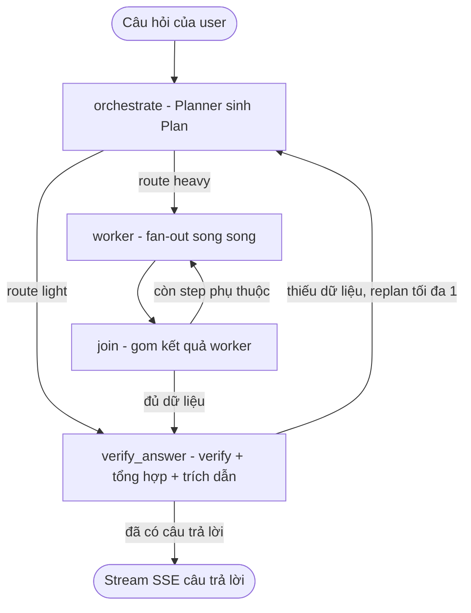

# AI Architecture — Multi-Agent Orchestration + Capability Routing

> Kiến trúc riêng cho **phần AI** của hệ thống: cách query-service điều phối nhiều agent, cách mỗi agent chọn model qua ai-router, và cách tool/memory/streaming/observability ghép lại. Các doc khác: [architecture.md](architecture.md) (Clean Architecture toàn backend), [api-spec.md](api-spec.md) (endpoint), [mcp-query-integration.md](mcp-query-integration.md) (hợp đồng rag_search).

## 0. Mục đích & phạm vi

Tài liệu này mô tả "bộ não" của chatbot — nằm gọn trong `src/query-service/app/agents/` (điều phối) + `src/ai-router/` (gateway LLM) + `src/mcp-service/app/tools/` (công cụ). Trọng tâm: **một câu hỏi của user được xử lý qua nhiều agent như thế nào**, và vì sao thiết kế tách 3 lớp.

## 1. Ba lớp tách rời

```
┌─────────────────────────────────────────────────────────────────┐
│ LỚP 1 — ĐIỀU PHỐI (query-service/app/agents/)                    │
│   Multi-Agent Orchestrator-Workers: orchestrate → worker →       │
│   join → verify_answer (gộp). Mỗi agent chỉ khai CAPABILITY.      │
└───────────────┬───────────────────────────┬─────────────────────┘
                │ gọi tool (MCP)            │ gọi LLM (capability alias)
                ▼                           ▼
┌───────────────────────────┐   ┌─────────────────────────────────┐
│ LỚP 2 — CÔNG CỤ (mcp-svc) │   │ LỚP 3 — LLM GATEWAY (ai-router) │
│ 6 tool: rag_search,       │   │ alias capability → model thật + │
│ hr_query, leave_write,    │   │ key + provider (OpenAI/         │
│ leave_approvals,          │   │ OpenRouter). Cost/load routing. │
│ leave_types, resolve_date │   │ Bind 127.0.0.1, fail-open.      │
└───────────────────────────┘   └─────────────────────────────────┘
```

**Nguyên tắc xuyên suốt (MOSA — Modular Open Systems Approach):** mỗi lớp chỉ khai **"cần gì"**, không biết **"làm thế nào"** của lớp dưới. Agent khai capability `answer`, không biết model thật; agent khai tool `rag_search`, không biết nó đọc Qdrant ra sao. Ghép nhau qua **chuẩn mở** (OpenAI API cho LLM, MCP cho tool) → đổi model/tool/thuật toán không phải sửa code agent.

> "MOSA" là **biệt danh** team đặt cho hệ multi-agent này trong `agents.yaml` (vì nó dựng theo nguyên tắc module-mở ở trên) — **không phải tên một mô hình agent**. Mô hình thực tế là **Orchestrator-Workers**.

---

## 2. Lớp 1 — Multi-Agent Orchestrator-Workers

Code: [`src/query-service/app/agents/`](../src/query-service/app/agents/). Build trên **LangGraph** (`StateGraph` + `Send` để fan-out động).

### 2.1 Luồng tổng quát



> 4 node thật trong graph (`graph_builder.py`): `orchestrate → worker → join → verify_answer`. **KHÔNG có node `synthesize` riêng** — verify, phân tích, tổng hợp và trích dẫn được **gộp vào `verify_answer`** (tiết kiệm 1 LLM call nối tiếp).

- **orchestrate (planner)** — [`planners/orchestrator_workers.py`](../src/query-service/app/agents/planners/orchestrator_workers.py): đọc câu hỏi → sinh **Plan**. Câu đơn giản → `route=light` (đi thẳng `verify_answer`, bỏ qua workers); câu cần thu thập → `route=heavy` với danh sách `steps`.
- **worker** — fan-out **song song** theo DAG (`Send` payload chỉ mang dữ liệu step, serializable). `max_workers_per_level: 4`, `worker_timeout_seconds: 60`. Workers CHỈ gom dữ liệu (rag/hr/leave_action); role `synthesize_recommend` + `analyze` bị **strip khỏi plan** ở mode này.
- **join** — gom kết quả worker; nếu còn step phụ thuộc (`depends_on`) chưa chạy → dispatch tiếp; xong → `verify_answer`.
- **verify_answer** — node DUY NHẤT lo verify + tổng hợp + **trích dẫn nguồn `[N]`**, **stream** token qua SSE (`astream_verify_answer`). Nếu `verify_before_synthesize: true` và còn thiếu dữ liệu (`<<NEED_MORE>>`) và chưa có answer → **replan** về `orchestrate` (tối đa `max_replan: 1`); có answer → END.

### 2.2 Plan schema

[`plan_schema.py`](../src/query-service/app/agents/plan_schema.py):

```python
class PlanStep(BaseModel):
    role: str                 # tên role (phải có trong Agent Registry)
    direction: str = ""       # định hướng cụ thể cho worker
    depends_on: list[int] = []# ID step phụ thuộc (tạo DAG)

class Plan(BaseModel):
    route: Literal["light", "heavy"]
    reasoning: str = ""       # router hiểu câu hỏi + vì sao plan này
    answer_hint: str = ""     # gợi ý trả lời khi route=light
    steps: list[PlanStep] = []
```

### 2.3 Các role-agent

Khai trong [`agents.yaml`](../src/query-service/app/agents/agents.yaml), code ở [`roles/`](../src/query-service/app/agents/roles/). Mỗi role gắn **1 capability** (gửi cho ai-router) + **tool MCP** được phép gọi:

| Role | Capability | Tool MCP | Nhiệm vụ |
|---|---|---|---|
| `rag_retrieve` | `worker` | `rag_search` | Truy hồi tài liệu nội bộ (mcp-service → rag-worker `/api/search` → rerank) |
| `hr_lookup` | `worker` | `hr_query` | Tra HR cá nhân (leave balance, payroll…) |
| `analyze` | `worker` | — | Phân tích/đối chiếu dữ liệu các worker khác |
| `leave_action` | `think` | `resolve_date` | Tạo **DRAFT đơn nghỉ** hoặc mở hàng đợi duyệt → xuất action JSON cho FE render form |
| `synthesize_recommend` | `answer` | — | Role fallback ở **react mode**; ở orchestrator_workers **bị strip** — việc tổng hợp/citation/stream do node `verify_answer` lo |
| `critic` | `worker` | — | (mặc định **tắt** `enabled: false`) phản biện kết quả |

> Thêm/bớt role, đổi capability/tool/memory = **sửa `agents.yaml`, không sửa code** (hot-config). Sai field → manifest fallback an toàn về `mode: react`.

### 2.4 Hai mode — an toàn khi rollback

[`manifest.py`](../src/query-service/app/agents/manifest.py): `Mode = Literal["react", "orchestrator_workers"]`.

| Mode | Mô tả |
|---|---|
| `orchestrator_workers` | Multi-agent ở trên (**prod**). |
| `react` | Single-agent ReAct cũ ([`planners/react.py`](../src/query-service/app/agents/planners/react.py)) — đường lui an toàn, giữ flow LangGraph cũ. |

**Mode hiệu lực** = env `AGENT_MODE` (override) **>** `agents.yaml`. Prod đặt `AGENT_MODE=orchestrator_workers` ([`deploy/env/query-service.env`](../deploy/env/query-service.env)); e2e enforce khớp (`EXPECT_AGENT_MODE`) để không vô tình deploy bản fallback. File `agents.yaml` commit để `mode: react` làm default-off an toàn.

---

## 3. Lớp 3 — Capability routing qua ai-router

Agent **không gọi OpenAI trực tiếp**. Nó gọi ai-router bằng OpenAI SDK, field `model` = **alias capability**, ai-router map sang model thật + key + provider tối ưu chi phí/tải. Chi tiết ai-router: [`src/ai-router/README.md`](../src/ai-router/README.md) + [`PLAN.md`](../src/ai-router/PLAN.md).

```python
# trong role-agent — chỉ khai Ý ĐỊNH, không biết model thật:
client = AsyncOpenAI(base_url="http://ai-router:8010/v1", api_key="internal")
await client.chat.completions.create(model="worker", messages=[...])   # 'worker' = capability
```

### 3.1 Bảng capability → mục đích (cấu hình ở [`routing.yaml`](../src/ai-router/routing.yaml))

| Capability | Dùng cho | Ghi chú |
|---|---|---|
| `plan` | Node planner (lập kế hoạch) | Model flash nhanh, có reasoning |
| `worker` | Subagents song song (rag_retrieve/hr_lookup/analyze) | Fetch + phân tích |
| `think` | `leave_action` (tạo draft đơn nghỉ) | Flow đơn giản |
| `answer` / `synth` | Câu trả lời cuối + verify | Đa-pool model (DeepSeek/Qwen/Meta/Zhipu…) chống nghẽn |
| `triage` / `triage_fast` | Phân loại nhanh (RAG/OTHER) | Rẻ, reasoning-off |
| `summary` | Tóm tắt hội thoại (memory) | Model rẻ |
| `embed` | Embedding (rag-worker, query) | `EMBED_MODEL=qwen/qwen3-embedding-8b` (4096 native); CONTRACT-CRITICAL khớp collection; multi-collection forward-write khi ingest |
| `rerank_api` | Rerank (mcp-service) | Cohere `/rerank` qua OpenRouter |
| `guardrail`, `caption`, `ocr` | Guardrail / mô tả ảnh / OCR | — |

> **Đổi model cho 1 capability = sửa 1 ô trong `routing.yaml`** (hot-reload qua `POST /admin/reload`), không deploy code. Mỗi node/role một model phù hợp: việc nhẹ → model rẻ, tổng hợp → model mạnh. Đây là ý "mỗi agent gắn model nào cũng được" — gán qua config, không phải agent tự bốc.

### 3.2 Tiers & an toàn

- Bậc thang tier: `free_oai → free_or → paid` (OpenAI free → OpenRouter free → paid). Selector **default `banded_rotation`** (xoay key theo ngưỡng token); nhiều capability (`answer`/`plan`/`think`/`worker`/`ocr`/`triage_fast`) **override `adaptive_balanced`** — AIMD tự dò trần qua 429 cho OpenRouter, TPM-headroom cho OpenAI. Cạn mọi tier → **`save_mode` degrade** sang model rẻ **thay vì trả 503**.
- **Fail-open**: không service nào `depends_on` ai-router. Nếu router chết, query-service set `OPENAI_BASE_URL` rỗng = **gọi thẳng OpenAI** (kill-switch tức thì).

---

## 4. Lớp 2 — Công cụ qua MCP

mcp-service ([`app/tools/`](../src/mcp-service/app/tools/)) expose **6 tool** qua MCP Streamable HTTP. Agent là **MCP client**.

| Tool | Backend | Vai trò |
|---|---|---|
| `rag_search` | gọi rag-worker `/api/search` + rerank | Truy hồi tài liệu, trả Top-K đã rerank |
| `hr_query` | proxy hr-service `POST /hr/query` | Đọc HR cá nhân theo `user_id` |
| `leave_write` | proxy hr-service | Tạo/sửa/hủy đơn nghỉ |
| `leave_approvals` | proxy hr-service | Pending-approval + approve/reject |
| `leave_types` | proxy hr-service | Taxonomy loại nghỉ |
| `resolve_date` | nội bộ | Chuẩn hoá ngày tương đối ("thứ 6 tới") → ISO |

**Bảo mật tham số:** `document_ids` (ACL) và `user_id`/`approver_user_id` do query-service **inject từ JWT**, KHÔNG để LLM tự điền (chống vượt quyền). Search tool nhận `document_ids` nhưng **không tự filter** — ACL enforce ở query-service (post-filter + threshold). Xem [mcp-query-integration.md](mcp-query-integration.md).

---

## 5. Memory (ngắn hạn)

[`agents/memory/`](../src/query-service/app/agents/memory/). Cấu hình ở `agents.yaml`:

```yaml
memory:
  impl: recent_buffer    # recent_buffer (hiện tại) | summary_buffer | vector
  keep_recent: 4
  summarize_after: 8
```

- `recent_buffer`: giữ N lượt gần nhất verbatim.
- `summary_buffer`: LLM tóm tắt lượt cũ (capability `summary`, model rẻ) + giữ lượt gần nhất.
- Lưu ở Redis ([`redis_store.py`](../src/query-service/app/agents/memory/redis_store.py)). Default-off được (như mode react).

---

## 6. Streaming, "suy nghĩ của agent" & observability

- **SSE**: node `verify_answer` stream token câu trả lời + `done` kèm `sources`. Các pha trung gian (orchestrate/worker/join) phát event trạng thái để FE hiển thị "đang suy nghĩ".
- **Persist "suy nghĩ của agent"**: thoughts/plan/trace/models của agent được lưu vào `query_svc.messages.metadata.agent` (xem [data-schema.md](data-schema.md)) → **reload trang vẫn xem lại được** "Xem suy nghĩ của agent", không lệ thuộc localStorage. Hợp đồng SSE kiểm ở [`sse_contract.py`](../src/query-service/app/agents/sse_contract.py) (cảnh báo khi drift, **không bao giờ làm vỡ stream**).
- **Langfuse**: trace từng bước (latency, token, retrieved chunks, scores). RAGAS chạy offline (Phase 1.5).

---

## 7. Bảo mật & độ bền

| Khía cạnh | Cơ chế |
|---|---|
| Không tin LLM điền tham số nhạy cảm | `document_ids`/`user_id` inject từ JWT |
| ai-router không lộ ra ngoài | Bind `127.0.0.1:8010`, chỉ service nội bộ + SSH tunnel |
| Router chết không kéo sập app | Fail-open: `OPENAI_BASE_URL` rỗng → gọi thẳng OpenAI |
| Cạn quota | `save_mode` degrade model rẻ, không 503 |
| Manifest lỗi | Fallback `mode: react` (service không vỡ) |
| MCP down | Circuit breaker (`pybreaker`, fail_max=5, reset 30s) → 503 nhanh |
| Worker treo | `worker_timeout_seconds: 60` |
| Replan vô hạn | `max_replan: 1` |

---

## 8. Cấu hình — đổi gì ở đâu (hot-config)

| Muốn đổi | Sửa file | Cần deploy code? |
|---|---|---|
| Bật/tắt multi-agent, thêm role, đổi memory | `query-service/app/agents/agents.yaml` (+ env `AGENT_MODE`) | Không |
| Đổi model cho 1 capability, thêm provider/key, đổi thuật toán | `ai-router/routing.yaml` (`POST /admin/reload`) + env `*_API_KEY_n` | Không |
| Thêm/sửa tool | `mcp-service/app/tools/` | Có |
| Logic planner/graph | `query-service/app/agents/planners/`, `graph_builder.py` | Có |

---

## 9. Tóm tắt một câu hỏi đi qua hệ AI

1. Câu hỏi → query-service (JWT verify, ACL pre-filter, semantic cache).
2. **planner** (`capability=plan`) sinh Plan: light hay heavy + steps.
3. Heavy → **workers** song song (`capability=worker`/`think`), mỗi worker gọi **MCP tool** (rag_search/hr_query/leave_*), LLM đi qua **ai-router**.
4. **join** gom kết quả worker → `verify_answer`.
5. **verify_answer** (`capability=answer`/`synth`) verify (đủ chưa? thiếu → replan ≤1) + tổng hợp + citation `[N]`, **stream SSE**.
6. Lưu message + `metadata.agent` (thoughts/trace) + Langfuse trace.

Mọi lời gọi LLM ở các bước trên đều qua **ai-router** (alias capability → model thật), mọi truy cập dữ liệu đều qua **MCP tool** (tham số nhạy cảm inject từ JWT).
