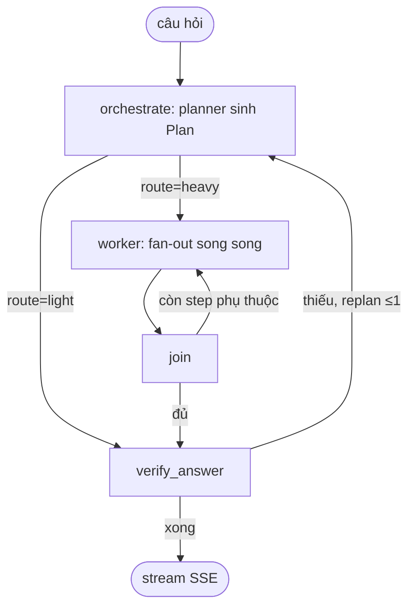

# Kiến trúc AI — "bộ não" của chatbot

> Phần AI nằm ở 3 lớp: điều phối (`query-service/app/agents/`), công cụ (`mcp-service/app/tools/`), gateway LLM (`src/ai-router/`).
> Topology & luồng: [overview.md](overview.md), [data-flow.md](data-flow.md). Hợp đồng: [contracts.md](contracts.md).

## 3 lớp tách rời (MOSA)

```
LỚP 1 — ĐIỀU PHỐI  (query-service/app/agents/)
  Orchestrator-Workers: orchestrate → worker → join → verify_answer
        │ gọi tool (MCP)              │ gọi LLM (capability alias)
        ▼                             ▼
LỚP 2 — CÔNG CỤ (mcp-service)   LỚP 3 — LLM GATEWAY (ai-router)
  6 tool: rag_search, hr_query,   alias capability → model thật +
  leave_write/approvals/types,    key + provider (OpenAI/OpenRouter)
  resolve_date                    quota/cost routing, bind 127.0.0.1
```

**MOSA** (Modular Open Systems Approach) là biệt danh team đặt cho hệ multi-agent — mô hình thật là **Orchestrator-Workers**.
Mỗi lớp chỉ khai "cần gì", không biết "làm thế nào" của lớp dưới; ghép qua chuẩn mở (OpenAI API cho LLM, MCP cho tool) ⇒ đổi model/tool không sửa code agent.

## Lớp 1 — Orchestrator-Workers (LangGraph)

4 node thật trong `graph_builder.py`: **orchestrate → worker → join → verify_answer** (KHÔNG có node `synthesize` riêng — verify + tổng hợp + citation gộp vào `verify_answer`, tiết kiệm 1 LLM call).



- **orchestrate**: sinh `Plan{route, reasoning, answer_hint, steps[]}` (`plan_schema.py`). Câu đơn → `light`; câu cần thu thập → `heavy` + DAG `steps`.
- **worker**: fan-out song song theo `depends_on` (`Send`). `max_workers_per_level: 4`, `worker_timeout_seconds: 60`. Worker CHỈ gom dữ liệu; role `analyze`/`synthesize_recommend` bị strip ở mode này.
- **join**: gom kết quả, còn step phụ thuộc → dispatch tiếp; xong → verify_answer.
- **verify_answer**: verify + tổng hợp + citation `[N]`, stream SSE; thiếu (`<<NEED_MORE>>`) → replan về orchestrate (`max_replan: 1`).

### Role-agent (agents.yaml)

| Role | Capability | Tool MCP | Nhiệm vụ |
|---|---|---|---|
| rag_retrieve | worker | rag_search | Truy hồi tài liệu nội bộ |
| hr_lookup | worker | hr_query | Tra HR cá nhân |
| analyze | worker | — | Đối chiếu dữ liệu worker khác |
| leave_action | think | resolve_date | Tạo DRAFT đơn nghỉ → action JSON cho FE |
| synthesize_recommend | answer | — | Fallback react mode (strip ở orchestrator_workers) |
| critic | worker | — | Phản biện (default `enabled: false`) |

Thêm/bớt role = sửa `agents.yaml` (hot-config), không sửa code; lỗi manifest → fallback an toàn `mode: react`.
**Mode hiệu lực** = env `AGENT_MODE` > `agents.yaml`. Prod = `orchestrator_workers` (e2e enforce `EXPECT_AGENT_MODE`).

## Lớp 3 — Capability routing (ai-router)

Agent gọi ai-router bằng OpenAI SDK, `model` = alias capability; ai-router (`routing.yaml`) map sang model thật + key + provider.

| Capability | Dùng cho |
|---|---|
| plan | node planner |
| worker | subagents (rag/hr/analyze) |
| think | leave_action (draft đơn nghỉ) |
| answer / synth | câu trả lời cuối + verify (đa-pool chống nghẽn) |
| triage / triage_fast | phân loại nhanh |
| summary | tóm tắt memory |
| embed | embedding (qwen3-8b, 4096 native; CONTRACT-CRITICAL khớp collection) |
| rerank_api | rerank (Cohere qua OpenRouter) |
| guardrail / caption / ocr | guardrail / mô tả ảnh / OCR |

- Đổi model 1 capability = sửa 1 ô `routing.yaml` (`POST /admin/reload`), không deploy code.
- Selector default `banded_rotation`; nhiều capability override `adaptive_balanced` (AIMD dò trần 429 OpenRouter, TPM-headroom OpenAI). Cạn quota → `save_mode` degrade model rẻ thay vì 503.
- **Fail-open**: không service nào `depends_on` ai-router; router chết → query-service set `OPENAI_BASE_URL` rỗng = gọi thẳng OpenAI.

## Lớp 2 — Công cụ MCP

mcp-service expose 6 tool qua MCP Streamable HTTP; agent là MCP client.

| Tool | Backend | Vai trò |
|---|---|---|
| rag_search | rag-worker `/api/search` + rerank | Top-K đã rerank |
| hr_query | proxy hr-service `/hr/query` | HR cá nhân |
| leave_write / leave_approvals / leave_types | proxy hr-service | Đơn nghỉ |
| resolve_date | nội bộ | Ngày tương đối → ISO |

**Bảo mật:** `document_ids` (ACL) và `user_id`/`approver_user_id` do query-service inject từ JWT, KHÔNG để LLM tự điền.
mcp KHÔNG embed/đọc Qdrant — chỉ gọi rag-worker rồi rerank.

## Độ bền

| Khía cạnh | Cơ chế |
|---|---|
| Tham số nhạy cảm | inject từ JWT |
| ai-router không lộ | bind 127.0.0.1:8010 |
| Router chết | fail-open thẳng OpenAI |
| Cạn quota | save_mode degrade |
| Manifest lỗi | fallback mode react |
| MCP down | circuit breaker (pybreaker, fail_max=5, reset 30s) |
| Worker treo | worker_timeout_seconds: 60 |
| Replan vô hạn | max_replan: 1 |
