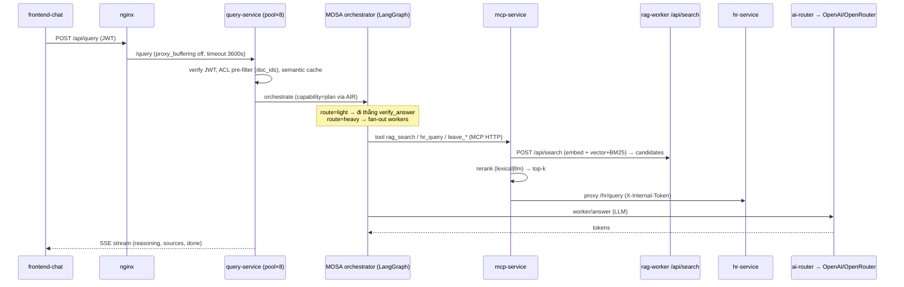
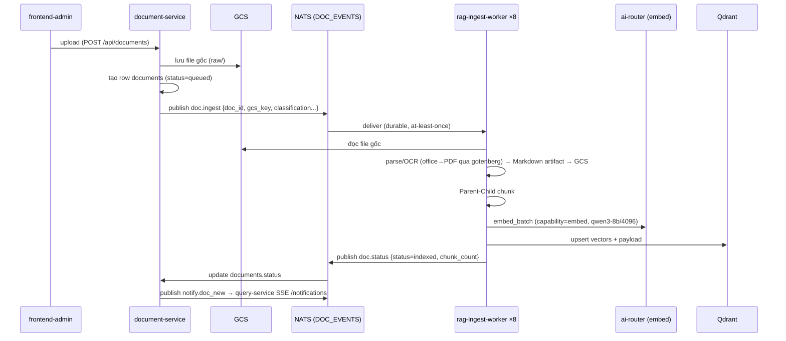

# Luồng dữ liệu

Hai luồng chính: **CHAT** (đọc, tổng hợp, stream) và **INGEST** (nạp tài liệu). Mọi mũi tên kiểm chứng được trong code/compose.

## 1. Luồng CHAT (SSE)

Các bước (verify):
1. **FE → nginx → query-service**: `POST /api/query`, router `query.py` trả `StreamingResponse` (SSE). nginx tắt buffering cho `/api/query/*`.
2. **JWT + ACL + cache** ở query-service: `document_ids` lọc từ projection `document_access`/`user_access_profile` (query_db) — KHÔNG để LLM tự điền.
3. **orchestrate (planner)** sinh `Plan` (`route=light|heavy`, `steps` DAG) — LLM qua ai-router (`capability=plan`).
4. **workers** fan-out song song (`Send`), mỗi worker gọi **MCP tool**:
   - `rag_search` → mcp-service → **HTTP `POST /api/search`** tới rag-worker (embed query + vector/BM25 hybrid trên Qdrant → candidates) → **rerank** ở mcp → top-k.
   - `hr_query`/`leave_*` → mcp-service → **HTTP proxy** hr-service.
5. **verify_answer** (node duy nhất): verify + tổng hợp + citation `[N]`, **stream token** qua SSE; thiếu dữ liệu → replan ≤1.
6. Lưu message + `metadata.agent` (thoughts/trace) vào `query_db`; trace Langfuse (tùy chọn).

> Mọi LLM call ở các bước trên đều qua **ai-router** (`base_url=http://ai-router:8010/v1`, `model`=alias capability).

## 2. Luồng INGEST

Các bước (verify từ subjects.md + use_cases):
1. **Upload → GCS**: document-service lưu file gốc, tạo row `documents` status `queued`.
2. **`doc.ingest`** (JetStream `DOC_EVENTS`, at-least-once, durable `RAG_WORKER_INGEST`): payload bắt buộc `event_id, doc_id, gcs_key, document_name, file_type, classification, allowed_departments, allowed_user_ids`.
3. **rag-ingest-worker** (×8, `INGEST_ENABLED=true`, claim-lease DB-safe): đọc GCS → parse/OCR → Markdown artifact (ghi lại GCS) → **Parent-Child chunk** → **embed qua ai-router** → **upsert Qdrant**.
4. **`doc.status`** (DOC_EVENTS): rag-worker báo `indexed`/`failed` (+`chunk_count`). Đây là kênh DUY NHẤT cập nhật status trong `doc_db`; rag-worker KHÔNG ghi `doc_db`.
5. **`notify.doc_new`** (NOTIFY_EVENTS): document-service phát sau `indexed` → query-service đẩy SSE `/notifications` cho user online có quyền.

> Idempotency: consumer dedupe theo `event_id` (fallback key trong subjects.md). ACL change đi qua `doc.access`; profile qua `hr.employee_profile.updated`.
